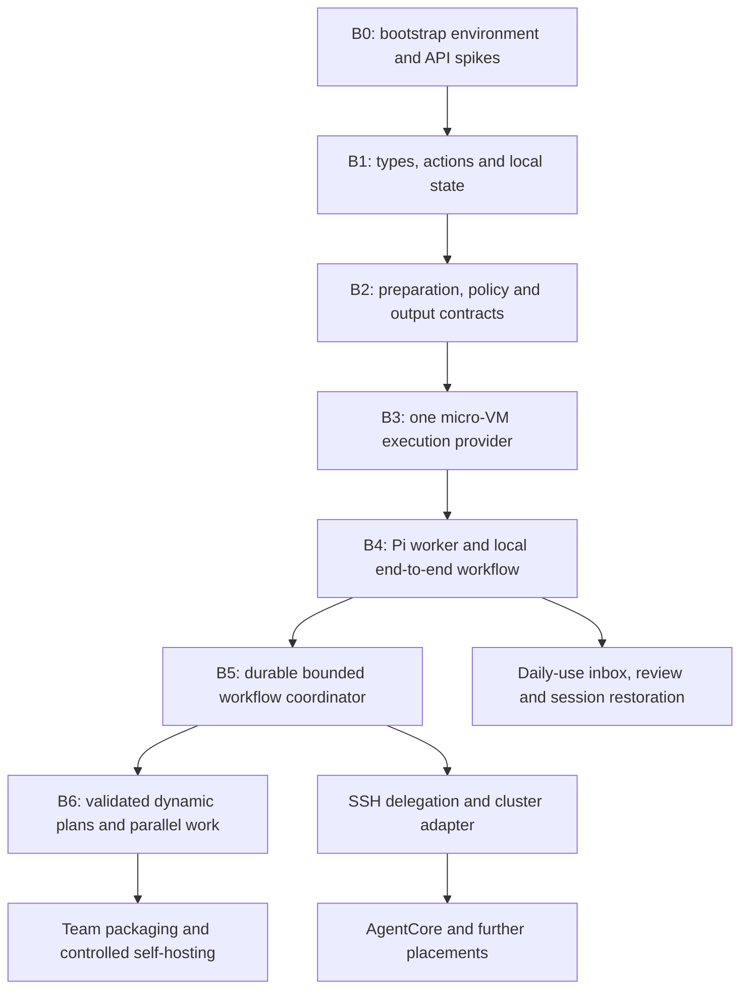

# Bootstrapping Pi Workbench with Pi

Implementation plan • design baseline 1.27

## GitHub review gates

Follow IMPLEMENTATION-TIERS.md as the outer sequencing contract. First complete Tier 0: hooks, CI, toolchains, development environment and a verified sandbox. Kirk reviews each tier in GitHub before dependent implementation proceeds. B0–B7 below describe technical dependencies, not permission to cross tier boundaries autonomously. Capability-building subgoals remain inside the current tier.

Use stacked PRs within the current tier and the GitHub Project/Issues board defined in IMPLEMENTATION-TIERS.md. Discovered capability gaps become linked tasks; board state never substitutes for human tier acceptance. Required GitHub Actions cover PR and merge-group revisions.

## Verification progression

The central progression is nondeterministic discovery → reviewed acceptance criteria → deterministic hooks and CI → evidence-based goal checking. Pi should turn recurring investigations into executable checks as it builds capabilities. Required goal completion is computed from current, version-bound evidence; ambiguous requirements remain explicit human gates. See IMPLEMENTATION-TIERS.md for checker integrity, structured outcomes and the separation between implementation completion and tier acceptance.

Validation grows from lint/type checks to unit tests, integration tests and review agents. Retain all earlier gates. Review agents produce evidence-linked findings, not deterministic approval; recurring findings become regression checks. Sandbox safety verification is required when the sandbox is introduced, even before the broader integration suite exists.

## Immediate operational target

Prioritize semi-autonomous implementation on the current Fedora box through OpenShell. Complete the minimal Tier 0–2 path in IMPLEMENTATION-TIERS.md: verified sandbox, narrow control contracts, then one bounded Pi edit/test/repair task and review package. Use a small externally supervised upstream Pi loop before building the general workflow engine. Defer rich UI and other placements; retain micro-VM requirements and GitHub tier gates.

Use native OpenShell MicroVM directly on Fedora/Linux and macOS. Reserve the Kubernetes/OpenShift/OKD path for remote clusters. Do not put local Kind or KubeVirt on the bootstrap critical path. The completed OpenShell/Kata Kind experiment is compatibility evidence only; its guest startup fixes are recorded in KATA-SPIKE.md. Validate native VM behavior and design §14.3 Codex credential isolation before enabling a credentialed implementation worker.

## Approach

Use a pinned upstream Pi installation to build the first trusted components in a disposable development environment. Introduce the new Workbench incrementally as its contracts pass verification. Do not depend on the unfinished workflow engine to coordinate its own initial implementation, or grant experimental broker code access to real credentials simply to test it.

“Dependencies first” means small, independently verifiable contracts and one usable execution path, rather than building every abstraction before trying a real workflow. Reuse pinned upstream Pi, sandbox runtimes and libraries; build the Workbench integration and missing semantics. The existing mockup guides interaction, not production architecture.

## Capability-building loop

The objective is a progressively self-extending harness: Pi builds the tools it needs to construct later parts of Workbench, then reuses those tools. The backlog includes both product outcomes and missing capabilities that prevent those outcomes. Dependencies are discovered during work as well as planned initially.

Use this loop: **attempt the next outcome → identify a concrete capability gap → reuse or build the smallest tool → verify it independently → register an approved version → resume the blocked outcome**. A capability gap must name the blocked task and expected benefit. Prefer an existing verified tool or a direct bounded operation when building a reusable tool would not repay its maintenance cost.

For example, implementing the workspace dashboard may reveal a need for structured workspace inspection. Pi first builds a read-only registry query, tests it against known fixtures and registers its schema. It then uses that tool while building session restoration. Later, a reproducible image/build runner enables worker tests; a worker test runner enables a bounded repair coordinator; the coordinator helps implement additional adapters. Each completed capability becomes a dependable input to subsequent work, not just another generated script.

### Tool creation and promotion

Track each capability as `proposed → implementing → verifying → available`, with `rejected`, `deprecated` and `quarantined` states as needed. Record its consumer task, owner, schema, source revision, artifact digest, dependencies, required permissions, execution boundary, acceptance evidence and compatible broker/worker versions. These records describe Workbench behavior to implement; upstream Pi does not automatically enforce them.

Pi may author, test and propose registration of tools inside its existing scope. Deterministic admission checks verify schema, provenance, compatibility and evidence. Low-risk tools can become available automatically where an existing policy explicitly allows that promotion. Tools needing new credentials, host-native powers, publication rights or policy changes require the corresponding trusted authorization. Generated implementation code cannot approve its own authority or rewrite its acceptance criteria to make promotion pass.

Keep generated tools in reviewed, versioned source packages. Register semantic capabilities through the existing action/broker contract; do not silently load arbitrary generated extensions into the trusted host Pi process. Early tools should execute in the disposable development boundary. Promotion into the broker or host extension set is a separate release step because it expands trusted executable code even when the tool's advertised purpose sounds harmless.

### Dynamic dependencies and limits

A workflow can insert a `build-capability` subgoal before a blocked consumer, preserving the original goal and evidence. Proposed dependency patches must remain acyclic outside declared loops and preserve the consumer's acceptance requirements. After promotion, revalidate the consumer against the exact new capability version and resume from its checkpoint.

Bound recursive tool building: initially allow at most two nested capability-building subgoals and three repair attempts per capability, within the original goal's time/token/cost envelope. If building a tool reveals another missing foundation beyond those bounds, checkpoint the chain and surface the concrete dependency rather than creating an endless framework project. A failure of the development harness itself uses the last known-good toolchain and external recovery path.

Persist discovered gaps and successful tools so later runs do not recreate them. Distinguish tool defects from product defects. Quarantine a failing tool version, invalidate affected evidence and assess its prior effects before retrying dependent work. Updating a tool does not retroactively validate results produced by its previous version.

### Minimal starting toolchain

The initial trusted tools are the pinned upstream Pi installation, source editing, version control, a bounded command/test runner in an authorized development environment, and a human-owned approval/recovery path. Pi builds richer structured inspection, artifact handling, provider adapters and workflow coordination from there. The new scheduler becomes responsible for capability-building only after its own persistence and authorization gates pass.

The success metric is completed user work with fewer repeated manual steps and verifiable results—not the number of plugins or tools generated. Preserve a simple direct path for tasks that do not justify a new capability.

## Dependency graph



The UX branch can start with fixtures after B1, but its real action path depends on B4. Runtime/API feasibility spikes happen in B0 so a bad assumption is discovered before building a large dependent subsystem. Belt schema inspection is independent and does not block local work.

## Milestones and evidence gates

| Milestone | Build | Acceptance evidence |
|---|---|---|
| B0: reproducible bootstrap | Feature branch, repository instructions, pinned toolchain and dependencies, package skeleton, disposable test environment; short Pi extension/SDK/RPC and micro-VM probes | Fresh setup builds; actual APIs can support the first interaction; versions and isolation limitations recorded. |
| B1: contracts and state | Work/Workspace/run IDs, action schemas, context generation, registry migrations, artifact metadata, fake provider | Invalid context rejected; state reopens after restart; separate checkouts and profiles remain distinct. |
| B2: trusted action path | Prepare/evaluate/approve/execute/verify contract, immutable input binding, bounded outputs, audit and idempotency records | Changed input/identity or expired approval fails; replay is reconciled; fixture secrets never reach model-facing results. |
| B3: one real provider | Selected local OpenShell micro-VM adapter, pinned development image, workspace storage and limits | A test job executes with a verified VM boundary; denied access stays denied; cleanup preserves unpublished work; no host fallback. |
| B4: one real Pi loop | Worker bridge, shared action integration, minimal local UI, revision-bound source/test/review handoff | Human starts a bounded task, sees real results and resumes context after client restart; no fictitious completion or duplicate launch. |
| B5: coordinator | Durable step records, linear inspect/edit/test workflow, retries, budgets, external waits, cancellation and recovery | Kill/restart during dispatch and result recording; reconcile ambiguity; stop at bounds; completion requires current evidence. |
| B6: dynamic workflow | Validated graph revisions, conditional branches, bounded fan-out, writer leases, input/approval waits | Invalid graphs/scope expansion rejected; independent steps run safely; stale workers cannot write after ownership changes. |
| B7: controlled self-hosting | Use the last verified Workbench release to build the next; separate candidate broker/worker instances; team install and upgrade checks | Known-good launcher remains usable; candidate migrations use test state; promotion follows evidence and required review. |

Start with exact action/result contracts, not a general plugin framework. B2 uses a fake executor before adding real effects. B3 can expose a narrow test capability before arbitrary agent code is admitted. Tests should target boundaries, recovery and user-visible behavior; avoid tests that merely repeat type declarations or implementation details.

## Driving the work with upstream Pi

At bootstrap, store a small checked-in backlog and acceptance definitions in the implementation repository. Keep execution observations, large logs and transient scheduler state outside tracked configuration. Until B5 exists, use explicit Pi sessions and a simple human-readable progress ledger. Pi can propose the next ready task; it must not claim durable background scheduling or an approval boundary that has not been implemented.

For each task:

1. Read the relevant design sections, dependency results and current repository state.
2. Record a bounded objective, allowed paths/actions, inputs, acceptance evidence and limits.
3. Implement the smallest complete change and run focused verification.
4. On a retryable failure, inspect new evidence and attempt a bounded repair. Stop repeating an unchanged remedy.
5. Review the diff against the task objective and trust boundary. A second agent review, when used, supplies feedback rather than independent authorization.
6. Checkpoint results with source revision, tests, artifacts, limitations and the next ready dependency. Follow repository attribution hooks for any commits; do not bypass a blocked hook.

Human input is needed for unresolved product or infrastructure choices and required approvals, not every reversible implementation step. Existing authorization remains valid within its recorded scope. Real identity enrollment, host changes, provider deployment and publication require their own applicable authorization; a development task cannot grant them to itself.

## Dynamic workflow contract

A workflow template describes a bounded graph; the instantiated run records immutable inputs, graph revision and evidence. Pi may propose graph patches as it learns, but deterministic validation decides whether they preserve scope, allowed actions, budgets and dependencies. Model-selected nodes never become direct shell strings or policy grants.

```yaml
# Proposed Workbench workflow format; not runnable in stock Pi
workflowTemplate:
  id: implement-ready-component
  objectiveRef: backlog/selected-component
  inputs: [design-revision, source-checkpoint, dependency-evidence]
  limits:
    maxRepairAttempts: 3
    maxElapsed: 45m
    maxConcurrentWorkers: 2
    tokenBudgetRef: bootstrap-standard
  steps:
    - id: inspect
      kind: agent
      task: assess-selected-component
    - id: implement
      kind: agent
      needs: [inspect]
      task: implement-selected-component
    - id: verify
      kind: job
      needs: [implement]
      capabilityRef: focused-component-checks
    - id: assess
      kind: verification
      needs: [verify]
      acceptanceRef: component-acceptance
  repair:
    when: retryable-verification-failure
    sequence: [inspect-new-evidence, repair, verify, assess]
    until: acceptance-satisfied
    onNoProgress: needs-input
  dynamicChanges:
    allowed: [add-scoped-investigation, split-independent-check, wait-for-evidence]
    forbidden: [expand-authority, weaken-acceptance, remove-required-verification]
```

Before B5/B6, these fields document desired behavior and guide bounded Pi work; they do not execute automatically. Build a persisted linear loop first. Later graph mutation validation must check missing dependencies, cycles outside declared bounded loops, incompatible data profiles, conflicting writers and total resource budgets. Every additional branch inherits the goal's restrictions.

Use events or bounded polling for waits without repeated LLM turns. Pause only dependent branches for approvals or missing input. A result changing the source invalidates verification tied to the old revision. Record cancellation effects and reconcile uncertain mutations before retrying. Durable remote progress requires an available owning coordinator, not merely a saved goal file.

## Delegation as the harness grows

Parallelize only ready, independent work: an API conformance probe, fixture UI work or an adapter against a stabilized contract. Assign each writing agent its own worktree/workspace, input revision, permitted scope and evidence requirements. A designated integrator combines changes after checking contracts and conflicts. Never have several agents redesign or mutate the same broker boundary concurrently without ownership.

Begin locally. Add Remote SSH PC delegation after B4/B5 so it exercises an already working run contract. Use the Mac → RPi → headunit workflow initially for bounded diagnostics through reviewed host-native capabilities. Add cluster and AgentCore execution after their identity, persistence and lifecycle contracts pass; they are not prerequisites for building the core.

## Extension testing with disposable Pi instances

**Build-out requirement:** Pi builds candidate extensions, launches separate Pi instances to test them, and promotes verified versions into the main development instance. Installation and activation are distinct recorded steps. This is the concrete mechanism by which new capabilities become available during construction.

1. Package the candidate from a recorded source revision with pinned dependencies and an artifact digest. Run the applicable lint/type/unit checks first.
2. Launch a disposable Pi instance in the approved development sandbox using the target Pi version. Give it separate agent configuration, session state, temporary workspace, sockets and synthetic/scoped credentials. Prevent accidental discovery of the main instance's packages and project-local extensions. A different config directory alone is not a security boundary.
3. Test loading and registration, command/tool schemas, expected results, failure paths, policy denial, unload/reload behavior where supported, and compatibility with the approved package set. Use bounded scripted inputs or the verified RPC/client interface; capture exit status, structured events and artifacts. The child cannot approve itself or mutate the main installation.
4. Verify actual behavior against independent acceptance checks. A child Pi saying the extension works is not sufficient. For TUI-only features, add terminal/interaction checks and required human inspection rather than claiming RPC tests prove rendering fidelity.
5. Prepare promotion of the exact tested artifact, recording its dependencies, host/worker placement, required permissions, test evidence and rollback version. Promote automatically only within an existing policy-approved development scope; trusted host-code changes and tier transitions retain their required review.
6. Checkpoint the main task and quiesce affected operations. Install the pinned artifact through the managed package path. Use the target Pi version's supported reload mechanism after validating its semantics; otherwise perform a controlled restart. Never assume package installation activates code already loaded in memory.
7. Probe the main instance for the expected capability and version, run a minimal smoke check, then resume the blocked consumer task. On activation failure, restore the known-good package set and state through a tested recovery path and quarantine the candidate.

Keep a launcher/supervisor outside the instance being replaced so Pi can request its own controlled reload without losing the party responsible for recovery. Persist pending prompts, run references and output cursors before restart. Reconcile in-flight actions instead of replaying them. Remote workers stay pinned to their original package set until deliberately restarted or migrated; a main-instance reload must not silently upgrade running agents.

Store promotion records with candidate digest, test-instance ID, Pi version, evidence revision, approval/policy reference, activation outcome and previous release. Dependency installation scripts are executable code and must run in the permitted install boundary. Test and activate the same immutable package; local-path development packages must be captured before promotion so later file edits cannot change a supposedly verified version.

Add this loop after the minimal worker/test runner is verified, initially with one harmless fixture extension that exposes a deterministic inspection command. Prove both successful promotion and recovery from a broken extension before letting capability-building workflows use it broadly. Constrain child concurrency, runtime and token budgets under the parent goal; child test agents cannot recursively launch unbounded test instances.

## Self-hosting without circular trust

The candidate must not approve its own promotion, alter its verifier to declare success, or use production policy/credentials while its enforcement is under test. Keep the known-good version, independent acceptance fixtures and a human recovery path. Run candidate services with separate sockets, data directories, identities and disposable migration copies. Test service version skew and rollback/recovery before moving active work.

After B4, dogfood low-risk local tasks. After B5, use bounded workflows to implement ordinary adapters and UI work. Keep security-sensitive changes subject to the existing review process even after self-hosting. Promote a release only when its acceptance evidence is complete and any required human review has occurred. Passing a build or an agent's favorable review is not proof of secure isolation.

## First instruction to Pi

Read the design and this plan. Complete B0 first: inspect the chosen upstream version and actual machine capabilities; establish a reproducible implementation skeleton; run minimal API/runtime feasibility probes in an authorized disposable environment; and record decisions and evidence. Then implement B1 and B2 against a fake provider. Do not expand into every runtime, create production infrastructure, or use the unfinished scheduler as though it already exists. Continue through authorized ready tasks, checkpointing results and surfacing concrete blockers.
