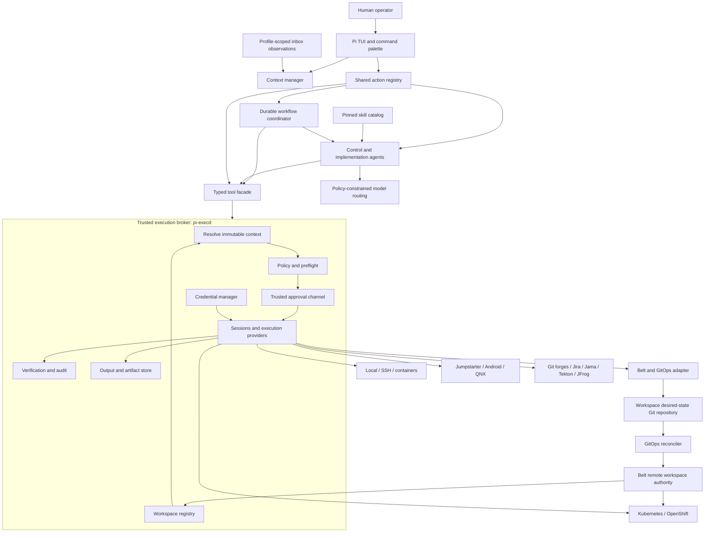
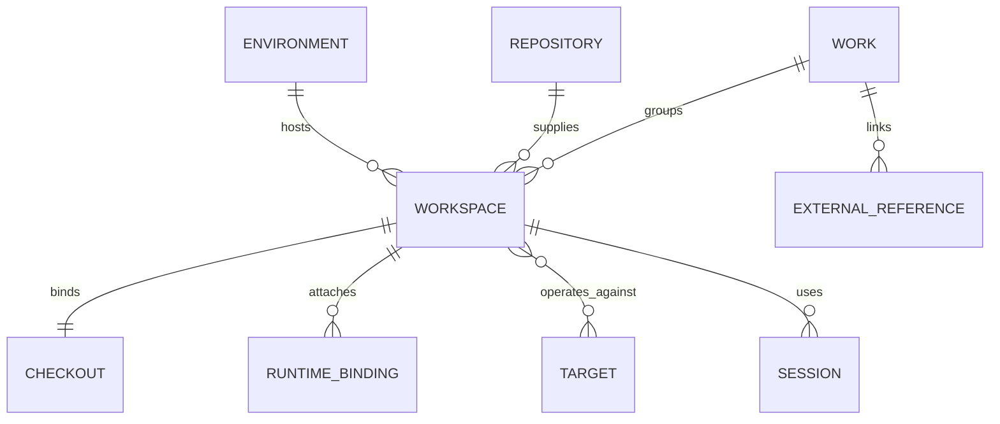
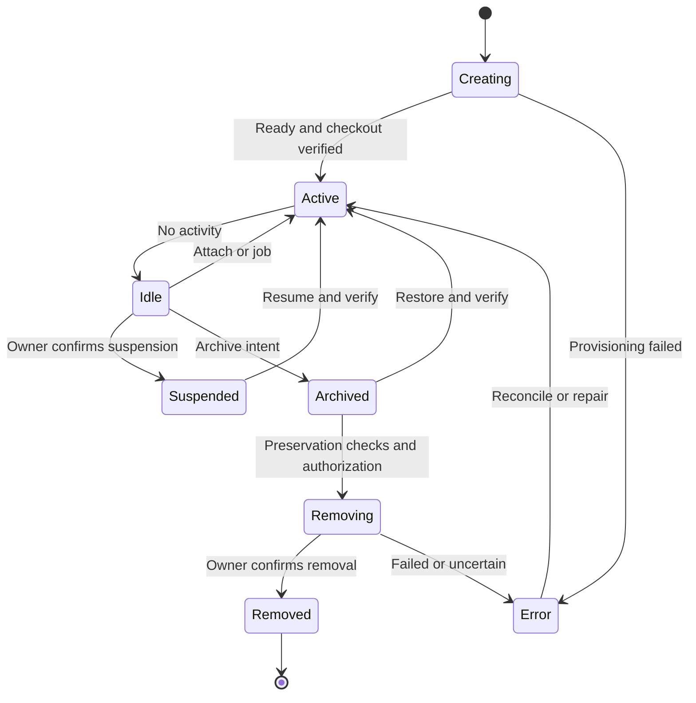
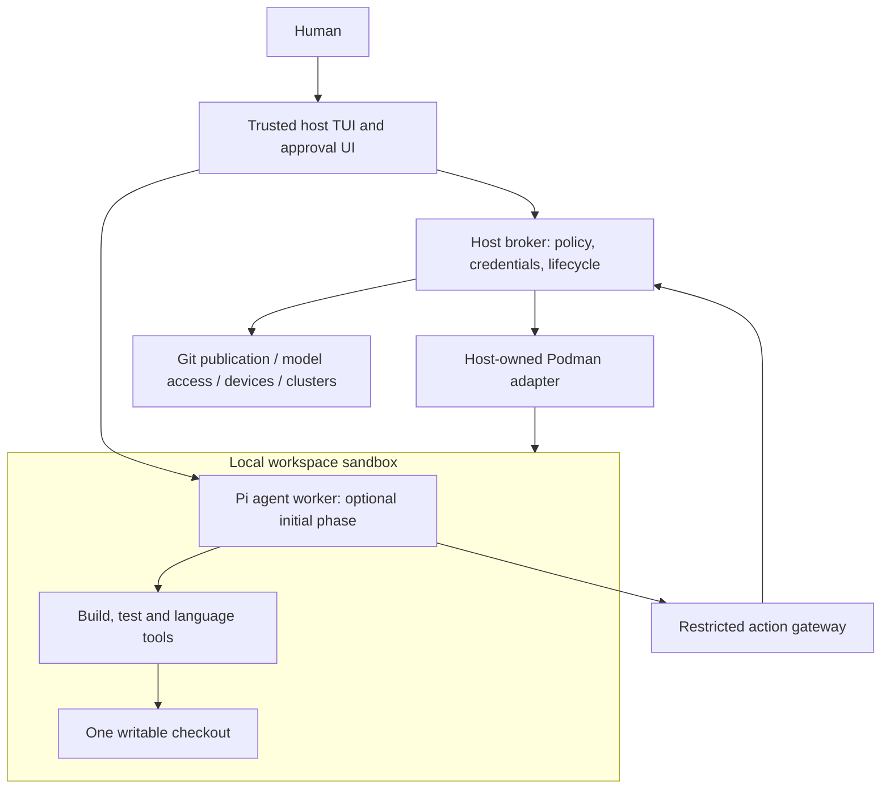
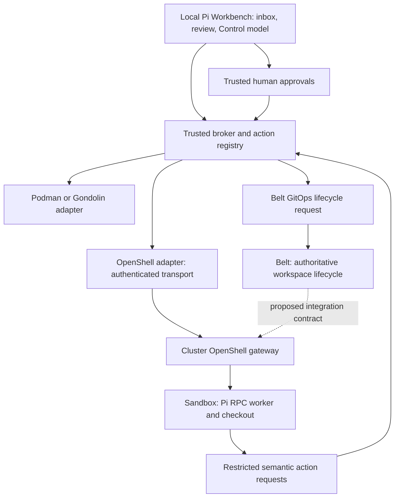
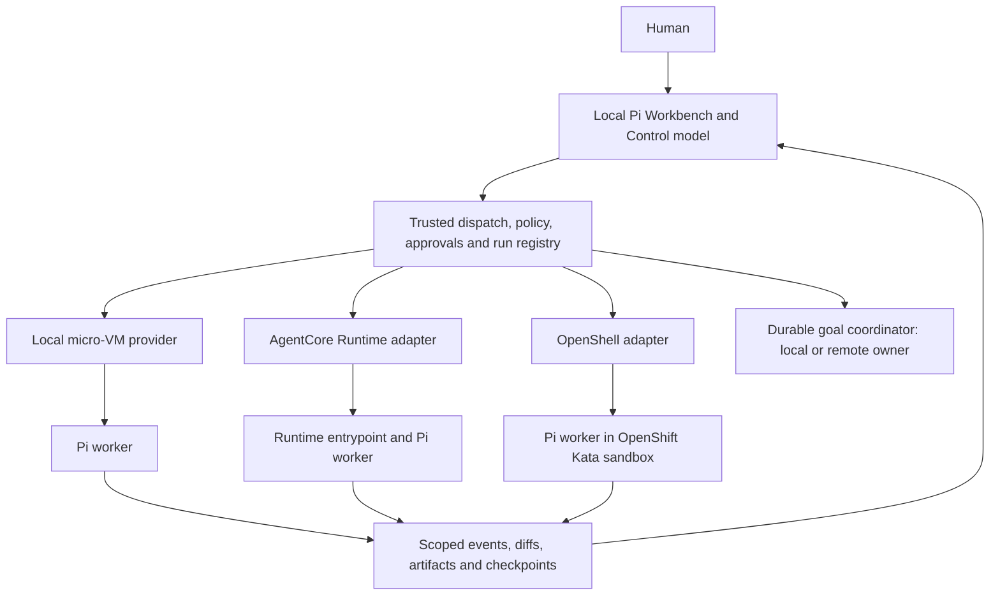
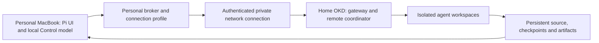
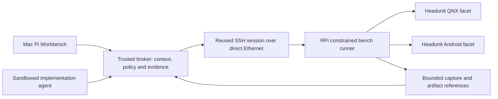
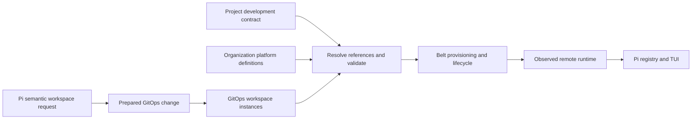

# Pi Workbench

## Personal engineering control plane — architecture and design

**Status:** Design baseline 1.27 — working OpenShell/Kata spike and Codex authentication boundaries  
**Owner:** Kirk  
**Date:** September 5, 2026  
**Source:** [Design Pi Workbench](chatgpt-conversation://6a9c668f-3c80-83ea-a0b8-16e2f7406fb1)

This document consolidates the referenced design conversation and the subsequent workbench, security, review, workflow, and dashboard refinements. “Decision” denotes the agreed architectural baseline; it does not imply implemented software. API shapes, configuration filenames, policy defaults, and implementation mechanisms are proposals. The later Belt/GitOps ownership decisions supersede earlier suggestions to put remote workspace definitions in Pi configuration or treat the runtime registry as their source of truth.

Private Belt repositories were not inspectable in the referenced conversation and have not been inspected for this document. No example below claims to describe an existing Belt CRD, controller, or API. All Belt mappings require validation against its actual implementation.

### Current implementation refinements

The imported baseline below is retained. [Work and resumption](../WORK-AND-RESUMPTION.md)
refines the morning workflow, Project/Work/goal/task/thread relationships, optional
multi-repository checkout sets, build-compatible checkout strategies, XDG state
ownership and sharing boundaries. Worktrees remain a preference, not a requirement.
These refinements distinguish current registry behavior from proposed capabilities;
they do not enable a scheduler, remote provider or UI outside the reviewed tier.

## 1. Executive summary

Pi Workbench is a personal engineering control plane for development, operations, architecture, and hardware testing across a Fedora workstation, a work Mac, SSH hosts, and OpenShift/Kubernetes environments. A context-rich TUI brings together source checkouts, work items, remote sessions, build pipelines, application environments, and physical targets. Existing systems retain their authority: GitLab/GitHub own code review, Jira owns issues, Jama owns requirements, Jumpstarter owns hardware leases, and Belt owns remote workspace provisioning and lifecycle.

The foundation is a **trusted execution broker** beneath Pi. The model proposes typed operations; the broker resolves identities, checks policy, obtains narrowly scoped human approval, manages credentials and persistent connections, executes, and verifies outcomes. Connection setup and large logs remain outside model context. Credentials never become model capabilities by accident.

**Work** represents an objective; a **Workspace** binds one independently mutable repository checkout to one execution environment. Several workspaces on different machines can belong to the same Work. Runtime deployments and test targets attach separately. Git worktrees are the default Git checkout strategy. Git remains canonical for collaboration and cross-machine exchange, while local Jujutsu is optional behind a semantic VCS interface.

Remote workspaces follow GitOps. Project configuration states portable development requirements; private organization configuration supplies infrastructure and policy; GitOps declares instances; runtime discovery reports observed state. Pi composes and exposes these sources without maintaining competing remote definitions. Implementation starts with micro-VM-backed agent workspaces, Git worktrees, persistent tmux sessions, local review, and the broker foundation. Rootless Podman remains available for scoped Linux toolchain tasks. A thin sandbox-provider boundary accommodates optional Gondolin tool routing and the planned OpenShell cluster workers controlled from local Pi (§10.2). Belt integration follows validation of its actual contracts; macOS support and distributed execution follow the local baseline.

Session entry presents **“What would you like to move forward?”**, followed by an actionable inbox of workspaces, reviews, CI, goals, and tickets across explicitly identified Jira tenants. A local model handles control and resumption by default; a configured, policy-permitted small cloud model can fill that role. Implementation work hands off to a capable model with a revision-bound context package. Keyboard shortcuts, slash commands, and plain English reach the same typed actions.

Persistent tmux sessions keep ordinary terminal work available alongside Pi. A scrollable review panel combines local and published changes, inline feedback, forge discussions, descriptions, and CI evidence. Pinned personal/team skills supply reusable context; a durable coordinator advances explicit goals through bounded workflows, waits, and repair loops. Neither skills nor model selection grants additional authority. The local harness dispatches and supervises workers in local micro-VMs, enrolled remote SSH PCs, AWS AgentCore Runtime and OpenShift/OpenShell/Kata through a common run contract (§10.5). Execution placement and model choice are independent policy decisions.

## 2. Goals and non-goals

### Goals

- Carry engineering context across repositories, branches, PRs/MRs, machines, clusters, and hardware without repeated manual setup.
- Make execution location and operational risk visible and enforceable for every action.
- Reduce model tokens and latency spent reconnecting, discovering context, refreshing credentials, and reading unbounded logs.
- Support secure remote privileged operations with meaningful human approval.
- Provide concurrent, isolated checkouts for development, investigation, and review.
- Support local and remote Android development, Linux/QNX benches, Raspberry Pi devices, and Jumpstarter hardware-in-the-loop workflows.
- Integrate with the OpenShift-based Software Development Platform, including Belt, Tekton, Argo CD, and JFrog.
- Keep public capabilities reusable while separating corporate topology, policy, identity, and data from personal use.
- Establish reusable core APIs so future interfaces or other agent harnesses can use the same broker.
- Resume daily work from actionable context, retaining ordinary terminal access without relaunching agents.
- Review local changes and forge discussions in one scrollable workspace view, with explicit publication controls.
- Reuse Git-backed personal/team skills and bounded background workflows while preserving data and credential boundaries.

### Non-goals

- Replacing GitLab, GitHub, Jira, Jama, k9s, IDEs, or existing platform dashboards.
- Building another remote workspace controller alongside Belt.
- Giving an agent unrestricted root, cluster-admin, or arbitrary access to credential-bearing shells.
- Making JJ mandatory, replacing Git remotes, or synchronizing repository metadata through filesystem replication.
- Committing active sessions, dirty state, tokens, or observed pod identities into configuration Git repositories.
- Building a web application or sophisticated automatic model router before the execution foundation works.
- Supporting every integration in the first release or claiming that a prompt-based permission convention is a security boundary.

## 3. Core decisions and principles

| ID | Architectural decision | Consequence |
|---|---|---|
| D01 | Pi carries context between existing systems. | Integrations reference external authority rather than duplicate it. |
| D02 | The model proposes; the broker authorizes and executes. | Policy and approvals cannot be changed by agent reasoning. |
| D03 | Prefer semantic capabilities over raw shell commands. | Risk, resource scope, verification, and audit can be explicit. |
| D04 | Workspace is the unit of execution context; Work groups objectives. | Two independently editable checkouts are two workspaces. |
| D05 | Execution environment and operated-on target are separate. | A local checkout can deploy to production without becoming a production checkout. |
| D06 | Reuse sessions and query captured output. | Connection mechanics and large logs stay out of the model loop. |
| D07 | Git is canonical; JJ is an optional local backend. | Collaboration, CI, and cross-machine exchange remain Git-based. |
| D08 | GitOps owns desired state for managed remote workspaces. | Create, suspend, and remove use the authoritative declaration path. |
| D09 | Belt is the authoritative remote workspace layer. | Pi supplies an adapter and normalized view, not parallel CRDs. |
| D10 | Configuration has explicit ownership by field. | Project and user settings cannot weaken organizational policy. |
| D11 | The TUI displays broker-derived context and approvals. | Model prose cannot impersonate an authorization control. |
| D12 | Data policy precedes model selection. | Corporate context cannot silently fall back to personal providers. |
| D13 | Micro-VMs are the default agent workspace isolation boundary. | Local and cluster providers implement a shared development contract; rootless Podman remains a scoped toolchain option, with no silent isolation downgrade. |
| D14 | tmux preserves workspace terminal sessions. | Resume attaches existing sessions; the human shell remains a distinct authority surface. |
| D15 | Review is revision-aware and integrated into Work. | Independent scrolling, local feedback, descriptions, and CI retain their source and revision identity. |
| D16 | Keyboard, slash commands, and plain English share actions. | Natural-language interpretation cannot bypass argument validation or policy. |
| D17 | Skills come from pinned, scoped Git sources. | Personal/team reuse is reproducible; skill text cannot expand permissions. |
| D18 | Control defaults to local inference; implementation can hand off. | Explicit provider selection and a bounded context package preserve profile policy. |
| D19 | A durable coordinator owns goals and workflow progress. | Dynamic plans and loops have evidence, budgets, checkpoints, and idempotent recovery. |
| D20 | Session entry leads with a call to action and work inbox. | Work links resources across sources; Jira tenant identity and freshness remain visible. |
| D21 | Credentials and SSH identities are partitioned by trust domain. | Authenticated CLI workers, signing sockets, and connection pools stay outside agent reach. |
| D22 | Local control and sandbox execution use separate provider/worker contracts. | Gondolin remains a local option; OpenShell is planned for cluster workers with authenticated Pi RPC transport and Belt-owned lifecycle. |
| D23 | The local harness dispatches and supervises agents across execution providers. | Local, AgentCore and OpenShift workers share run/control contracts while preserving provider-specific identity, lifecycle and persistence. |
| D24 | Home and work share experience and contracts, while retaining separate trust domains. | Identity, credentials, data, policy and upgrade ownership remain isolated; reproducibility and compatibility are verified rather than assumed. |
| D25 | Browser automation, previews and editor access are scoped workspace capabilities. | Test browsers/editor hosts run in isolation; human attachment, authenticated test state and publication have separate authority. |
| D26 | Environment-owned catalogs resolve base images and workspace templates. | Corporate JFrog and personal registries use separate identities; immutable resolutions preserve platform policy and reproducibility. |
| D27 | Jobs and agents can be delegated to Local, Remote SSH PC and Cluster placements. | Transport, isolation and model selection remain independent; durable destination execution enables reconnect without duplicate work. |
| D28 | Host-native execution has a stricter, separate permission profile. | Platform-specific tasks resolve verified hosts and capabilities; sandbox grants never authorize local/SSH host access or sudo. |
| D29 | Prefer composable Pi packages and a pinned team distribution before a source fork. | Shared core and private defaults evolve independently; broker security is separate from packaging and branding. |
| D30 | Pi incrementally builds and reuses missing capabilities to construct Workbench. | Dynamic capability subgoals require bounded scope, independent evidence and controlled promotion; tool creation grants no new authority. |
| D31 | Convert nondeterministic discovery into deterministic hooks, CI and goal predicates. | Completion requires current evidence and required human gates; agents cannot weaken checks to declare success. |

Production protections, GitOps ownership, and one-time dangerous-action approvals take precedence over earlier broad “approve session” examples. Scoped grants remain possible only where trusted policy explicitly permits them.

### Consistency, security and stability across home and work

**Decision:** provide one familiar operating model across personal and corporate environments: the same entry inbox, Work/Workspace concepts, agent controls, review experience, skills interface and development contract. A user should switch context without relearning the harness. This promises consistent interaction and reproducible declared tooling, not identical hardware, privileges or results on unsupported architectures.

Keep trust domains independent. Each profile owns its identities, credentials, allowed model routes, skill/config sources, network destinations, artifact access and audit requirements. Cache entries, search, handoff packages and remote-run references retain their originating profile and classification. Context switching does not copy grants or expose another profile's data. Only explicitly permitted portable configuration and artifacts cross a boundary; corporate constraints cannot be weakened by personal preferences.

Stability requires immutable image and skill pins, versioned provider/worker protocols, compatibility checks and deliberate upgrades. Trial a candidate runtime or policy in a disposable environment before promoting it within its owning domain. Record the effective image, platform, runtime and policy revisions for each run. Preserve checkpoints before upgrades, validate schema migrations and document recovery; reverting a binary alone is not guaranteed to undo a state migration.

Keep experimental cluster workloads scoped and resource-limited so their failure does not imply unrestricted impact on other work. Reject incompatible providers or missing enforcement instead of silently changing execution semantics. Surface partial failures with source/profile identity while keeping independent authorized work available.

Acceptance means a representative workflow can be repeated at home and work through the same controls, with declared toolchain differences visible, cross-profile access denied, and tested recovery from disconnects, worker restarts and upgrades. Consistency is an implementation property to demonstrate, not a security or availability guarantee supplied by the shared UI.

## 4. System architecture



### Components

**Pi extension and TUI.** Expose typed tools, deterministic commands, context views, plans, and human controls. Keep integration with the chosen Pi version thin; validate its extension and rendering APIs during the first implementation spike.

**Shared actions and orchestration.** One versioned action registry supplies discoverability, argument schemas, keyboard/slash mappings, and model tools. Trusted dispatch validates proposals from any input. The durable coordinator stores workflow state and schedules bounded agent/action steps; it uses the broker for effects and does not manufacture approvals. The model interprets intent, while deterministic services handle discovery, cache refresh, waits, and session restoration.

**Inbox and session manager.** Aggregate profile-scoped source observations into Work-linked attention items. Manage tmux attachment separately from broker transport pools: the former preserves human terminal processes, the latter supports authorized tool calls. Agents cannot inject commands into a human shell through tmux.

**Core/context manager.** Resolve Work, Workspace, repository, execution environment, runtime bindings, target leases, and model/data profile. A context switch creates a new context generation; already-running actions retain their original pinned context.

**Execution broker (`pi-execd`).** A per-machine service with a versioned local RPC API over an OS-protected Unix socket. It owns policy enforcement, provider adapters, sessions, jobs, locks, approval records, audit, and artifact access. It normally runs unprivileged; narrowly scoped remote helpers handle privileged operations.

**Registry.** Start with a local SQLite database and provider discovery. Local lifecycle metadata is durable; observations and sessions are replaceable caches. Belt and GitOps remain authoritative for managed remote resources.

**Providers.** Implement local processes, SSH, containers, Kubernetes/OpenShift, Git/JJ, Android, QNX, Jumpstarter, and Belt. Providers declare supported operations and constraints; unsupported operations fail explicitly.

**Integrations and skills.** Integrations retrieve or mutate external records through the same broker authorization path. Skills encode workflows such as investigation, deployment, incident response, MR review, requirements review, pipeline debugging, and bench testing. A skill grants no authority.

**Optional remote broker.** Later, run execution and output collection close to large builds or cloud workspaces. Authenticate local-to-remote RPC with mTLS or equivalent workload identity, authorize delegated operations at the destination, and prevent the remote broker from expanding the originating scope.

## 5. Domain model

| Concept | Meaning | Examples / authority |
|---|---|---|
| Project | Engineering domain and portable development contract | Voice service, Jumpstarter, SDP |
| Repository | Stable source identity independent of checkout path | GitLab repository ID and canonical remote |
| Work | Logical objective, potentially spanning repositories | Issue, MR investigation, incident, architecture activity |
| Workspace | One independently mutable checkout in one execution environment | Mac JJ checkout, SSH Git worktree, cloud checkout |
| Environment | Where execution occurs, with trusted identity and policy metadata | Fedora, work Mac, build host, workspace container |
| Runtime binding | Application/platform resource associated with work | Deployment, namespace, pipeline run, forwarded endpoint |
| Target | Device or system being tested or operated against | Android device, QNX ECU, Linux bench, Raspberry Pi |
| Session | Reusable transport/execution context | SSH connection, exec context, port forward |
| Plan / Action | Proposed workflow / one authorized operation | Deploy revision, restart service, verify health |

An Environment's transport kind is distinct from its safety tier. A `local` process can hold corporate data or request production changes. Policy evaluates the actual destination resources and data sensitivity, not merely the machine from which a command originates.



### Invariants

1. A workspace ID is stable and opaque; its name, branch, and filesystem path are mutable metadata.
2. One workspace binds exactly one repository checkout and one execution environment. Multi-repository work uses a group of workspaces; a future composite view does not weaken this rule.
3. Independently editing the same branch on two machines creates two workspaces, both associated with the same Work.
4. A deployment or test device is an attached runtime/target unless it also contains an independently editable checkout.
5. PR/MR metadata is independent of branch identity. Review status or target-branch changes do not silently rewrite a checkout.
6. No action resolves its final destination from ambient shell state, global kube context, or the model's guess about the current directory.
7. Environment classification and resource ownership come from trusted configuration and corroborated remote identity; the agent cannot relabel production as development.

### Proposed core types

These are normalized Workbench types, not Belt storage schemas. IDs and observation versions are resolved by the broker.

```typescript
type Id = string;
type Tier = "local" | "dev" | "staging" | "prod";
type VcsKind = "git" | "jj";
type Ref = { system: string; id: string; url?: string };

interface Work {
  id: Id;
  name: string;
  objective: string;
  projectIds: Id[];
  references: Ref[]; // Jira, GitLab/GitHub, Jama, incident
  workspaceIds: Id[];
  status: "open" | "paused" | "complete";
}

interface Environment {
  id: Id;
  name: string;
  kind: "local" | "ssh" | "container" | "kubernetes" | "openshift-devspace";
  tier: Tier; // trusted default; destination resource policy also applies
  identityRef: Id; // broker-owned identity descriptor, never a credential
  dataProfile: "personal" | "work";
  capabilities: string[];
  repositoryRoot?: string;
  workspaceRoot?: string;
}

type WorkspaceOrigin =
  | { kind: "local" }
  | { kind: "gitops"; platformId: Id;
      source: { repositoryId: Id; path: string };
      externalRef: Ref }
  | { kind: "discovered"; externalRef?: Ref }
  | { kind: "ephemeral"; expiresAt: string };

interface Workspace {
  id: Id;
  name: string;
  workId: Id;
  repositoryId: Id;
  environmentId: Id;
  origin: WorkspaceOrigin;
  checkout: {
    path: string;
    kind: "git-worktree" | "git-clone" | "jj-workspace";
    vcs: VcsKind;
    expectedRef?: string;
    observedCommit?: string;
    jjChangeId?: string;
  };
  runtimeBindings: Ref[];
  targetIds: Id[];
  lifecycle: "creating" | "active" | "idle" | "suspended" |
             "archived" | "removing" | "removed" | "error";
  observation: {
    observedAt: string;
    version: string;
    dirty: boolean | "unknown";
    health: "ready" | "drifted" | "unreachable" | "unknown";
    desiredRevision?: string;
    reconciledRevision?: string;
  };
}

interface Target {
  id: Id;
  kind: "android" | "qnx" | "linux" | "raspberry-pi" | "bench" | "virtual";
  environmentId: Id;
  identityRef: Id;
  tier: Tier;
  provider: string;
  capabilities: string[]; // power, console, adb, logs, flash, capture...
  lease?: { authority: "jumpstarter"; id: Id; expiresAt: string };
}
```

For managed remote workspaces, expiry and lifecycle intent remain in their GitOps/Belt origin; a remote review workspace does not become Pi-owned merely because it has a TTL. `discovered` does not grant permission to mutate: adoption must establish the actual owner first.

## 6. Execution broker and session efficiency

### Workspace-relative execution

Most tools take only a workspace ID and typed parameters:

```typescript
workspace.exec({
  workspaceId: "ws_voice_build04",
  argv: ["./scripts/test-voice", "--suite", "smoke"],
  output: { mode: "capture", maxInlineLines: 60 }
});

service.restart({ targetId: "bench17", service: "voice-service" });
logs.query({ targetId: "bench17", sinceAction: "act_restart_42" });
```

The broker resolves checkout directory, transport, operating identity, environment initialization, destination, and policy. Execution adapters offer `exec`, `read`, `write`, `search`, upload/download, port forwarding, environment metadata, and an explicitly authorized interactive shell.

Use argv-based execution by default. Where a shell is necessary, treat the script as executable input with its own digest and policy; argv alone does not make interpreters, scripts, plugins, or user-writable executables safe.

### Reuse without hidden authority

**SSH.** Reuse authenticated connections, with OpenSSH multiplexing as the initial implementation candidate. `ControlMaster` and `ControlPersist` support this reuse. Sockets must be broker-owned, isolated by identity/profile/destination, and inaccessible to agent execution contexts. Verify host keys through the trusted channel and fail on unexpected identity changes. [OpenSSH configuration reference](https://man.openbsd.org/ssh_config)

**Kubernetes/OpenShift.** Cache API clients, discovery metadata, health observations, and renewable authentication state. Maintain reusable watches and broker-managed port forwards. An individual exec stream may still be created per operation; “session reuse” does not promise that every pod exec shares a persistent shell. Bind to cluster identity, namespace, pod UID, container, and credential scope. A replaced pod invalidates the old execution binding.

**Execution context.** Keep a session object containing cwd, environment profile, toolchain initialization version, processes, forwards, and workspace identity. Prefer explicit per-command cwd and an approved environment snapshot over an arbitrary mutable interactive shell. Stateful shells may be opt-in for toolchains that require them, with serialization, drift checks, and reset semantics.

**Credential lifetime.** Reauthenticate through OS/enterprise mechanisms when required. Pooling must never extend approval lifetime, conflate personal and work sessions, or reuse an elevated connection as an unbounded capability. Revocation, expiry, context drift, and policy changes invalidate affected grants.

### Output and jobs

Capture complete output in an access-controlled store and return a bounded structured result:

```json
{
  "actionId": "act_42",
  "status": "succeeded",
  "exitCode": 0,
  "durationMs": 1820,
  "output": {
    "handle": "out_42",
    "lines": 3842,
    "truncatedInline": true,
    "summary": "2 reconnect errors found",
    "summaryMethod": "provider-parser"
  }
}
```

Expose `output.search`, `output.tail`, `output.readRange`, and structured test/build results. Keep source timestamps and provenance. Truncation must be explicit; summaries cannot hide failed exit status or verification failures. Secrets must be excluded or redacted before output is returned to any model, with separate restricted handling where raw evidence is necessary.

Long builds return job handles. The broker streams progress to the TUI and reports meaningful transitions to the model. Remote builds keep artifacts near execution and return artifact IDs. Apply quotas, retention, classification, access controls, and expiring downloads to logs and artifacts.

Measure tokens per completed workflow, warm-session setup calls, authentication prompts, time to first result, inline output size, reconnect failures, and total execution latency. The discussion's “five calls instead of fifty” is a design aspiration, not a measured claim.

## 7. Authorization and secure remote sudo

### Common action pipeline

```mermaid
sequenceDiagram
    participant A as Agent
    participant B as Broker
    participant P as Policy / preflight
    participant H as Trusted human UI
    participant E as Execution provider
    A->>B: Typed action request
    B->>B: Authenticate caller; resolve destination and ownership
    B->>P: Initial policy check
    P-->>B: Deny or permitted preparation scope
    B->>E: Authorized preflight, diff, dry-run
    E-->>B: Evidence, versions, predicted impact
    B->>P: Final classified plan
    P-->>B: Allow / approval / strong / break-glass / deny
    B->>H: Exact operation and impact, if required
    H-->>B: Bound approval or denial
    B->>B: Recheck state, policy, expiry, locks
    B->>E: Execute exact approved plan
    E-->>B: Result and output handle
    B->>E: Post-change verification
    B-->>A: Verified result or explicit failure/uncertainty
```

Preflight is itself authorized. A plan cannot smuggle mutations into “diagnostics.” Final authorization uses the actual resolved operation and evidence; approvals are not requested before a meaningful diff and impact assessment exist.

### Risk model

Combine RBAC with resource attributes and semantic action risk. Risk is determined by the broker/provider, never trusted from the agent. Consider privilege, reversibility, blast radius, data sensitivity, singleton resources, ownership, physical effects, and external publication.

| Class | Meaning | Illustrative operations |
|---|---|---|
| R0 | Read-only, within authorized data scope | Status, bounded logs, source diff |
| R1 | Reversible mutation | Local edit/commit, isolated development resource update |
| R2 | Disruptive mutation | Service restart, scaling, rebase, controlled node drain |
| R3 | Destructive mutation | Data deletion, hard reset, namespace/PVC removal |
| R4 | Critical or irreversible | Disk wipe, high-impact firmware flash, production trust/RBAC changes |

These examples are not fixed command labels. Scaling to zero may be a critical outage even though reversible; a read can expose secrets; a build script can contact production. Git fetch mutates local repository metadata despite usually being low risk. Pod exec and general shell execution are not inherently read-only.

### Proposed default matrix

The matrix applies only after identity, capability scope, and mandatory restrictions pass. Explicit denies override every grant; unknown destinations, unknown operations, or conflicting identity evidence fail closed.

| Tier | R0 | R1 | R2 | R3 | R4 |
|---|---|---|---|---|---|
| Local | Allow | Allow | Allow within sandbox and capability scope | Strong approval | Deny; explicit exceptional capability required |
| Dev | Allow | Allow | Approve | Strong approval | Deny; explicit exceptional capability required |
| Staging | Allow | Approve | Approve | Strong approval | Deny |
| Prod | Allow within read scope | Approve | Strong approval | Eligible break-glass only | Deny |

Prod otherwise defaults to deny. The matrix does not create production mutation permissions. Trusted policy must enable each supported capability. Privileged operations require at least human approval even when their general risk class would otherwise allow them. Limited development capabilities, such as reflashing an assigned recoverable lab device, may have a dedicated stronger rule after validation rather than relaxing all R4 actions.

```yaml
# Proposed Workbench policy schema; not an existing product configuration.
schemaVersion: 1
policy:
  unknownDestination: deny
  unknownCapability: deny
  mandatoryDenies:
    - agent.environment.reclassify
    - agent.approval.issue
    - credentials.export
  tiers:
    dev:     { R0: allow, R1: allow, R2: approve, R3: strong, R4: deny }
    staging: { R0: allow, R1: approve, R2: approve, R3: strong, R4: deny }
    prod:    { R0: allow, R1: approve, R2: strong, R3: break-glass, R4: deny }
  rules:
    - capability: service.restart
      tier: prod
      resources: [service/voice-service]
      decision: strong
      require: [fresh-preflight, verification-plan]
    - capability: kubernetes.namespace.delete
      tier: prod
      decision: deny
    - capability: workspace.remote.remove
      ownership: gitops
      mutationPath: gitops
  scopedGrants:
    maxTtl: 10m
    allowedTiers: [local, dev]
    maxRisk: R1
  breakGlass:
    maxTtl: 15m
    require: [reason, incident-reference, reauthentication, audit]
    allowedCapabilities: [] # centrally enumerated; empty means unavailable
```

Start with a small deterministic policy engine and schema validation. Preserve an interface that could later use OPA/Rego or Cedar if organizational policy demands it.

### Approval strength and binding

**Ordinary approval** shows exact resource, destination tier, action, privilege, diff, expected effects, and verification. **Strong approval** additionally requires deliberate resource-name entry; typing is an attention check, not authentication. **Break-glass** requires separately authorized eligibility, a reason/incident reference, reauthentication, narrow scope, a short expiry, and durable audit. A hard deny is not convertible into break-glass by an agent or a checkbox.

The broker canonicalizes and hashes the prepared plan, then authenticates the approval record. Bind at least actor/session, destination identity, workspace/context generation, resource identities and versions, executable/script or adapter version, argv or semantic parameters, cwd, approved environment values, input artifact digests, privilege, policy version, verification plan, expiry, and nonce. A hash alone does not authenticate the approver.

Dangerous and production grants are one-time. Lower-risk scoped grants, when enabled, constrain capability, target set, allowed parameter bounds, maximum uses, and expiry. Never grant “all sudo,” “all kubectl,” or “all production” for a session.

A batch approval binds every prepared action and its dependencies. Newly discovered steps require fresh evaluation and, where applicable, approval. Changed artifacts, targets, or impact invalidate the prepared authorization. Check preconditions immediately before mutation; use native compare-and-set/version constraints when available and surface residual race risk where they are absent.

### Sudo authentication versus operation authorization

Sudo's credential timestamp answers whether the human has authenticated. It does not answer whether this agent action is authorized. Cached authentication must never suppress the broker's approval requirement.

Preferred privileged API:

```typescript
service.restart({ targetId: "bench17", service: "voice-service" });
device.reboot({ targetId: "bench17" });
network.capture({ targetId: "bench17", interface: "eth0", seconds: 30 });
```

Use a root-owned helper with enumerated operations, validated arguments, fixed executable paths, and narrow sudoers permissions. Prevent user-controlled service names, executable replacement, writable helper configuration, or shell interpolation from widening privilege. Do not grant `NOPASSWD: ALL` or arbitrary privileged shells.

Where password sudo is necessary, a trusted credential prompt sends secret input directly through the broker's protected channel to a dedicated remote PTY/authentication flow over verified SSH. Secret entry is excluded from transcript recording, tool arguments, environment exports, command history, model input, debug logs, and audit payloads. Never build `echo PASSWORD | sudo -S ...` commands. The broker must control prompt handling and prevent spoofed tool output from soliciting passwords.

Validate platform-specific privilege mechanisms for QNX and Android rather than assuming Linux sudo semantics. Human-operated emergency access outside Workbench remains governed by platform controls and must not be portrayed as broker-authorized automation.

### Preflight and verification

For staging/prod mutations, gather identity, current state, proposed diff, access checks, dependencies, health baseline, and rollback options. Use server-side dry-run or the provider's plan mechanism where supported; it checks acceptance, not eventual service health. Unsupported dry-run must be visible, with compensating checks or policy denial. [Kubernetes dry-run API](https://kubernetes.io/docs/reference/using-api/api-concepts/#dry-run)

For a rollout, inspect replicas, readiness, rollout strategy, `maxUnavailable`/`maxSurge`, capacity, dependencies, and relevant disruption controls. A PDB is not a guarantee of rollout availability: workload rolling updates are not constrained by PDBs in the same way as eviction operations. [Kubernetes disruption documentation](https://kubernetes.io/docs/concepts/workloads/pods/disruptions/)

Verification is part of the action contract: desired revision observed, ready replicas match expectations, smoke tests pass, and relevant error metrics remain acceptable over a defined window. Report `succeeded`, `failed`, or `unknown/verification-incomplete`; exit code zero alone is insufficient. Rollback goes through policy, unless an exact conditional rollback was already included in the approved plan. Never automatically retry a mutation after an ambiguous transport failure until its outcome has been reconciled.

## 8. Proposed action and provider APIs

```typescript
type Risk = "R0" | "R1" | "R2" | "R3" | "R4";

interface ActionRequest {
  requestId: Id;
  capability: string;
  workspaceId?: Id;
  destination: { environmentId: Id; targetId?: Id; resourceRefs?: Ref[] };
  parameters: Record<string, unknown>; // validated per capability schema
  inputArtifacts?: Array<{ id: Id; digest: string }>;
  reason?: string;
  idempotencyKey: string;
  output?: { mode: "capture" | "structured"; maxInlineLines: number };
}

// Constructed by the broker, never accepted as authoritative from the agent.
interface PreparedAction {
  id: Id;
  request: ActionRequest;
  actor: { userId: Id; agentSessionId: Id };
  contextGeneration: number;
  destinationIdentity: string;
  effectiveTier: Tier;
  risk: Risk;
  privilege: "user" | "constrained-elevation";
  ownership: "local" | "gitops" | "external";
  policyVersion: string;
  preflightEvidence: Id[];
  preconditions: Array<{ subject: string; expectedVersion: string }>;
  verification: Array<{ capability: string; parameters: Record<string, unknown> }>;
  planDigest: string;
  expiresAt: string;
}

type PolicyDecision =
  | { effect: "deny"; reason: string; ruleIds: string[] }
  | { effect: "allow"; constraints: string[] }
  | { effect: "require-approval"; level: "ordinary" | "strong" | "break-glass";
      planDigest: string; expiresAt: string; requirements: string[] };

interface ExecutionBroker {
  prepare(request: ActionRequest): Promise<{
    action: PreparedAction; decision: PolicyDecision
  }>;
  execute(preparedActionId: Id): Promise<{ jobId: Id }>;
  status(jobId: Id): Promise<{
    state: "queued" | "running" | "verifying" | "succeeded" | "failed" | "unknown";
    outputHandle?: Id;
  }>;
  cancel(jobId: Id): Promise<void>; // cancellation may not undo external effects
}
```

Approval issuance lives on a separate authenticated human channel, not an agent-callable `approve` tool. `execute` loads server-side grants and revalidates them. RPC authentication derives actor identity; caller-supplied names cannot impersonate a user. Every provider contract includes schema, risk classification, preparation, execution, verification, cancellation behavior, supported concurrency, and idempotency/reconciliation behavior.

## 9. Workspace registry, lifecycle, and concurrency

The registry unifies local and remote workspaces without conflating ownership. Persist IDs, local lifecycle intent, Work associations, repository/environment references, origin, observation timestamps, checkout metadata, lock records, job references, and output handles. Keep secrets outside it. Retain durable audit separately from disposable caches.

Proposed local state layout:

```text
~/.local/state/pi-workbench/
├── registry.db
├── sessions/
├── outputs/
├── audit/
└── cache/
```

Use appropriate platform storage paths in implementation. Never synchronize a live SQLite file between machines.

### Lifecycle operations

| Operation | Behavior |
|---|---|
| `create` | Resolve Work/repo/ref/environment, prepare local worktree or GitOps change, observe readiness. |
| `discover` / `adopt` | Inspect configured roots and platform APIs, detect `.git` files/directories and `.jj`, establish ownership. |
| `attach` / `switch` | Validate identity, checkout and runtime bindings; update UI context without moving running jobs. |
| `spawn` | Create a distinct destination workspace at a verified source revision. |
| `lock` | Obtain shared read, serialized write, or exclusive topology/lifecycle access. |
| `suspend` / `resume` | Use owner-specific lifecycle; GitOps-managed desired state changes through GitOps. |
| `archive` | Mark inactive, retain recovery context; separate from deleting source or remote runtime. |
| `remove` | Check preservation conditions, authorize, mutate through owner, verify removal. |



Lifecycle is separate from health and observation freshness. An unreachable workspace is not necessarily stopped, and stale observations cannot authorize deletion.

### Preservation and drift

Before cleanup inspect dirty/untracked files, unpublished commits or JJ changes, open PR/MR associations, running processes, active agents, hardware leases, and storage retention. Dirty or unpublished work blocks automatic removal. TTL triggers assessment, not permission to discard source. For managed workspaces, Belt's storage/finalizer/TTL semantics must provide equivalent protection or Pi must withhold automatic cleanup.

Validate repository identity, expected ref/revision, checkout path, and destination before writes. Unexpected branch changes suspend mutations and offer repair, explicit adoption, or detach. Do not “repair” by silently resetting user changes. JJ detached HEAD is normal backend state and must not be misclassified as Git branch drift.

### Coordination

Use shared read leases, one writer per checkout, and exclusive leases for rebase/reset/workspace removal. Repository-wide operations also lock the shared repository store. Hardware leases remain issued by Jumpstarter; Pi tracks and checks them rather than inventing an independent lease authority.

For remote execution, enforce leases at the executing broker with expiry and fencing tokens so an old disconnected writer cannot resume after takeover. Local locks cannot stop arbitrary human edits outside the broker; detect and reconcile those changes. In early multi-machine support, route writes to the owning broker rather than relying on several independent client registries for coordination.

## 10. Multi-machine workspaces and VCS

### Git-first checkout strategy

Use a per-environment repository store and separate worktrees for concurrent branches and reviews. The provider manages creation/removal and checks existing branch occupancy rather than forcing it. Git supports multiple linked working trees attached to a repository. [Git worktree documentation](https://git-scm.com/docs/git-worktree)

```text
Repository: voice-service
Work: IVI-3921
  ws_voice_mac      work-mac       JJ workspace    local changes
  ws_voice_build04  SSH build04    Git worktree    commit a18f4be
  ws_voice_cloud    Belt/OpenShift Git checkout    commit a18f4be
```

Store paths in machine/environment configuration, not portable repository contracts. An MR review can use an ephemeral detached Git checkout at the review revision, without disturbing development branches.

Cross-machine continuation resolves a published ref to an immutable commit, creates the destination checkout, verifies the commit, initializes the development contract, and transfers only permitted task context. Uncommitted work requires an explicit checkpoint/publication decision or an approved content-addressed patch transfer. Do not assume it already exists on the remote. “Move” should be implemented as spawn, verify, then optional separately authorized cleanup.

### Git/Jujutsu recommendation

Keep Git remotes canonical for collaboration, review, CI, and cross-machine exchange. Use Git by default on ephemeral OpenShift workspaces and shared build machines. Permit local JJ on Fedora/Mac and later selected persistent remote hosts.

JJ's Git-backed and colocated modes support Git interoperability; its native workspace mechanism is distinct from Git worktrees. Mixed Git/JJ mutations can produce confusing state, and JJ hooks are not equivalent to Git hooks. Pin and test the actual version before enabling writes. [Jujutsu Git compatibility](https://github.com/jj-vcs/jj/blob/main/docs/git-compatibility.md)

Initially allow agent file edits and broker-mediated status/diff in JJ workspaces. Prohibit raw agent Git/JJ mutations there. Then add semantic checkpoint/describe/commit, followed by rebase/publish/workspace creation, and finally undo/split/squash/absorb. The provider must account for status commands that snapshot or otherwise update JJ metadata when assigning locks.

Do not rsync `.jj`, `.git`, live worktrees, or shared repository databases between machines. Exchange published Git commits/bookmarks through the remote. Represent Git commit IDs separately from JJ change IDs; show conflicts and divergence rather than pretending every JJ change maps to one stable commit.

### Proposed VCS interface

```typescript
type Revision = { gitCommit?: string; jjChangeId?: string };
type VcsStatus = {
  dirty: boolean;
  conflicts: boolean;
  revision: Revision;
  publicationRef?: string;
  unpublished: boolean | "unknown";
};
interface VcsBackend {
  kind: VcsKind;
  capabilities(): Promise<string[]>;
  status(workspaceId: Id): Promise<VcsStatus>;
  diff(workspaceId: Id): Promise<{ outputHandle: Id }>;
  createWorkspace(input: {
    repositoryId: Id; environmentId: Id; ref: string; workId: Id
  }): Promise<Workspace>;
  removeWorkspace(workspaceId: Id): Promise<void>;
  checkpoint(workspaceId: Id, message?: string): Promise<Revision>;
  commit(workspaceId: Id, message: string): Promise<Revision>;
  fetch(repositoryId: Id, environmentId: Id): Promise<void>;
  rebase(workspaceId: Id, onto: Revision): Promise<Revision>;
  publish(workspaceId: Id, input: {
    remote: string; destinationRef: string; expectedRemoteCommit?: string
  }): Promise<{ commit: string; ref: string }>;
  undo(workspaceId: Id, operationId: Id): Promise<Revision>;
}
```

These methods are provider contracts behind broker policy, not direct authority exposed to agents. Backends may report unsupported operations. A Git checkpoint needs explicit preservation semantics; it is not an implicit push or a universal equivalent of JJ undo. Remote publication, force updates, destructive cleanup, and history rewrites get independent policy checks. Protected-branch writes are denied; development uses feature/bugfix branches.

For Kirk's repositories, preserve the configured attribution hooks: supply the expected Codex co-author input, let hooks generate the assistance/DCO trailers, and never skip hooks. JJ write/publication support must remain disabled wherever it cannot preserve the required hook and attribution behavior. A blocked hook is surfaced for human resolution, never bypassed.

### 10.1 Local container environments — Linux baseline

Local containers should be a first-class execution option, sharing the Work/Workspace model and project development contract with remote workspaces. They provide reproducible toolchains and bounded access to the local machine. The container is disposable; the checkout, useful artifacts, and Work identity are durable.

**Scoped toolchain option:** direct container execution targets Linux using rootless Podman, with Fedora as the primary development host. The default agent workspace now requires the micro-VM boundary in §10.4. Keep the runtime adapter boundary, but defer macOS container support. Podman Machine remains a future candidate for the Mac; Podman requires a Linux VM there, introducing filesystem, networking, resource, and architecture differences to validate separately. [Podman Machine documentation](https://docs.podman.io/en/stable/markdown/podman-machine.1.html)

#### Separate toolchain isolation from agent isolation

| Mode | Placement | What it isolates |
|---|---|---|
| Container execution | Pi TUI and agent harness on host; broker routes builds/tests into container | Toolchain and child processes, provided file/shell tools also respect the workspace boundary |
| Sandboxed agent | Trusted TUI/broker on host; Pi agent worker and tools in restricted container | Agent code, extensions, scripts, and their filesystem/process access |
| Stronger sandbox | Agent and tools in dedicated VM or stronger isolated runtime | Use where untrusted code needs a stronger boundary than shared-kernel containers |

Containerizing only builds does not isolate an agent that retains unrestricted host shell and file tools. Containerizing the agent helps only if it cannot access host credentials, the container engine, policy administration, or approval issuance. The trusted approval surface remains outside the agent sandbox.



The gateway exposes only authenticated, workspace-scoped action submission and results. It does not expose the full broker socket, host shell, Podman/Docker API, policy editing, or approval APIs. All code inside a sandbox must be assumed able to use that sandbox's granted capabilities; do not rely on it keeping a gateway token secret from its own build scripts.

#### Source ownership and Git worktrees

Support two explicit storage modes:

1. **Host-owned checkout, container execution.** Bind only the selected checkout into the container. This is convenient for local editors and preserves the existing Git/JJ workflow. Container edits are real host edits, so they still need checkout locks and preservation checks. The container is an attached execution runtime of the host workspace; its alternate path is not a second workspace.
2. **Volume-owned checkout.** Keep an independent clone/worktree in a persistent volume, with all edits through the container environment. This is a separate workspace, useful for isolated review, clean-room reproduction, or avoiding expensive host filesystem sharing. Export/publish changes explicitly before deleting its volume.

A linked Git worktree's `.git` file may reference metadata outside the mounted checkout. Do not fix this by mounting the entire host repository store writable: that can expose sibling workspaces and shared repository state. Initially perform VCS operations in the host broker and provide build tools with trusted revision metadata. If a toolchain requires functional `.git` access inside the container, use a dedicated per-workspace clone or explicitly designed metadata arrangement. Keep JJ mutations in the owning backend as well.

This refines the Environment invariant: each checkout has one owning environment, but may attach alternate execution runtimes that access that same checkout. A second independently mutable copy always remains a different workspace. Tool requests resolve both checkout identity and selected execution runtime, including path mapping; policy still evaluates actual operated-on destinations.

#### Default isolation profile

Use a non-root container process, dropped capabilities, `no-new-privileges`, a read-only root filesystem where supported, bounded writable scratch, CPU/memory/PID limits, and the runtime's seccomp and host security labeling protections. Adapt UID mapping and SELinux volume labels narrowly to the selected directory; do not recursively relabel the home directory or disable host labeling for convenience. Podman exposes these controls, but their exact combination needs platform/toolchain testing. [Podman run reference](https://docs.podman.io/en/latest/markdown/podman-run.1.html)

Never mount the user's home directory, SSH agent, AWS credentials, kubeconfigs, keychain material, container-engine socket, or unrestricted broker socket into the workspace. A container-runtime socket grants control over runtime resources and can undermine filesystem isolation. Avoid host networking and privileged mode by default.

Network restrictions must be enforced outside the sandbox. Merely selecting bridge networking or setting proxy environment variables does not enforce a destination allowlist. Provide an offline mode and, later, a mediated mode whose firewall/proxy denies direct bypass. Package installation and arbitrary internet access are separately authorized capabilities. Model traffic should use a provider gateway or host-side inference path so corporate model credentials stay outside the sandbox; validate how the selected Pi integration supports this.

Separate dependency caches by personal/work profile and trust level. A cache writable by untrusted review code must not become trusted executable input to another workspace. Containers still share a kernel on native Linux; select a stronger VM boundary for workloads requiring greater assurance.

#### Development contract and local binding

Reuse the project's portable image, tasks, ports, and capability requirements. A Dev Container or Devfile definition may be an input adapter if already present; lifecycle hooks, requested mounts, features, and privilege flags remain untrusted requests subject to broker policy. Do not create a competing project contract merely for local execution.

```yaml
# Proposed private/machine Workbench binding, not a Podman CLI configuration
schemaVersion: 1
localExecutionProfiles:
  isolated-dev:
    provider: podman
    projectContractRef: voice-service
    imageResolution: pinned-digest
    sourceMode: host-checkout
    agentPlacement: sandbox # staged after host-controlled execution works
    isolation:
      rootless: true
      containerUser: non-root
      readOnlyRoot: true
      dropCapabilities: [ALL]
      noNewPrivileges: true
      hostHomeAccess: false
      runtimeSocketAccess: false
    writableStorage:
      - { role: checkout, mountPath: /workspace }
      - { role: scratch, mountPath: /tmp, disposable: true }
    resources: { cpu: 4, memory: 8Gi, pids: 512 }
    network: offline # mediated egress requires an implemented enforcement layer
    externalCapabilities: [] # broker grants explicitly, per operation
```

The adapter must reject unsupported required isolation fields rather than silently ignore them. Image builds are also untrusted execution: build with equivalent isolation, no implicit secrets or host sockets, and controlled egress. Resolve and record the image digest, architecture, contract revision, mount plan, and policy version before creation.

#### Lifecycle and physical targets

Create the checkout, validate the image/profile, start the runtime, check readiness, and reuse it across commands. Recreate the runtime when its image or isolation contract changes; preserve source and selected data volumes. Stop, rebuild, archive, and delete are separate operations. Never interpret removal of a container as permission to remove source. Quota/TTL cleanup follows the existing unpublished-work checks.

Prefer broker-mediated ADB/Jumpstarter/SSH operations to granting the agent direct device access. USB, KVM, GPU, nested builds, Android emulators, and QNX toolchain/licensing requirements need dedicated profiles and platform validation. On a Mac, VM device forwarding and CPU architecture may make remote Linux/OpenShift execution more practical. Exceptional device mounts must remain narrow; do not make `--privileged` the default solution.

#### Implementation increment and acceptance checks

Add Linux rootless Podman execution to Phase 1, using a host-owned checkout and host-broker VCS operations. Validate this increment on Fedora; macOS container support is not an initial acceptance requirement. Add the sandboxed Pi worker and restricted gateway in Phase 2, after confirming the harness can route model/tool access without exposing credentials. Local runtime lifecycle is owned by Pi, while Belt remains the authority for GitOps-managed remote workspaces.

Accept this increment only after demonstrating: the sandbox cannot read host credentials or sibling checkouts; it cannot invoke the container engine or issue approvals; its network mode is actually enforced; ordinary tests and editor workflows work; runtime recreation preserves changes; Git/JJ attribution requirements remain intact; and the same Work can spawn a distinct Belt workspace from a verified published revision.

### 10.2 Pluggable sandboxes: Gondolin locally, OpenShell remotely

**Direction:** keep Pi's integration lightweight, and separate its control surface from execution placement. OpenShell with OpenShift Sandboxed Containers is the planned experimental cluster sandbox platform; §10.3 refines the local provider recommendation. Retain rootless Podman for the initial Linux toolchain increment and evaluate Gondolin as an optional local micro-VM provider. Prefer a common Workbench contract over requiring identical runtime internals everywhere. This refines D13 without requiring three full implementations at once.

#### What the upstream integrations establish

Pi documents two placements: routing host-side tools into isolation, or placing the whole Pi process inside it. Its Gondolin extension routes built-in file/search/shell tools and `!` commands into a micro-VM with a writable project mount. Other extensions still execute alongside the host Pi process unless they delegate too. The documented OpenShell pattern places Pi and its extensions inside a managed sandbox; remote checkout files are separate from desktop files. Configured inference routing can keep model keys outside the worker. [Pi containerization guide](https://pi.dev/docs/latest/containerization)

OpenShell exposes sandbox lifecycle through a gateway and supports Podman, Docker, Kubernetes, and VM compute drivers. Current documentation selects one driver per gateway. This makes local OpenShell on Podman a useful parity experiment, subject to validating rootless operation and required privileges on Fedora; it does not establish equivalence with plain rootless Podman. [OpenShell compute drivers](https://docs.nvidia.com/openshell/latest/reference/sandbox-compute-drivers)

| Pattern | Intended Workbench use | Boundary to validate |
|---|---|---|
| Direct rootless Podman | Initial local build/test tasks | Shared kernel; host Pi/extensions need separate restrictions. |
| Gondolin tool routing | Optional local micro-VM tool execution with a thin extension | Host extension code remains trusted; writable mounts expose the selected checkout. |
| OpenShell-managed Pi worker | Planned cluster execution and optional local parity profile | Whole worker isolation, gateway identity, policy enforcement, persistence and resource limits. |

Gondolin's lightweight extension is an interaction pattern worth retaining, not evidence that every host-side extension is isolated. OpenShell adoption does not replace Workbench's semantic approvals, Work identity, review state, or goal coordinator. Do not nest Gondolin inside OpenShell by default; each provider should supply the required boundary directly.

#### Remote control has two distinct interfaces

1. **Runtime control:** the trusted broker discovers the gateway and sandbox, checks access, attaches transports, retrieves status/artifacts, and routes lifecycle intent to its owner. Begin with a pinned OpenShell CLI adapter using explicit gateway selection and structured results; evaluate the versioned SDK/protocol for persistent streams once behavior is established.
2. **Agent control:** the local Workbench submits prompts, steering, cancellation and state requests to a remote Pi worker. Pi provides a headless JSON-lines protocol over stdin/stdout through `pi --mode rpc`; this is a subprocess protocol, not an authenticated network service. Workbench must provide the authenticated transport, durable dispatch, and reconnect semantics around it. [Pi RPC reference](https://github.com/earendil-works/pi/blob/main/packages/coding-agent/docs/rpc.md)



The diagram's Belt-to-OpenShell relationship is a proposed ownership contract, not an observed integration. The remote worker can propose actions but cannot access approval issuance or gateway administration. Ordinary contained file edits/tests may run within the sandbox's prepared grant; external effects still require the corresponding broker operation. OpenShell's enforcement of process/network access complements the broker's authorization of intent.

**Recommended worker shape:** run a small session bridge with Pi RPC inside each worker sandbox. The bridge owns the Pi subprocess and maps Workbench request IDs to its session. The trusted coordinator outside the untrusted worker owns durable dispatch records, connection generations, leases and authoritative budgets. Treat bridge output as untrusted evidence; do not make this process an approval or credential authority. A remote trusted coordinator is needed for progress independent of desktop availability.

Use a non-PTY byte stream for JSONL, separate stderr/log capture, bounded messages and explicit protocol/version negotiation. A connection loss must trigger discovery of the existing worker before launch or retry. Workbench adds durable sequence/cursor handling and deduplication; Pi RPC request correlation alone is not an exactly-once guarantee. Reconcile uncertain tool effects before retrying a prompt. Keep native remote Pi terminal attachment as a human fallback, separate from machine RPC, and never parse terminal escape output as an agent protocol.

OpenShell documents one-shot `sandbox exec`, terminal attachment, file transfer and reconnect to a retained main process. Disconnecting an attachment does not stop that process; this does not establish that an arbitrary exec stream or Pi RPC session survives a transport failure. Validate the bridge transport separately. Stop/start and deletion also have different persistence effects, so require preservation checks before lifecycle mutations. [OpenShell sandbox management](https://docs.nvidia.com/openshell/latest/sandboxes/manage-sandboxes)

#### Proposed provider and worker contracts

These are internal Workbench shapes, not OpenShell API definitions. Provider capabilities must be discovered and verified; no method silently substitutes weaker isolation.

```typescript
type SandboxProviderKind = "podman" | "gondolin" | "openshell" | "agentcore";
type SandboxBinding = {
  id: string;
  workspaceId: string;
  provider: SandboxProviderKind;
  providerResourceId: string;
  gatewayRef?: string;
  generation: string;
  lifecycleOwner: "pi-local" | "belt-gitops" | "aws-platform" | "personal-platform";
  executionPolicyRef: string;
  dataProfile: string;
  isolation: "container" | "microvm";
};
interface SandboxProvider {
  capabilities(binding: SandboxBinding): Promise<string[]>;
  inspect(binding: SandboxBinding): Promise<{
    state: string; observedGeneration: string; observedAt: string;
  }>;
  // Requires broker authorization; lifecycle dispatch honors lifecycleOwner.
  connectWorker(binding: SandboxBinding, workerId: string): Promise<{
    transportHandle: string; protocolVersion: string;
  }>;
  collectArtifact(binding: SandboxBinding, artifactId: string): Promise<{
    outputHandle: string;
  }>;
}
type WorkerRequest = {
  requestId: string;
  workerId: string;
  workspaceId: string;
  expectedGeneration: string;
  expectedRevision: string;
  operation: "prompt" | "steer" | "inspect" | "cancel";
  payloadHandle?: string;
};
```

The lifecycle owner is separate from the execution provider. A remote checkout remains a distinct Workspace even when it starts from a local checkpoint. Select a single writer per checkout, bind review/test evidence to remote revisions, and retrieve diffs/artifacts through scoped handles. Do not continuously mirror dirty directories or Git/JJ metadata across machines. Local tmux preserves the control/shell presentation; remote session persistence belongs to the remote runtime and coordinator.

```yaml
# Proposed private Workbench mapping; not OpenShell or Belt deployment YAML
sandboxProfiles:
  local-tools:
    provider: podman
    executionPlacement: local
    lifecycleOwner: pi-local
    rootlessRequired: true
  local-microvm:
    provider: gondolin
    executionPlacement: local
    lifecycleOwner: pi-local
    agentPlacement: host-tool-routing
  work-cluster:
    provider: openshell
    gatewayRef: corporate-agent-gateway
    executionPlacement: remote
    agentPlacement: sandbox-rpc-worker
    lifecycleOwner: belt-gitops
    policyRef: corporate-agent-development
    identityRef: work-openshell-user
    inferenceRouteRef: work-approved
    allowRuntimeFallback: false
```

A production-hosted control plane does not automatically make every developer sandbox a production target. Classify the worker's access and the operated-on resources independently. Conversely, a dev worker invoking a production deployment still needs production policy.

#### Identity, policy and Belt ownership

Select gateway, tenant/workspace scope and principal explicitly from trusted profile bindings; never rely on the CLI's globally active gateway. Gateway health does not prove authenticated access. OpenShell documents OIDC or a trusted access proxy for Kubernetes user authentication, with local mTLS user authentication being a separate case. Keep its authentication material in trusted workers and validate scopes, refresh, logout and revocation. [OpenShell gateway authentication](https://docs.nvidia.com/openshell/latest/reference/gateway-auth)

Use approved gateway inference routes for remote Pi and retain credential-isolated `gh`/`glab` publication. Do not mount desktop Pi authentication, SSH agents, broker administration or engine sockets into the sandbox. A permitted inference endpoint grants usage even without revealing the backing token, so enforce profile/model/cost limits. Missing provider enforcement must fail closed rather than falling back to host execution. Policy changes remain reviewed administrative actions; denied egress is not permission to auto-relax policy.

**Ownership proposal to validate with Belt:** Belt/GitOps owns workspace intent, placement, durable source/storage and lifecycle; OpenShell owns sandbox execution and its enforced runtime policy through a platform integration. Record the actual external IDs and references in Pi. If Belt cannot reconcile an OpenShell sandbox today, explicitly implement or agree that platform integration before claiming managed lifecycle. Do not let both controllers independently create, stop, or delete the same resource. A documented delegation for ephemeral worker instances could be valid, but needs explicit cleanup and storage ownership. Pi must not use direct OpenShell deletion as a bypass for Belt-managed intent.

#### Implementation gates and revised priority

Bring the OpenShell remote-control spike into Phase 0/2, before building a large Podman-specific agent layer. Demonstrate one existing development sandbox first: connect from local Pi, send a prompt, stream events, inspect a remote diff, steer, cancel, disconnect/reconnect, and preserve session identity without duplicating a mutation. Then add lifecycle through the validated Belt owner path. This keeps remote control independent of unresolved provisioning schemas.

The current OpenShift documentation marks its install path experimental and requires the privileged SCC for sandbox pods. Its quick evaluation setup disables gateway TLS; the same page describes a certificate-backed Route and OIDC configuration for real deployments. These facts are a concrete compatibility/security gate, not evidence that the supplied recipe satisfies our production policy. Pin and test the cluster/chart versions, effective SCC permissions, network enforcement, TLS/OIDC, tenancy and storage before rollout. Do not copy the evaluation settings into production. [OpenShell OpenShift guidance](https://docs.nvidia.com/openshell/latest/kubernetes/openshift)

Validate local Gondolin extension escape paths and startup/mount behavior; OpenShell Podman rootless requirements; remote non-PTY streaming and reconnection; gateway/worker restart and token expiry; stale sandbox generations; malicious worker output; credential/egress boundaries; retained checkout/draft/session state; and Belt reconciliation conflicts. Compare cold start, warm calls and operational overhead before choosing whether local OpenShell replaces direct Podman. Upstream latest/main documentation was consulted September 5, 2026; implementation must pin versions and retest these contracts.

### 10.3 Local macOS/Linux selection and experimental cluster placement

**Updated direction:** the planned cluster deployment is an experimental workload in the production DevOps cluster, using OpenShift Sandboxed Containers with OpenShell. Experimental maturity is accepted for this evaluation; it does not confer production-resource permissions. For local autonomous Pi workers, evaluate **OpenShell's native micro-VM driver on both Linux and Apple-silicon macOS first**. Retain direct rootless Podman for the initial Linux toolchain workflow and Gondolin as an optional lightweight tool-routing profile. The micro-VM boundary is the selected baseline (§10.4); provider suitability and performance remain subject to the comparative spike.

OpenShell's support matrix lists a rootless Podman path and VM-backed sandboxes, with host virtualization on macOS and Linux. Its driver documentation describes libkrun using Apple's Hypervisor framework on macOS and KVM on Linux. This provides a candidate common management layer without requiring a local Kubernetes cluster. The published macOS binaries target Apple silicon; Intel Mac support must be established separately. [OpenShell support matrix](https://docs.nvidia.com/openshell/reference/support-matrix), [compute drivers](https://docs.nvidia.com/openshell/reference/sandbox-compute-drivers)

| Local purpose | Linux recommendation | macOS recommendation |
|---|---|---|
| Autonomous Pi implementation worker | Evaluate OpenShell VM driver with KVM | Evaluate OpenShell VM driver on Apple silicon |
| Existing build/test container workflows | Rootless Podman remains the initial path | Podman Machine only when container tooling/workflow compatibility warrants it |
| Minimal host Pi plus isolated tools | Optional Gondolin profile | Optional Gondolin profile |
| Foreground Control model | Native approved Linux inference runtime | Native MLX runtime on supported Apple silicon |
| Native OS-specific work | Explicit, narrowly authorized host task | Explicit host task for Xcode, signing or macOS SDK work |

The VM recommendation aims to align local worker management with OpenShell in the cluster and isolate each worker's Linux kernel boundary. Rootless containers remain useful for trusted toolchain tasks, but do not provide the same per-worker VM separation. Avoid requiring users to understand these choices for every action: profile policy picks a verified provider; the UI shows placement and isolation. A required VM profile must not silently become a shared-kernel container when virtualization is unavailable.

Gondolin supports macOS and Linux, but its documented limitations include an Alpine-only image builder, no full memory/process snapshot restore, and restrictions on HTTP/2, HTTP/3 and UDP-based protocols. This makes it a useful lightweight candidate whose fit must be tested with the actual toolchains and network clients. It should not become the universal engineering image format merely because the Pi extension is small. [Gondolin limitations](https://earendil-works.github.io/gondolin/limitations/)

#### Keep inference and source ownership explicit

Keep the local Control model outside the worker VM. This preserves the native-runtime approach to MLX and avoids coupling the dashboard's responsiveness to a worker's lifecycle. Give a worker only an authorized model proxy route with usage limits; do not expose the host's unrestricted inference/admin endpoint or assume that guest loopback reaches the host. Validate the selected gateway's routing to the host runtime.

Use architecture-matched development images. An Apple-silicon Linux guest does not provide native macOS tooling, and an arm64 image does not guarantee compatibility with x86-only Android/QNX/vendor binaries. Use the verified Linux remote workspace for incompatible toolchains. Benchmark shared-checkout reads, filesystem watchers, Git status and build I/O before choosing bind mounts versus a sandbox-owned checkout. A sandbox-owned checkout is a separate Workspace; a shared host checkout has one writer lease across all attached runtimes. Never expose the whole home directory for editor convenience.

#### Cluster layering

OpenShift Sandboxed Containers supplies the Kata VM boundary; OpenShell supplies runtime policy and mediated access. Red Hat has documented this combined pattern using a Kata RuntimeClass. That is supporting evidence for the proposed experiment, not certification of every OpenShift/OpenShell version combination. [Red Hat's layered sandboxing example](https://developers.redhat.com/articles/2026/07/16/layered-sandboxing-ai-agents-openshift-and-openshell)

Resolve the installed RuntimeClass through platform configuration and verify it on the admitted sandbox pod. Do not hard-code an assumed name or allow fallback to the default runtime if Kata placement fails. Verify effective SCC permissions, node virtualization, network mediation, storage and gateway identity in the experimental namespace. Keep Belt/GitOps as the lifecycle authority under the ownership contract in §10.2. The earlier experimental OpenShift caveat remains a validation item; it is not a reason to reject the user's chosen experiment.

#### Small selection spike

Compare OpenShell VM and Gondolin on the actual Mac and Linux hosts, plus OpenShell with rootless Podman on Linux as the container alternative. Use the same repository and representative tests. Measure first install/image preparation, cold and warm startup, idle memory, filesystem operations, test runtime, control-model responsiveness and reconnect behavior. Exercise suspend/restart, revision preservation, credential denial, per-worker resource limits and ordinary terminal attachment. Validate native Mac architecture before committing to the Apple-silicon path.

Adopt OpenShell VM as the shared worker default if it meets those requirements with acceptable overhead. If it does not, record the specific failure and select a supported profile explicitly; retain the same Workbench action and Pi worker protocols. Do not spend the first implementation phase maintaining every provider equally. Scoped Linux Podman tasks can proceed alongside validation; bring the Mac runtime spike forward. Provider selection must preserve the micro-VM default in §10.4.

### 10.4 Micro-VM baseline and portable development contract

**Placement decision (supersedes earlier local-cluster options):** Local Fedora/Linux and macOS workspaces use the native OpenShell MicroVM driver directly on the host. Kubernetes/OpenShift/OKD with OpenShell and Kata/Sandboxed Containers is reserved for remote clusters, including a home OKD machine controlled from the MacBook. Local Kind is not a worker runtime or bootstrap dependency. The successful Kind spike is compatibility evidence only. The direct-host VM path still requires a real Fedora smoke test and separate macOS validation. An SSH workstation can host its own native VM gateway; host-native commands retain the stricter broker policy.

Keep a consistent Work/Workspace contract, image catalog and policy semantics across these placements, with environment-specific identities, credentials and templates. Use explicit gateway driver selection, rather than falling back from VM isolation to an auto-detected container driver. Local tooling may still use the previously approved rootless Podman profile; autonomous workspace execution retains the VM requirement.


**Decision:** micro-VM isolation is the default for agent development workspaces across local and remote placement. The provider may change; the Workbench workspace, action, worker and development-environment contracts remain consistent. Local OpenShell VM is the first implementation candidate, with Gondolin an optional adapter; cluster placement uses the planned OpenShell plus OpenShift Sandboxed Containers combination. Validate concrete providers without reopening the requirement for a VM boundary.

A container image describes the development userspace; the sandbox provider supplies its kernel/isolation boundary, storage and network implementation. Keep these concerns separate so a project does not encode a desktop hypervisor or a cluster RuntimeClass. Provider adapters resolve the project's requirements against permitted platform profiles and report incompatibilities explicitly.

#### What consistency means

- **Tooling:** versioned development tools, dependencies, task entrypoints and workspace layout, resolved to immutable image/build inputs.
- **Behavior:** the same semantic build, test, review and agent-control actions with explicit capability reporting.
- **Identity and state:** stable Work/Workspace IDs, one independently mutable checkout per Workspace, revision-bound results and separately durable artifacts/checkpoints.
- **Enforcement:** a verified VM boundary and required credential, network and filesystem restrictions. Similar policy intent must have provider-specific enforcement evidence.
- **Portability limits:** architecture, kernel features, devices, proprietary SDKs and native macOS tooling remain declared constraints. Consistent environments do not imply byte-identical binaries or interchangeable VM snapshots.

Use a pinned multi-architecture image index where available, record the resolved platform-specific digest, and track the guest/runtime version separately. An adapter that needs another image format must build a reproducible derivative with provenance from the same declared toolchain inputs, or report unsupported. Do not claim arbitrary OCI images run unchanged on every provider, especially Gondolin's current image-builder path.

```yaml
# Proposed project contract; reuse Belt's convention when validated
schemaVersion: 1
development:
  imageRef: dev-image-lock/engineering # immutable image index/digests in lock
  platforms: [linux/amd64, linux/arm64]
  workspacePath: /workspace
  tasks:
    test: { argv: [./scripts/test] }
  capabilities: [git, node, python]
# Mandatory isolation and credential policy are platform-owned.
```

```yaml
# Proposed private platform profile; no credentials or live instance state
executionProfile:
  id: isolated-development
  requiredBoundary: microvm
  localProviderRef: openshell-vm
  clusterProviderRef: openshell-kata
  credentialDelivery: mediated
  allowWeakerFallback: false
  imagePolicyRef: approved-development-images
```

Prefer one independently writable workspace per VM isolation domain. Multiple containers inside that domain share its trust boundary; do not put mutually untrusted workspaces or personal/work credential domains together. A common desktop VM hosting several ordinary containers is not equivalent to a VM boundary per workspace. Keep local Control inference native and outside worker VMs, accessed only through the approved routing path where needed.

Rootless Podman remains useful for image building and explicitly scoped toolchain tasks. Direct shared-kernel execution is an optional capability, not the default autonomous-worker boundary. If a requested micro-VM cannot start, surface the missing requirement or offer another approved VM/remote placement; never silently downgrade isolation. Do not expose a host engine socket merely to support container builds within a worker.

Move source through verified Git revisions or explicit preserved checkpoints and transfer artifacts separately. Recreate the environment from its contract on another machine; retain a distinct Workspace for its distinct checkout. Persistence and resume must be tested per provider rather than relying on live process or disk snapshot portability across hypervisors.

The first end-to-end acceptance demonstration should recreate the same project's declared development environment on Linux and macOS, then on the experimental cluster, run representative tests, and expose the same review and remote-control experience through Pi. Record architecture-specific differences and unsupported capabilities instead of concealing them behind a uniform UI.

### 10.5 Local harness with distributed agent placement

**Decision:** the local Pi Workbench is the human control point for agents placed in local sandboxes, AWS AgentCore Runtime, and the planned OpenShift/OpenShell/Kata environment. The user selects Work and intent; a policy-constrained placement service resolves an allowed execution profile. Each remote agent remains visible and controllable through the same inbox, goals, review and action surfaces. Placement does not require opening another harness and reconstructing context.

Separate **agent execution placement** from **model selection**. A worker in AWS can use a permitted model route independently of its hosting service; a local Control model can supervise cloud implementation workers. Treat allowed model routes, data residency, repository access, cost, architecture and isolation as independent constraints. Do not automatically upload context to another provider when a preferred placement is unavailable.



#### Three placements, one control contract

| Placement | Initial role | Provider-specific obligations |
|---|---|---|
| Local micro-VM | Interactive implementation, offline/local work | Host virtualization, selected checkout access, native inference routing and local lifecycle. |
| AgentCore Runtime microVM session | Managed cloud agent tasks with bounded sessions | Runtime entrypoint, AWS identity/account/region, invocation/event adapter, lifecycle limits and durable checkout/checkpoint handling. |
| OpenShift + OpenShell + Sandboxed Containers | Experimental team/platform workloads and remote development | Gateway identity, admitted Kata boundary, cluster resource/storage policy and validated Belt/GitOps lifecycle ownership. |

Use **AgentCore Runtime**, not a model-provider alias, for the AWS execution adapter. AWS documents isolated Runtime sessions, including a microVM compute mode whose compute lifecycle is bounded. Session identity can outlive a compute instance; filesystem continuation requires the configured persistence path. Do not confuse a retained session ID with a continuously running development machine. [AgentCore sessions](https://docs.aws.amazon.com/bedrock-agentcore/latest/devguide/runtime-sessions.html)

AWS currently documents up to eight hours per microVM compute lifecycle and separate limits for its Instances option. The latter must not silently replace the chosen per-workspace micro-VM boundary. Validate region, quotas and compute mode during provisioning. [AgentCore lifecycle settings](https://docs.aws.amazon.com/bedrock-agentcore/latest/devguide/runtime-lifecycle-settings.html)

Package a Workbench runtime entrypoint around Pi's worker protocol and adapt provider invocation/streaming to the shared request/event contract. AgentCore is not assumed to expose an OpenShell gateway or a raw Pi stdio connection. Verify image architecture, request/health endpoints, cancellation, background-task signaling and reconnect behavior in an initial adapter spike. Ordinary shell/PTY access is a discovered capability, not a prerequisite for controlling an agent or an assumed universal feature.

#### Dispatch and recovery

1. Resolve the task, selected skill pins, source checkpoint, data profile, requested capabilities, isolation requirement and budget.
2. Prepare a placement record showing provider/account/region or gateway, source revision, permitted model route, storage policy and cost bounds. Existing scoped authorization can cover routine dispatch; new data boundaries or required elevated actions need their own approval.
3. Allocate a distinct workspace for an independently writing worker. Record provider resource/session ID, worker ID and generation separately from Work/Workspace identity.
4. Transfer the minimal authorized context package and verified source inputs; issue narrowly scoped workload identity without copying desktop credentials.
5. Start or resume through an idempotent dispatch record. Stream bounded events and retain full logs/artifacts outside model context.
6. Return reviewable changes, tests tied to the tested revision and draft responses. Publication and external mutations follow existing action authorization.
7. On completion, checkpoint/preserve results and apply the owner's cleanup policy. On disconnect, reconcile the existing run before retrying or allocating another worker.

Extend the provider model with `agentcore` and an AgentRun record containing placement/profile reference, owning coordinator, provider session/resource IDs, generation, Work/Workspace IDs, source revision, worker protocol version, limits, last event cursor and checkpoint references. Keep runtime infrastructure deployment ownership separate from per-run session allocation. Belt remains authoritative for Belt-managed workspaces; AgentCore infrastructure and session lifecycle need an explicit AWS platform owner/adapter contract. Do not require Belt to control AWS unless that integration is deliberately implemented.

AWS session storage can retain a configured directory across compute stop/resume, with asynchronous persistence and graceful-shutdown flushing. Validate crash behavior and export important source/artifact checkpoints independently before cleanup. Agent memory is not a substitute for a repository checkout or artifact store. [AgentCore filesystem configuration](https://docs.aws.amazon.com/bedrock-agentcore/latest/devguide/runtime-filesystem-configurations.html)

The local harness may disconnect while remote agents continue only when the remote runtime and responsible coordinator support that lifetime. A laptop-local coordinator cannot schedule the next step while powered off. The UI must distinguish worker still running, checkpointed, awaiting coordinator, awaiting approval and connection state unknown. Remote continuation never inherits unrestricted permission to act while the human is absent.

The first cloud milestone is one bounded task launched locally, inspected/steered remotely, recovered after disconnect, and returned as a revision-bound review package. Implement one cloud backend end to end before claiming provider parity. Test expired identity, failed upload, interrupted invocation, duplicate dispatch, session replacement, exhausted budget, unavailable coordinator and denied cross-profile transfer.

### 10.6 Personal MacBook controlling a home OKD cluster

**Planned topology:** the personal MacBook runs the Pi Workbench TUI, local Control model and trusted human approval surface. A future OKD installation on the home PC supplies remote compute, persistent development storage and agent workers. The MacBook can dispatch, inspect, steer, review and reconnect through the same provider contracts used for local and corporate work. Installing OKD is a future user choice, not a prerequisite for using the local harness.



Use a dedicated `personal-home` profile with a verified gateway endpoint, personal identity, allowed repositories/model routes and explicit cluster scope. The personal home cluster must not inherit corporate credentials, skill sources or work context merely because the same harness can reach both. Model placement remains independent: the MacBook may handle Control inference while the home worker uses any route permitted by the personal profile.

Prefer an authenticated private network path, such as a user-managed VPN, rather than exposing cluster administration to the public internet. The Workbench needs only its scoped gateway and artifact/action interfaces; routine remote control does not require a desktop cluster-admin credential or arbitrary pod exec. Choose and enroll the actual network and identity mechanism during setup. A secure network route complements gateway authorization; it does not replace it.

The home deployment should reuse the intended OpenShell and VM-isolation contracts where compatible. Do not assume that an OpenShift product/operator configuration is available or supported unchanged on OKD. Validate the actual OKD version, host virtualization, runtime installation, admitted RuntimeClass, storage and OpenShell policy enforcement. If the required VM boundary cannot be provided, report the missing capability and retain local VM execution as an explicit alternative.

Run the personal goal coordinator on the home PC/cluster when work must continue while the MacBook sleeps or disconnects. Persist its dispatch records, checkpoints and result references there. On return, the MacBook authenticates and discovers existing runs before starting anything new. Laptop disconnection, worker failure and home-host shutdown are distinct states. Persistent storage can preserve source/checkpoints through a restart; it does not preserve running processes automatically.

Give each independently editing home checkout its own Workspace linked to the same logical Work as the MacBook context. Review remote diffs in the local sidebar and publish only through the authorized personal forge path. Do not mount the MacBook home directory remotely or rely on continuous dirty-checkout synchronization. Include cluster quota, idle cleanup and storage preservation in the personal profile, even for a single-user installation.

The authoritative home lifecycle owner must be selected explicitly: reuse Belt if it is installed and adopted there; otherwise define a personal platform/GitOps owner for the existing runtime adapter. Pi must not label a home workspace as Belt-managed when Belt is absent. Keep desired declarations separate from observations regardless of owner.

Acceptance scenario: start a task from the MacBook, let the home worker continue while the laptop disconnects, reconnect to the same run, inspect its current diff/test evidence and resume the ordinary shell or agent view without rebuilding mental context. Also verify home-host restart recovery, unavailable networking, stale credentials and preservation of unpublished changes before enabling unattended cleanup.

### 10.7 Browser, preview and editor capabilities

**Decision:** browser automation, private website previews, editor attachment and extension testing are first-class, separately authorized workspace capabilities. They run within the selected sandbox boundary or a dedicated sandbox linked to the same Work. They do not grant an agent control over the user's everyday browser or desktop editor. Routine use can be covered by a workspace profile; approval is needed only when the requested scope or effect exceeds that grant.

| Capability | Default placement | Scope |
|---|---|---|
| Website automation | Playwright and pinned Chromium inside the workspace micro-VM | Declared preview service and permitted test origins; isolated test profile. |
| Browser-extension tests | Dedicated Chromium test profile in the VM | Explicit extension build and fixture sites; no personal browser state. |
| VS Code extension tests | Disposable VS Code extension test host inside the VM | Selected extension build, fixture workspace and test data. |
| Human editor attachment | Local VS Code client to an authorized remote workspace | Human-owned connection; remote extension host remains sandboxed where supported. |
| Interactive visual debugging | Optional VM-local virtual display with private viewer | Short-lived authenticated attachment; no host display socket. |

#### Website and browser-extension development

Prebuild the development image with a pinned Playwright package, matching browser binaries, fonts and OS dependencies. Start Chromium unprivileged and explicitly enable/verify its internal sandbox in the tested launcher profile; the outer micro-VM complements this boundary. Configure sufficient VM-local shared memory and the minimal permitted process/syscall features. Do not repair browser startup by silently adding `--no-sandbox`, privileged mode or host IPC. Playwright's container guide describes the user and seccomp requirements for Chromium sandboxing; adapt these to the actual guest/provider rather than copying Docker flags wholesale. [Playwright sandbox guidance](https://playwright.dev/docs/docker)

Use separate disposable user-data directories per run or explicitly retained per-workspace test profiles. Never import personal/work daily-browser cookies, password stores or extensions. Authenticated tests use scoped test identities; any cookie or token delivered into the sandbox is available to that workload and must be treated accordingly. Keep storage-state files, screenshots, network traces and downloads profile-scoped, access-controlled and out of Git. Return bounded observations and artifact references to Pi, with test evidence tied to source revision.

Website tests normally target the VM-local development server. Define a preview service by workspace ID, generation and port; broker-created forwarding exposes it only through an authenticated private route. A service may need a non-loopback guest bind for forwarding, but must not thereby become publicly reachable. Allocate unique origins or equivalent isolation for previews, handle WebSockets/hot reload, and validate Host/Origin checks. Browser navigation, redirects, subresources, downloads and server-side fetches remain subject to egress policy, including denial of cloud metadata and unrelated private services. Playwright URL interception alone is not the network security boundary.

For Chrome-extension development, Playwright documents bundled Chromium with a persistent context and the `chromium` channel for headless extension testing; branded Chrome/Edge have removed the relevant command-line side-loading flags. Use that supported test path and add separate product-compatibility checks where required. Chromium test success is not proof of every Chrome distribution or policy configuration. [Playwright extension testing](https://playwright.dev/docs/chrome-extensions)

The browser automation transport is privileged within its test session. Prefer a pipe or VM-local endpoint; never expose an unauthenticated CDP/Playwright port publicly or forward it as an ordinary preview. If browser execution is a separate service, authenticate and scope each session, isolate profiles, and verify how it reaches the selected app. Do not allow a shared browser service to bridge personal and corporate contexts.

#### VS Code: authoring versus testing

**Human authoring:** Pi's “Open in VS Code” action attaches a human client to the selected checkout using a supported, authenticated remote connection. Reuse the trusted SSH/gateway path when available. VS Code Remote Tunnels is an optional transport only where that external service and identity flow are permitted by profile policy; it must not be started as a hidden workaround for denied networking. [VS Code Remote SSH](https://code.visualstudio.com/docs/remote/ssh), [Remote Tunnels](https://code.visualstudio.com/docs/remote/tunnels)

**Agent testing:** run VS Code extension integration tests in an isolated test host, using `@vscode/test-electron` for desktop extensions and a virtual display such as Xvfb for Linux GUI execution where needed. Use fresh user-data and extension directories, no Settings Sync, and only declared test extensions. Web extensions require their own browser-compatible test path, such as `@vscode/test-web`; they do not have the same runtime capabilities as desktop extensions. [VS Code extension CI](https://code.visualstudio.com/api/working-with-extensions/continuous-integration), [web extension development](https://code.visualstudio.com/api/extension-guides/web-extensions)

Pin the editor/test versions and validate extension host placement. Some extensions execute locally in the UI host, so remote attachment does not mean every extension is sandboxed. Never install an agent-produced extension into the user's daily editor automatically. Native macOS/Windows behavior needs explicit platform tests beyond the Linux VM. An editor server is an interactive access service, not the agent-control protocol; Pi RPC remains the worker interface.

Both human and agent edits must participate in workspace writer coordination. Prefer pause/lease handoff for concurrent editor access; when the editor cannot enforce leases, observe changes and invalidate stale review/test evidence rather than claiming strong single-writer guarantees. Publishing extensions to a marketplace or deploying the website remains a separate authorized action with trusted-worker credentials.

#### Proposed capability profile

```yaml
# Illustrative private platform policy; project requirements request this profile
capabilityProfile:
  id: web-extension-development
  requiredBoundary: microvm
  toolsImageRef: dev-image-lock/web-extension-tools
  browser:
    engine: chromium
    automation: playwright
    internalSandboxRequired: true
    profileScope: test-run
    allowedServiceRefs: [workspace-preview, approved-test-api]
    exposeDebugPort: false
  preview:
    ports: [3000, 5173]
    visibility: authenticated-private
    lease: workspace-session
  editor:
    humanAttach: remote-ssh-or-approved-gateway
    tests: [vscode-electron, vscode-web]
    allowHostExtensionInstall: false
  artifacts:
    classification: inherit-workspace
    retentionPolicyRef: development-test-artifacts
```

Expose `browser.start`, `browser.test`, `preview.open`, `editor.attach`, `extension.test` and session cleanup as typed actions in the shared registry. Requests bind workspace/generation, source revision, capability profile and resource limits. Pi should accept “test this page at mobile width,” “show me the preview,” “open this workspace in VS Code” and “run the extension tests,” resolving the same validated actions as shortcuts. Sidebar entries show preview/editor status, active test runs and links to screenshots, traces and failures.

Add a web-development provider conformance check early: render a fixture app, run a browser-extension test, run desktop/web VS Code extension tests, inspect artifacts from the local harness, and reconnect to a private preview. Verify cross-profile cookie isolation, denied destinations, protected debugging endpoints, cleanup and cancellation. Each provider, including AgentCore, must prove browser subprocess/display/dependency and connectivity support before advertising these capabilities. Where unavailable, offer an explicitly permitted capable placement rather than weakening isolation. No browser/editor software is installed or external service enabled merely by adopting this design.

### 10.8 Delegating jobs and agents: Local, Remote SSH PC and Cluster

**Decision:** expose three primary placement choices in Pi: **Local**, **Remote SSH PC**, and **Cluster**, plus managed services such as AgentCore where configured. A placement is where work runs; its transport, sandbox provider and model are separate choices. SSH reaches a machine and authenticates the connection; it is not itself the sandbox boundary.

| Placement | Connection and execution | Intended experience |
|---|---|---|
| Local | Local broker to the selected micro-VM provider | Fast interactive work using the current machine. |
| Remote SSH PC | Trusted SSH connection to an enrolled remote worker service and its micro-VM runtime | Use a home PC, build workstation or remote development machine without requiring Kubernetes. |
| Cluster | Authenticated gateway to an isolated worker, with platform-owned lifecycle | Team capacity, persistent remote workspaces and multiple independent runs. |

A Remote SSH PC can later acquire a cluster placement without changing its existing Work relationships. Register the new environment/provider identity explicitly; do not infer that an SSH host and a cluster node share storage or lifecycle. Select the capabilities of the actual endpoint rather than its display name.

#### Jobs and agents share a run envelope

A **job** executes a bounded declared operation, such as build, tests or artifact generation, without needing an LLM. An **agent run** uses a Pi worker and may perform a bounded sequence of actions. A **workflow** coordinates jobs, agents, verification, external waits and approvals across placements. Use one run registry and event model while retaining these distinctions for cost, cancellation and completion evidence.

```typescript
type ExecutionPlacement = {
  environmentId: string;
  kind: "local" | "ssh-host" | "cluster" | "managed-service";
  connectionRef: string;
  sandboxProfileRef: string;
};
type DelegationRequest = {
  requestId: string;
  workId: string;
  kind: "job" | "agent";
  taskRef: string; // declared task or scoped agent objective
  sourceCheckpointRef: string;
  placement: { environmentId: string } | { policyRef: string };
  workspaceMode: "new-isolated" | "reuse-with-lease";
  requiredCapabilities: string[];
  dataProfile: string;
  modelProfileRef?: string; // agent runs only
  limitsRef: string;
  acceptanceRef: string;
};
```

These are proposed internal schemas. Resolve a request into a prepared run pinned to destination identity, source revision, template/image digests, capabilities, credentials scope, model route and limits. Policy-guided placement filters incompatible destinations first, then ranks eligible ones by user preference, data locality, capacity and estimated cost. Display the chosen destination and reason. Unknown capacity is not proof that a machine can accept the job, and a preferred target being offline is not permission to send work elsewhere.

#### Remote SSH PC execution contract

Enroll the host identity and scoped SSH principal using §14.2. Use the pooled trusted connection to reach an installed, versioned remote broker/runner; the agent does not receive the desktop key, SSH agent socket or connection control socket. Provisioning/upgrading that service is a separate administrative action. The remote service owns its runtime engine, durable run records, output capture and workspace leases, and authenticates/authorizes each delegated request at the destination.

For autonomous agents, the host must provide the selected micro-VM runtime. An ordinary shell-capable SSH login does not satisfy the isolation requirement. An explicitly authorized host-native job can use its separate policy profile where required by hardware or toolchains; it cannot become an automatic substitute for a sandboxed agent.

Run jobs under a persistent destination-side supervisor/service rather than making the lifetime of an SSH exec connection authoritative. Persist start acknowledgement, provider IDs and output cursors before reporting the run as launched. After transport loss, query the existing request/run ID and reconcile state; never blindly rerun a start command. tmux can expose a human terminal but is not the scheduler, approval service or authoritative job database.

#### Delegation interaction and results

Support requests such as “run the tests on my home PC,” “delegate this review fix to the work cluster,” “start two independent investigations locally,” and “show everything running remotely.” Resolve ambiguous host/profile names before dispatch. The same controls appear in an action palette and a delegation form with placement, task, template, model, limits and source checkpoint.

The run panel shows location, Work/Workspace, job versus agent, current step, model when applicable, queue reason, elapsed/budget, connection freshness and evidence. Offer inspect, steer for agents, pause where supported, cancel, resume and retrieve results. Unsupported pause or terminal attachment is shown explicitly; stopping a client stream is not presented as cancelling remote execution.

Independent writers get independent checkouts and leases. Transfer verified source checkpoints and scoped artifacts, not desktop credentials or an implicit live directory mirror. Return a review package containing the exact diff/revision, test evidence, artifacts and unresolved findings. Bringing results into another checkout is an explicit VCS operation that checks for local changes and conflicts; completion does not automatically merge or publish.

Cross-placement workflows can build on an SSH PC and verify on a cluster, provided each step receives an immutable input artifact/revision and a separately authorized destination. Dynamic fan-out is bounded by concurrency, capacity and total goal budget. Moving an active agent means checkpointing and resuming a new run on another placement after stopping/fencing the old writer; it does not imply live memory migration. Do not claim resumable process state across providers.

Bring one Remote SSH PC delegation into the early secure-worker phase alongside local execution, before requiring a home cluster. Acceptance: dispatch a test job and then an agent task from the MacBook, disconnect, reconnect to the same runs, inspect results, cancel safely and preserve unpublished changes. Verify wrong-host identity, duplicate starts, expired grants, destination restart, competing writers, unavailable virtualization and cross-profile placement denial. The local client remains responsive while remote work proceeds; continued workflow scheduling requires its coordinator to remain available.

### 10.9 Platform-specific tasks and stricter host-native execution

**Decision:** tasks may require a specific operating system, workstation identity, toolchain or cluster destination. Resolve these requirements explicitly. Direct execution on a local or SSH host uses a stricter permission profile than execution inside an approved sandbox. Local access is not inherently safer than SSH access: both may reach the user's files, sessions and credentials.

Keep three coordinates distinct: **execution placement** (where the process runs), **execution boundary** (micro-VM or host-native), and **target** (what it operates on). A command running on RHEL can target a cluster; a macOS tool can operate on local assets; a command inside a cluster pod is distinct from a Kubernetes API operation issued from the workstation. Environment selection never substitutes for destination authorization.

#### Task constraints and selection

Declare native requirements as structured capabilities and trusted host bindings, for example RHEL plus a corporate toolchain, macOS plus Xcode, or access to a specific cluster API and namespace. Labels from project files are requests, not proof of host identity or trusted classification. Verify the actual environment through the enrolled provider and installed capability inventory before preparing the action. A Linux container does not satisfy a task that requires the native RHEL workstation's host services or a macOS SDK.

```yaml
# Proposed task request: executable and permissions resolved by trusted policy
schemaVersion: 1
tasks:
  workstation-diagnostic:
    capabilityRef: corporate-workstation-diagnostic
    requires:
      environmentRef: work-rhel-workstation
      executionBoundary: host-native
      platform: linux
      distribution: rhel
    arguments:
      mode: status
  mac-build:
    capabilityRef: macos-project-build
    requires:
      platform: darwin
      executionBoundary: host-native
      toolchainRef: approved-xcode
  cluster-inspect:
    capabilityRef: cluster-workload-inspect
    targetRef: work-development-namespace
```

The examples do not grant execution. Platform-owned capability definitions resolve a pinned executable/helper, argument schema, working-directory rules, readable/writable paths, identity, destination and verification. Project task scripts remain untrusted executable inputs; the script's declared name cannot earn host access.

#### Host-native permission contract

- Deny host-native execution by default unless a trusted capability or explicit prepared action permits it. Sandbox grants never transfer to host mode; unavailable virtualization must not trigger host fallback.
- Prefer fixed operations and validated argument schemas. Constrain working directory, environment, executable provenance, input/output paths, duration, process count and network destinations where enforceable. Reject uncontrolled shell expansion, arbitrary executable paths and unvalidated option injection.
- Permit unattended host reads only through narrowly defined operations whose data access and output sensitivity have been evaluated. A command being read-only does not make access to home directories, keychains, environment variables or process state harmless.
- Require an action-bound human approval for general host shell execution, repository-supplied scripts and host mutations by default. An organization may define a reviewed, short-lived grant for a specific bounded operation; no blanket host/session approval. Show host identity, account, native boundary, target, exact resolved operation, requested effects and verification.
- Treat privilege elevation as an additional decision under §7. An SSH login, host grant or hardware key confirmation never implies sudo permission. Keep administrative helpers narrow and prevent use of cached elevation outside their authorized action.
- Construct a clean environment and isolated task home/config paths where possible. Do not inherit SSH agents, model/forge tokens, shell startup files, user CLI plugins or unrelated authentication. Credential-bearing operations use their dedicated trusted adapters.
- Apply OS-enforced restrictions or separate service identities wherever feasible. A broker running as the same unrestricted desktop user cannot promise filesystem/credential isolation merely by checking an executable name. Disable unattended capabilities whose required restrictions cannot be enforced; expose the residual access in any prepared human-approved exception.

A fixed command can still invoke arbitrary code through configuration, build hooks, plugins, compiler tools or child processes. Authorize and isolate that transitive execution, including mutable inputs and symlink/path substitution. Bind approval to the prepared inputs and revalidate before execution; use a captured input snapshot where necessary. Do not treat an allowlisted build tool as permission to run any repository on the host.

#### Policy and workflow behavior

Risk evaluation considers both native-host exposure and target effects. A personal macOS command can still mutate valuable signing state; a RHEL read can reveal corporate data; a cluster command can change production even if launched from a disposable VM. Requests to operate on cluster APIs, exec into pods or administer nodes are separate capabilities with separate native authorization and audit.

Plain English such as “run the vendor diagnostic on my RHEL workstation” or “build this with Xcode on the Mac” selects a declared capability and matching environment. If multiple hosts qualify, use an existing explicit binding or ask for the intended destination. The action card must label **HOST NATIVE** distinctly from **MICRO-VM** and show whether it is local or remote. A higher-capability model cannot override this policy.

Keep ordinary human terminal use separate from agent host execution. Agent tools cannot use tmux send-keys, editor tasks or another uncontrolled interactive channel to evade the native permission path. An explicit human command in the ordinary shell retains the user's own authority; do not claim the broker governs all manually launched host activity.

Record native execution intent, resolved inputs, policy/approval, output references and post-change evidence. Failed verification stops dependent mutations and surfaces actual state; rollback is a separately assessed action, not a presumed universal operation. Validate malicious command arguments/configuration, altered scripts, wrong hosts, expired approvals, inherited credentials, symlink races, child-process escape, unexpected writes and privileged-session reuse before enabling unattended host capabilities.

### 10.10 Reference workflow: Mac → Ethernet SSH → Raspberry Pi → headunit

**User-reported setup:** a Raspberry Pi is attached to the Mac over a direct Ethernet SSH link and is used to develop against a QNX + Android headunit. The Pi also resides on an external network. Current Claude/SSH interaction repeatedly spends context on transport setup and produces confusing scripts. The exact Pi-to-headunit protocols, interfaces and network routes remain to be discovered; this design does not assume ADB, serial, SSH or routing details that have not been verified.

Model this as one Work with explicit roles:

| Resource | Role |
|---|---|
| Mac | Human control surface, local model and trusted approval channel; optional source checkout/build placement. |
| Raspberry Pi | Enrolled remote bench-access environment reached through the direct SSH link; optional separate checkout if independently editing there. |
| Headunit | Target with QNX and Android facets, verified identity and capability inventory. |
| SSH connection and bench services | Reusable sessions attached to the environment/target, not new workspaces. |

The Pi's separate network provides useful separation, but does not establish a micro-VM security boundary or narrow the power of its SSH account. Treat commands run directly on the Pi as **remote host-native** operations under §10.9, with narrowly granted bench capabilities. Do not require a micro-VM on the Pi merely to make it an access appliance. General implementation agents can remain in a suitable local/remote micro-VM and submit bench requests through the broker.



#### Replace connection narration with bench capabilities

Enroll the RPi host key, expected account and direct-link connection profile once through trusted configuration. The broker resolves and authenticates the route, pools connections, and revalidates authorization for each action. Report changed host identity, authentication failure, link loss and target unavailability separately. Do not instruct the model to regenerate nested SSH commands or automatically switch to a different network route when the direct link fails.

Inventory the actual commands and protocols used today, then wrap a small initial set as structured operations: inspect target identity/health, collect a bounded log interval, transfer a verified build artifact, run a selected diagnostic/test, and prepare a deployment. These names describe desired capabilities, not a claim that an existing adapter supports them. Preserve original command/result evidence behind artifact handles so failures remain debuggable.

A trusted runner on the Pi can manage long-lived bench sessions, log capture and destination-side jobs with constrained privileges. It does not receive broad Mac credentials or approval authority. If runner installation is deferred, broker-owned fixed SSH operations can provide an initial bounded capability set; do not claim durable disconnect recovery until destination supervision and run records exist.

Record headunit identity and its QNX/Android facets independently from the Pi hostname. A successful SSH connection proves access to the Pi, not that the intended device or OS service is reachable. Use a target lease for conflicting deployment/test operations. Classify restart, flashing, reset and recovery actions by their actual effects; a device on a lab network may still require high-risk approval and a recovery plan.

#### Example interaction

“Collect the headunit logs for the last test through the Ethernet bench, then investigate the failure” resolves the selected Work, RPi environment, target identity and test interval. The broker obtains bounded logs, stores the full evidence and returns a concise result plus queryable handles. The agent can ask for specific errors or time ranges without receiving SSH banners, connection scripts or the whole log stream each time.

“Deploy this build to the Android side and verify it” prepares the target-specific operation only after that capability is implemented and its protocol verified. Bind approval, if required, to the actual target, artifact digest and requested mutation. Transfer once using a verified artifact identity, run the approved operation and collect independent post-change evidence. Never infer success solely from a successful file copy or an SSH exit status.

Keep reusable scripts versioned and owned by the appropriate capability adapter or reviewed skill package. Parameter schemas replace ad hoc string interpolation; script changes invalidate affected prepared actions. Command output is data, not instructions. The model reasons about source, failures and next actions while the broker owns transport mechanics, identity, repeated setup and output retention.

#### Network boundary and initial validation

Before enabling unattended access, inspect the actual interfaces, routes and forwarding behavior to establish what the Pi can reach and whether it bridges networks. Do not automatically enable IP forwarding, share the Mac's corporate VPN, install routes or proxy unrelated services. Constrain bench access to verified destinations and preserve personal/work data policy for logs, artifacts and model routing. Being external to the work network is not authorization to transfer work data there.

Use this setup as an early end-to-end acceptance case: one enrolled direct-link SSH connection, one verified headunit identity, one bounded diagnostic/log capability and one reviewable artifact-transfer operation. Add mutation only after target-specific verification and recovery are defined. Compare model tokens and repeated setup steps with the current Claude/SSH workflow, alongside correct target selection, link-loss recovery, duplicate prevention and usable raw evidence. Ask only for missing protocol/command details when implementing the adapter; no host, network or device changes are made by recording this design.

## 11. Belt and GitOps ownership

### Four complementary sources of truth

| Layer | Owns | Must not own |
|---|---|---|
| Project repository | Portable tooling/tasks, development image requirements, capability needs, ports | Corporate endpoints, credentials, placement, active instances |
| Private organization/platform config | Infrastructure mappings, profiles/classes, identity references, security, storage/network policy | Copies of project tasks or observed runtime state |
| Workspace GitOps repository | Instance owner, project/ref, Work link, profile/placement, supported desired lifecycle | Pod IDs, live sessions, duplicated toolchain and platform implementation |
| Runtime registry / platform status | Actual runtime, checkout revision, health, endpoints, sessions, leases, freshness | Authoritative replacement for managed desired state |

A later layer may reference and specialize permitted fields of an earlier layer, but it must not duplicate facts owned there. Pi preferences and local machine layout sit alongside this composition; they are not a fifth remote workspace authority.



The resolution location and concrete objects depend on Belt's existing API. Pi must not build an alternate reconciler merely because the conceptual composition is useful.

### Remote mutation contract

1. Pi resolves a semantic request such as `workspace.remote.create({ workId, environmentId, profile })`.
2. The Belt adapter discovers supported profiles and generates a declaration using Belt's real schema.
3. The broker validates ownership, naming, source revision, resource/cost limits, policy, and proposed Git diff.
4. Authorized execution commits to a permitted branch and opens an MR/PR, or uses a policy-approved direct update to the designated GitOps branch. Repository protections and hooks still apply.
5. The GitOps reconciler applies desired state; Belt provisions or changes the workspace.
6. Pi observes the declared revision, reconciled revision, runtime readiness, checkout identity, and connection availability before reporting success.

`/ws suspend` and `/ws remove` follow the same owner path. Directly deleting a pod or workspace object is not a durable substitute for changing GitOps intent. A stale controller, rejected MR, pending sync, and runtime failure are distinct states in the UI.

Routine interactive work inside a managed checkout remains ordinary workspace execution; it does not require committing each file edit to GitOps. The GitOps rule applies to managed desired-state fields. Any supported operational command outside reconciliation must have an explicit ownership contract. Emergency drift must be separately authorized, audited, and reconciled back into Git promptly; it is not the normal Pi lifecycle API.

PR/MR review workspaces can select a review revision and TTL. The owner of TTL cleanup, protection of unpublished work, and deletion of the GitOps declaration must be settled with Belt so expired runtimes are not continually recreated.

## 12. Repository structure and configuration layering

### Recommended repositories

```text
pi-workbench/                         public reusable software
├── packages/
│   ├── core/                         domain types and context
│   ├── execd/                        RPC, jobs, sessions, audit
│   ├── policy/                       evaluation and approval contracts
│   ├── workspace/                    registry and lifecycle
│   ├── vcs/                          semantic VCS contracts
│   ├── actions/                      shared action schemas and dispatch
│   ├── review/                       snapshots, anchors, drafts, forge mapping
│   ├── workflows/                    goals, scheduling, budgets, checkpoints
│   ├── models/                       control/worker routing and handoff
│   ├── skill-catalog/                pinned sources, discovery, trust
│   ├── inbox/                        attention state and source links
│   └── tui/                          Pi integration and views
├── providers/                        local, Podman, SSH, Kubernetes, Belt, Git, JJ, tmux
├── integrations/                     Android, QNX, Jumpstarter, forges,
│                                     tenant-scoped Jira, Jama, Tekton, Argo CD, JFrog
├── skills/                           generic engineering playbooks
├── schemas/                          versioned internal schemas
├── examples/                         synthetic portable examples
└── docs/                             design, ADRs, threat model

workbench-company/                   private integration settings and playbooks
workbench-personal/                  separate personal preferences and catalog
sdp-platform/                        long-lived platform policy/infrastructure
sdp-workspaces/                      dynamic workspace GitOps intent
  users/  teams/  shared/  reviews/

each-project/.workspace/             portable contract if Belt has no convention
machine-local config/state           paths, local discovery, runtime observations
```

These are responsibility boundaries, not a requirement to create every repository immediately. Reuse existing Belt/platform repositories and manifest conventions. Keep dynamic lifecycle churn separate from long-lived platform changes where the current deployment topology allows it. Private Pi config should mainly contain platform connections, integration aliases, preferences, and company playbooks; authoritative cluster policy and workspace classes stay in the platform layer.

### Composition rules

Resolve defaults, organization constraints, project requirements, user preferences, machine bindings, selected GitOps instance, and current observations by schema-defined ownership. Do not implement generic last-writer-wins deep YAML merges.

- Organization policy supplies mandatory restrictions; user/machine/project settings may only tighten them.
- Project configuration supplies portable requirements and task definitions, never trusted environment classification.
- User preferences choose among allowed providers, profiles, and VCS backends.
- Machine configuration resolves filesystem roots and local connection handles.
- GitOps selects permitted instance fields and references project/platform definitions.
- Runtime observations are stored separately and never overwrite declared intent.
- Conflicting owners or missing required mappings are errors; `/config explain` shows the effective value, source revision, owner, and constraints.

Project task definitions are executable inputs. Pin/trust their revision as appropriate, sandbox their execution, and never interpret a repository file as authority to grant credentials or weaken policy.

### Concrete illustrative configuration

The following YAML is a proposed Workbench composition example. It is deliberately not Kubernetes YAML and does not invent `workspace.belt.build` API versions or resource kinds. Replace the project contract with Belt's existing convention if one exists.

```yaml
# Project-owned .workspace/project.yaml
schemaVersion: 1
project:
  id: voice-service
  development:
    image: ghcr.io/example/voice-dev:2026.09 # illustrative; resolve/pin digest
    capabilities: [android, adb, cmake]
    resources: { cpu: "4", memory: 8Gi }
  tasks:
    build: { argv: ["./build.sh"] }
    test: { argv: ["./test.sh"] }
    lint: { argv: ["pre-commit", "run", "--all-files"] }
  ports:
    - { name: debugger, port: 2345 }
```

```yaml
# Private platform-owned mappings, using conceptual field names
schemaVersion: 1
platform:
  id: work
  provider: belt
  connectionRef: corporate-belt
  policyRef: sdp-workspace-policy
  profiles:
    embedded-android:
      capabilities: [android, adb, cmake]
      beltProfileRef: embedded-android # resolve to actual Belt identifier
      storagePolicyRef: developer-persistent
      networkPolicyRef: developer
      identityPolicyRef: corporate-oidc
```

```yaml
# Internal request rendered by an adapter into ACTUAL Belt GitOps schema
schemaVersion: 1
workspaceIntent:
  name: kirk-voice-3921
  owner: kirk
  projectRef: voice-service
  source:
    repositoryRef: voice-service
    ref: feature/IVI-3921
  workRef: IVI-3921
  profileRef: embedded-android
  placementRef: sdp-dev
  desiredState: running
  lifecycle:
    suspendAfter: 4h # only emitted if supported by the authoritative schema
```

```yaml
# Private Pi connection/preferences; no duplicate remote declarations
schemaVersion: 1
profile: work
platforms:
  work:
    provider: belt
    connectionRef: corporate-belt
preferences:
  vcs: { local: jj, remote: git }
  defaultWorkspaceEnvironment: sdp-dev
modelPolicy:
  allowedProviderProfiles: [corporate-local, corporate-bedrock]
  defaultMode: control
  fallbackAcrossProfiles: false
aliases:
  prod: sdp-production
```

```yaml
# Machine-local configuration; not part of a public project contract
schemaVersion: 1
machine:
  id: work-mac
  repositoryRoot: ~/Developer/repos
  workspaceRoot: ~/Developer/workspaces
  connectionBindings:
    corporate-belt: keychain-or-exec-plugin-reference
```

Credential references resolve inside the trusted broker. They contain no passwords, kubeconfig contents, bearer tokens, or private keys. Pin resolved image digests and configuration revisions in prepared operations so mutable tags cannot silently change approved content.

### Environment-specific image and workspace-template catalogs

**Decision:** base images, development images and workspace templates are configurable by environment and trust domain. Corporate profiles can resolve images from corporate JFrog; personal profiles can select their own approved registries. Project configuration requests portable tooling/capabilities or a permitted logical template, while platform configuration owns registry mappings, image admission rules and concrete placement. A template packages defaults; it cannot grant permissions or override mandatory policy.

Distinguish the minimal base image from the complete development image containing compilers, browser/editor dependencies and agent tooling. Track their build relationship and provenance. A shared logical template can resolve to different approved images or runtime settings across home, work, local and cluster environments. Required tool versions and capabilities remain explicit; a resolver must reject incompatible substitutions rather than silently changing the development contract.

```yaml
# Proposed private platform catalog; not a JFrog, Belt or OpenShell schema
schemaVersion: 1
registries:
  corporate:
    endpoint: registry.example.internal # illustrative corporate JFrog endpoint
    credentialRef: credentials/work/artifactory-pull
    trustBundleRef: corporate-registry-ca
    allowedRepositories: [engineering-base, engineering-dev]
    allowPublicFallback: false
imageCatalog:
  engineering-base:
    registryRef: corporate
    repository: engineering-base/linux
    immutableVersionRef: image-lock/work/linux-base
  web-development:
    registryRef: corporate
    repository: engineering-dev/web
    immutableVersionRef: image-lock/work/web-development
    baseImageRef: engineering-base
workspaceTemplates:
  web:
    developmentImageRef: web-development
    capabilities: [git, node, browser-test, vscode-extension-test]
    executionProfileRef: isolated-development
    resourceProfileRef: interactive-standard
    storagePolicyRef: preserve-unpublished-work
    networkPolicyRef: work-development
```

```yaml
# Proposed environment binding; GitOps instances reference the selected template
schemaVersion: 1
environmentBindings:
  work-local:
    catalogRef: corporate-workspaces
    templateRef: web
    placementProfileRef: local-openshell-vm
  work-cluster:
    catalogRef: corporate-workspaces
    templateRef: web
    placementProfileRef: cluster-openshell-kata
  personal-home:
    catalogRef: personal-workspaces
    templateRef: web
    placementProfileRef: home-okd
```

Names are illustrative and references resolve through trusted configuration. Reuse Belt's actual template/profile convention for Belt-managed instances. Do not create a parallel Pi template authority for fields Belt already owns. GitOps instances pin/reference the allowed catalog/template revision; the runtime registry records resolved image digests, architecture, template revision, provider and observed state.

Resolve tags or logical image versions to immutable digests before preparation, and bind execution to those digests. For multi-architecture images record both the selected index and platform image digest where applicable. Registry overrides cannot redirect existing credentials to arbitrary hosts or paths. Pin template revisions and derived image provenance too, so changing a catalog entry cannot silently alter a prepared action or a running workspace.

Registry authentication is a distinct credential domain from forge and model access. Prefer a trusted pull path: a local runtime worker or the platform's image-pull identity retrieves the image without exposing reusable credentials to project code. For OpenShell, AgentCore and VM image preparation, validate exactly which component pulls or converts the image and configure authentication there. If a provider cannot pull from the chosen registry directly, use an approved, provenance-preserving replication/build path into a provider-supported registry; do not silently fall back to a public image. Corporate CA trust and network access must be configured at the pulling component as well as any build worker that needs them.

Give image-building workloads separate scoped push credentials only when publication is authorized. Pulling a development image does not require giving the sandbox the workstation's registry login or permission to push. Credentials and pull-secret values never belong in project templates, ordinary GitOps manifests or model context; use approved secret references and delivery mechanisms.

Expose a resolved environment preview before creation: catalog/template revision, registry/repository, digest, architecture, requested capabilities, effective runtime/storage/network profiles and policy reasons. `/config explain` and equivalent plain-English requests should show why a corporate image was selected. Updating a template proposes a new resolved environment; rebuilding or replacing an existing workspace preserves unpublished state and follows its lifecycle owner.

Validate corporate and personal resolution independently, including unavailable JFrog, expired pull identity, corporate CA failure, wrong repository/account, mutable tags, architecture mismatch, rejected provenance, unsupported image format and offline cache use. Cached images remain subject to current admission/revocation policy. No image or template selection may weaken the required micro-VM boundary or cross data profiles implicitly.

### Installation, composable packages and a team edition

**Recommendation:** distribute a small set of composable Pi packages plus a managed team edition that pins upstream Pi and installs approved defaults. Begin without a long-lived source fork. Bedrock configuration, connection profiles, bundled skills and a theme are configuration/distribution concerns; a fork is reserved for demonstrated core API or UI limitations. A team edition can have its own launcher, onboarding and release cadence while still using upstream Pi.

Pi packages can bundle extensions, skills, prompts and themes through npm, Git or local paths. Their resources are declared in the `pi` section of `package.json`. Exact npm versions and Git refs can be pinned. Installation can run dependency installation, and extensions execute code with the permissions of the Pi process; package composition is not isolation. [Pi package documentation](https://pi.dev/docs/latest/packages)

#### Package boundaries

| Distribution unit | Owns | Placement/trust |
|---|---|---|
| `workbench-core` Pi package | Thin UI integration, action discovery, Work context, broker client, common views | Reviewed host-side client; exactly one action/context authority. |
| Optional integration packages | Review/forge, Jira, bench workflows, browser/editor UI and capability descriptors | UI pieces may load into Pi; authenticated adapters remain broker-side. |
| `workbench-worker` | Pi worker integration, scoped action client, protocol bridge | Pinned sandbox image; no host approval or credential authority. |
| Broker/runtime distribution | Policy engine, credentials, execution providers, remote runner | Separately installed/versioned services; not an ordinary arbitrary Pi extension. |
| Private team pack | Company skills, prompts, theme and non-secret connection/catalog defaults | Private approved package source; does not redefine remote platform authority. |
| Team launcher/release manifest | Pinned Pi and package set, profile selection, compatibility checks and onboarding | Managed distribution, with explicit upgrade ownership. |

Start with a core package and one private team pack; split integrations as their dependencies and ownership justify it. Avoid a plugin per panel or many independently competing extensions overriding Pi's built-in tools. Providers register capabilities through a versioned broker contract. Optional packages can remove features, but cannot remove mandatory security enforcement. Keep the source monorepo modular without requiring every internal package to be separately installed by users.

```json
{
  "name": "@example/pi-workbench-team",
  "version": "0.1.0",
  "private": true,
  "pi": {
    "extensions": ["./extensions/team-ui.ts"],
    "skills": ["./skills"],
    "prompts": ["./prompts"],
    "themes": ["./themes"]
  }
}
```

This example is a local/Git-distributed pack. An npm-published private-registry pack must use the appropriate publication metadata instead of `private: true`, which prevents npm publication. Package names and versions are illustrative. The release installer selects all required packages explicitly; do not assume that an ordinary dependency automatically registers another Pi package's resources.

#### Team installation and onboarding

Provide one documented installer/release artifact that installs a tested upstream Pi version, the broker/client components and the approved package set, then exposes a command such as `pi-work`. Prefer existing company distribution and private registry infrastructure, including JFrog where configured. Download and verify artifacts through a trusted installation process; do not distribute credentials or rely on unreviewed package lifecycle scripts for security configuration.

A proposed `pi-work` launcher selects the corporate profile and its dedicated state directory; a personal launcher selects the personal profile. Pi documents `PI_CODING_AGENT_DIR` for overriding its agent configuration directory. Treat that as state organization only: enforce credential/data separation in the broker and OS boundaries too, and inspect project-level configuration/resource discovery so a repository cannot override mandatory controls. [Pi environment variables](https://pi.dev/docs/latest/environment-variables)

On first use, onboarding enrolls the user's approved AWS identity, verifies account/region/model access, discovers or registers local/SSH/cluster endpoints, checks sandbox capabilities and shows effective policy. Do not copy Kirk's machine paths, SSH keys or login state to teammates. Shared defaults reference host groups and platform profiles; per-user bindings resolve actual machines and identities. Secret enrollment and host trust remain human-owned flows.

The team pack can include predefined corporate Bedrock routes and model identifiers, local inference connection templates, JFrog image catalogs, Jira tenant aliases, Belt/OpenShell connections and a company theme. Validate each route in the selected environment. Preserve the established local Control default; configure Bedrock for Implementation or explicitly selected cloud Control, without silent fallback between accounts/providers.

Pi already supports `amazon-bedrock` with AWS profiles and other AWS credential sources. Use the organization's approved identity path in a trusted credential boundary; provision only a mediated model route to untrusted workers. Bedrock model hosting and AgentCore execution placement remain distinct. Provider defaults do not enforce an allowed-provider policy by themselves. [Pi Bedrock support](https://pi.dev/docs/latest/providers)

Custom themes are JSON resources supported by Pi packages and selectable through settings. Ship accessible light/dark variants and distinct personal/work context accents, but always retain textual environment and risk labels; color alone must not identify production or serve as an approval signal. A theme changes presentation, not panel capabilities or authority. [Pi themes](https://pi.dev/docs/latest/themes)

#### When a fork is justified

Use this escalation order: upstream Pi with extension packages; a Workbench client embedding Pi's SDK or controlling a sandboxed Pi worker through RPC; then a minimal downstream patch set if required. Validate whether the chosen Pi APIs can support persistent split review/session panels and the trusted tool-routing boundary. A package cannot promise those capabilities just because the HTML mockup shows them.

If a fork becomes necessary, maintain a documented upstream base, small reviewed patches, automated compatibility tests and a scheduled security-update process. Prefer upstreaming general extension points. Keep corporate endpoints, skills, identities and policy out of forked core code, so personal/team editions still share the same maintained implementation. Branding alone is not a reason to accept a permanent merge burden.

A custom launcher or fork is not the enforcement boundary: users may run upstream Pi separately, and code may attempt direct access. Credentials and privileged resources remain protected through broker isolation, native permissions and platform policy regardless of which client is launched.

#### Extension activation during self-construction

Build candidate packages and test them in disposable, isolated Pi instances before promoting the exact verified artifact into the main development instance. Checkpoint and quiesce affected work, install the pinned package, use validated reload/restart semantics, probe registration and resume from durable state. Preserve a known-good launcher/package set for recovery. Child-instance feedback is evidence, not approval. BOOTSTRAP.md specifies the full test/promotion loop; host authority and tier gates remain unchanged.

#### Release and rollout contract

Pin the tested combination of Pi, UI packages, worker image, broker protocol, provider adapters, skill revisions and theme schema in a release manifest. Ship canary/stable channels with deliberate promotion, compatibility checks, state backups and documented migration/recovery. Do not auto-update an active worker mid-run. Session records retain the originating versions; an incompatible client cannot silently reinterpret state.

Before internal distribution, verify clean installation on the actual Mac/RHEL hosts, private-registry authentication, offline failure behavior, profile separation, project configuration override attempts, approved Bedrock routing, native local inference, broker/worker version skew, theme readability and safe upgrade/uninstall behavior. This design specifies distribution; it does not install packages, fork Pi, publish a registry artifact or enroll anyone's credentials.

## 13. TUI layout and interaction

Session entry opens the call to action and work inbox (§13.9). After selecting Work, the workspace view combines trusted context, an agent/plan work area, and session/capability status. It should feel like a coordinated engineering console, with deep links or launches into specialized tools for detailed work.

```text
┌ Pi Workbench ────────────────────────────────────────────────────────────┐
│ WORK │ DEV │ IVI-3921 │ voice-build04 │ execution: SSH build04           │
│ Operation destination: sdp-dev / kirk-voice │ provider: corporate       │
├───────────────────────┬─────────────────────────────────────────────────┤
│ CONTEXT               │ WORK / PLAN                                      │
│ Work     IVI-3921     │ Investigate reconnect failure                    │
│ MR       !483        │ ✓ Baseline captured                              │
│ Repo     voice       │ ✓ Candidate build complete                       │
│ Ref      feature/... │ → Restart service — awaiting approval            │
│ Commit   a18f4be     │ ○ Smoke tests                                    │
│ VCS      Git / dirty │                                                  │
│ Origin   Local       │ [Expand action: diff, evidence, logs, audit]      │
│ Target   bench17     │                                                  │
│ Lease    1h42m       │                                                  │
├───────────────────────┴─────────────────────────────────────────────────┤
│ SSH connected │ K8s authenticated │ ADB online │ elevation locked        │
│ > investigate the failed test                                           │
└─────────────────────────────────────────────────────────────────────────┘
```

Always show Work, active Workspace, source revision/dirty state, execution destination, operated-on tier, target, data/provider profile, and active locks. Use text and symbols as well as color. A local workspace targeting production must show **PRODUCTION** prominently; local context is not an excuse for a green development banner.

Primary views are **Home/inbox**, **Work**, **Review**, **Context**, **Resources**, **Sessions**, **Skills**, **Goals**, **Changes**, and **Audit**, exposed through a small navigation surface and the action palette. Home prioritizes actionable work and session resumption. Context includes GitOps origin/path plus desired/reconciled revisions. Sessions show connection age and authentication health without exposing credentials. Changes holds proposed/prepared/approved/running/verified/failed actions.

### Interaction model

| Input | Purpose |
|---|---|
| Natural language | Resolve intent into shared typed actions or workflow proposals |
| `/work IVI-3921`, `/ws use …` | Deterministic Work/workspace switching |
| `/ws new`, `/ws spawn`, `/ws discover`, `/ws archive` | Lifecycle operations through the broker |
| `/env`, `/cluster`, `/ns`, `/target` | Explicit validated runtime selection |
| `/sessions`, `/changes`, `/permissions`, `/context` | Inspect broker state |
| `/model`, `/mode` | Select policy-allowed providers and Control/Implementation roles |
| `/review`, `/skills`, `/goals`, `/home` | Open workspace tools or the entry inbox |
| `! command` | Explicit shell request subject to the same execution policy |
| F2 / F6 | Proposed action input / pane focus; validate against Pi and tmux |
| Page Up / Page Down / Escape | Scroll the focused pane / close the active overlay |

Keybindings are provisional pending Pi API validation. Workspace back/forward history and `/ws push`/`pop` make context switching cheap without model calls. Entering prod displays the policy change and requires a deliberate context transition; it does not approve any mutation. Pending actions retain their original destinations and visibly show them after a switch.

Tool actions render as structured cards, with compact progress and expandable evidence. Plans show dependencies and blocked steps. Approval controls appear only in trusted UI regions; ordinary agent prose and terminal output cannot create executable approval buttons. Strong approvals show the exact resource and typed confirmation. Password prompts are separate trusted controls.

Multiple agent sessions may have separate work panels while sharing the broker's policy and leases. A blocked writer can queue or inspect read-only; takeover is explicit. The TUI is not an independent lock authority. Production and dangerous actions never show an unrestricted “approve session” control.

### 13.1 Integrated code review panel

**Decision:** review is a first-class side panel within the Work view. The human should inspect code, triage human/CodeRabbit discussions, direct the agent, and prepare external responses without repeatedly switching to GitHub/GitLab. Forges remain authoritative for published reviews, approvals, discussions, and merge requirements. Pi owns local review drafts and agent feedback.

#### Layout and navigation

Split the main work area into an agent pane and a resizable review pane. Collapse the existing context sidebar to a compact strip when space is limited. Offer full-width review mode and a narrow-terminal toggle rather than squeezing several unreadable columns together. Use unified diffs initially; add side-by-side rendering when width allows.

```text
┌ WORK │ IVI-3921 │ voice-build04 │ DEV │ GitLab !483 ───────────────────┐
│ Review: [Working tree] [Local commits] [MR !483]  head: a18f4be       │
├─────────────────────────────┬────────────────────────────────────────┤
│ AGENT / PLAN                │ REVIEW                                 │
│                             │ Files: client.py +18 -4   3 threads     │
│ Investigating reconnect...  │                                        │
│                             │  81   def reconnect(self):             │
│ ✓ Baseline test             │  82 -     self.connect()               │
│ → Feedback F12              │  82 +     self.schedule_retry()        │
│ ○ Retry regression test     │       ┌ Human · unresolved ─────────┐  │
│                             │       │ Can this queue duplicates? │  │
│                             │       └─────────────────────────────┘  │
│                             │ [Send to agent] [Draft reply]          │
├─────────────────────────────┴────────────────────────────────────────┤
│ Feedback: 2 queued │ Replies: 3 local drafts │ Remote sync: current   │
│ Agent > _                                                           │
└─────────────────────────────────────────────────────────────────────┘
```

Proposed controls: `/review` toggles the panel; Tab switches pane focus; file/hunk/thread navigation stays keyboard-driven; selecting a line or range opens a comment composer. Each composer displays its destination prominently: **Agent feedback — local**, **Private note**, or **Forge reply — draft**. Publishing is a separate explicit action. Keybindings must be reconciled with Pi's existing controls rather than assumed available.

#### Three review scopes, with exact comparison boundaries

| Scope | Default comparison | Additional controls |
|---|---|---|
| Working tree | Current HEAD versus combined tracked working changes | Staged: HEAD versus index; unstaged: index versus working tree; explicit untracked-file preview |
| Local commits | Selected base/merge-base versus local HEAD | Individual commit, selected range, and commits absent from a named remote-tracking ref |
| PR/MR | Forge-reported diff revision and source/target context | Current discussions, prior reviewed revision, changes since last review, local follow-up changes |

Display base/head identifiers and fetch freshness. “Committed locally” and “not pushed” are different properties; compute unpublished status relative to an explicitly selected remote/ref and mark it unknown when evidence is stale. Never substitute an arbitrary local branch diff for the forge review diff without labeling the difference. If local changes are ahead of the PR/MR, show them as a separate overlay/scope; they cannot be published as inline comments on lines that do not yet exist remotely.

Snapshot local diffs when opening a review or creating feedback. As the agent edits, show “new changes available” and preserve the current selection until refresh. Provide a deliberate live-follow mode if useful, but do not silently move the code underneath a comment being written. For JJ, use the semantic backend's revisions and working change; staged/unstaged controls are unavailable unless the backend meaningfully supports them.

Handle renamed/deleted files, multiline ranges, binary files, generated files, submodules, and truncated large diffs explicitly. Render untrusted filenames/comment text safely. Load files and threads lazily, with search and filters, rather than sending the entire review to the model.

#### Durable comment anchors

A comment attaches to a specific reviewed snapshot, not just a current filename and line number. Store repository identity, workspace/review identity, old/new paths, diff side, line range, base/head or local snapshot IDs, blob/hunk context, and any native forge position fields. Local snapshots live in the classified review/output store and follow its access and retention policy.

On edits, rebase, or force-push, attempt deterministic mapping and report `exact`, `mapped-needs-review`, `outdated`, or `unmapped`. Never silently relocate an ambiguous comment to a nearby line. Preserve the original excerpt and revision so the human/agent can understand stale discussions. Revalidate anchors immediately before external publication; re-review changed context instead of posting at a guessed location.

GitHub review comments and review submission use commit/diff positioning and native review state. GitLab discussions use version-specific positions, including base/head/start SHAs. Preserve those native fields inside adapters rather than pretending the two forges have identical semantics. [GitHub review API](https://docs.github.com/en/rest/pulls/reviews), [GitLab discussions API](https://docs.gitlab.com/api/discussions/)

#### Unified human and CodeRabbit discussion inbox

Fetch review summaries, inline threads, top-level PR/MR conversation comments, review decisions, relevant checks, and resolution state through the forge adapter. Use the broker's `gh`/`glab` integration where it provides complete structured data; use typed REST/GraphQL calls for thread features it does not expose. Implement pagination and show incomplete/rate-limited synchronization explicitly.

Label authors using stable provider identities and verified bot accounts, not display-name matching alone. Preserve full original text, author, timestamps, native URL, edited state, thread replies, reviewed revision, and outdated/resolved status. CodeRabbit feedback is an external review source and remains untrusted input; it does not authorize code changes, command execution, or automatic agreement.

Offer filters for human/bot, unresolved, new since last visit, assigned to agent, waiting on me, and outdated. Severity is source-reported or explicitly labeled as Pi's assessment. Pi can group related comments, but must retain all source threads and separate replies. Distinguish a suggested concern from a confirmed merge blocker: show actual forge-required approvals/checks and discussion requirements alongside the review queue.

CodeRabbit supports comment commands that can trigger reviews or other automation. Treat such text as an external action with potential effects, not an ordinary harmless reply; present the exact command and apply capability policy. Do not issue bulk resolution or autofix commands implicitly. [CodeRabbit command reference](https://docs.coderabbit.ai/reference/review-commands)

#### Direct inline feedback to the agent

Selecting a line/range and choosing **Send to agent** creates a local feedback item containing the instruction, anchor, selected excerpt, relevant discussion references, workspace, and reviewed snapshot. The agent receives this focused context rather than a whole diff transcript.

Supported intents include **Investigate**, **Change code**, **Explain**, and **Draft response**. Queue multiple items into one explicit batch with scope and acceptance criteria. The UI shows queued, acknowledged, investigating, patch ready, verified, and needs-human states. Feedback directed to the agent never becomes a forge comment automatically.

If the agent is running, deliver feedback at its next safe task boundary or queue it; an explicit interrupt control can stop current work. Do not mutate its pinned workspace context silently. Before changing code, it validates the current snapshot and acquires the appropriate workspace lease. Ambiguous or conflicting instructions become visible rather than overwriting another agent's work.

After a fix, show a focused before/after diff, relevant test evidence, and links back to the originating threads. “Implemented locally,” “verified,” “published in commit,” and “remote thread resolved” are separate facts. The agent may recommend disagreeing with a reviewer and draft an explanation; it must not automatically accept every bot suggestion or claim tests that were not run.

#### Draft, publish, and resolve

Local drafts autosave in the private review store and survive switching workspaces. **Publish selected** presents the exact comments, replies, review verdict, destination account/repository, and reviewed head. That human action authorizes the selected external writes, avoiding repeated confirmation for the same concrete batch. Unselected drafts stay local. Never interpret this design discussion as authorization to post to real repositories.

Replying to an existing thread preserves its native thread identity. GitHub pending reviews may support grouped submission; GitLab draft/review support varies with installed version and API capabilities. Use native batching where validated. Otherwise show individual operations and their outcomes; do not promise an atomic cross-comment transaction. Persist per-item publication state and reconcile ambiguous failures before retrying to avoid duplicate comments.

Committing, pushing, posting replies, submitting an approval/request-changes verdict, resolving a discussion, and merging are distinct actions. A local fix does not resolve a remote thread automatically. Offer “publish fixes and prepared replies” as an explicit dependency plan: verify, commit with required hooks, authorize push, confirm the remote revision, then publish replies. Resolution requires the user's selected intent and provider permission; a successful reply is not evidence that a concern is resolved.

Bind approval/request-changes verdicts to the reviewed head and recheck it before submission. If the head changed, require review of the new state. Where the provider cannot enforce a head precondition atomically, expose that limitation and verify the recorded review afterward. Merge eligibility comes from current forge state, not the absence of visible comments.

#### Proposed review types and APIs

```typescript
type ReviewScope =
  | { kind: "working-tree"; workspaceId: Id;
      layer: "combined" | "staged" | "unstaged"; snapshotId: Id }
  | { kind: "local-commits"; workspaceId: Id; base: string; head: string }
  | { kind: "forge"; repositoryId: Id; reviewRef: Ref; diffVersion: string };

interface ReviewAnchor {
  snapshotId: Id;
  oldPath?: string;
  newPath?: string;
  side: "old" | "new";
  startLine: number;
  endLine: number;
  contextDigest: string;
  nativePosition?: Record<string, unknown>; // provider-owned validated fields
  mapping: "exact" | "mapped-needs-review" | "outdated" | "unmapped";
}

interface ReviewFeedback {
  id: Id;
  scope: ReviewScope;
  anchor?: ReviewAnchor; // file/general feedback can be unanchored
  sourceThreadRefs: Ref[];
  destination: "agent" | "private-note" | "forge-draft";
  intent: "investigate" | "change" | "explain" | "reply";
  body: string;
  status: "draft" | "queued" | "acknowledged" | "in-progress" |
          "patch-ready" | "verified" | "needs-human" | "closed";
}

interface ReviewService {
  open(scope: ReviewScope): Promise<{ reviewSessionId: Id }>;
  refresh(reviewSessionId: Id): Promise<{ newSnapshotId: Id }>;
  addFeedback(feedback: Omit<ReviewFeedback, "id" | "status">): Promise<Id>;
  sendToAgent(feedbackIds: Id[], agentSessionId: Id): Promise<{ batchId: Id }>;
  preparePublish(draftIds: Id[]): Promise<PreparedAction>;
  prepareResolve(threadRefs: Ref[]): Promise<PreparedAction>;
}
```

`ReviewService` coordinates snapshots, drafts, thread cache, and feedback routing; the execution broker still authorizes external writes and code/VCS operations. Native forge thread state and local feedback state remain separate records. Store remote publication IDs and edited/deleted status so refresh cannot resurrect removed content or publish a draft twice.

#### Implementation and acceptance

Bring the local diff panel forward into Phase 1: working tree, staged/unstaged, local commit range, file/hunk navigation, and local feedback to the agent. Add read-only GitHub/GitLab discussion synchronization once credential-isolated forge adapters exist. Then add prepared replies, native inline publication, review verdicts, and explicit resolution after write controls pass. Advanced side-by-side rendering, suggestions, and cross-repository review queues follow the core loop.

Validate an end-to-end workflow: open MR/PR; see both human and CodeRabbit comments; select a concern; send it to the agent; inspect the resulting patch and test evidence; publish chosen changes/replies; observe remaining actual blockers. Test uncommitted snapshot drift, rebases/force pushes, renames, deleted lines, unsupported anchors, incomplete pagination, permission failures, offline drafts, duplicate-write prevention, and concurrent human replies. The first Pi UI spike must verify split-pane rendering, resizing, focus, multiline input, and safe delivery to a running agent; if the extension surface is insufficient, a dedicated TUI client uses the same core API.

### 13.2 Jujutsu review and independent scrolling

The agent conversation and review panel must have independent scrollback, focus, selection, and restoration of position. Support wheel/trackpad, Page Up/Down, jump to file/thread, top/bottom, and a full-width review view. Refresh preserves the current anchor or explicitly reports it outdated; new agent output does not drag the reader away from a review discussion. The HTML study uses independent xterm.js surfaces as a preview technique; the production TUI should implement pane-local viewport state through Pi components or a dedicated client.

JJ should expose its own review vocabulary rather than emulate Git's index:

| Scope | Meaning |
|---|---|
| Working change `@` | Review the current working-copy change against its parent(s). |
| Selected change | Review one logical change, showing change ID and exact commit ID. |
| Change stack | Inspect an explicit ordered set/DAG slice of related changes and dependencies. |
| Since last review | Compare the previously reviewed incarnation with the current incarnation of a change. |
| Published PR/MR | Review the forge's exact Git revision and discussions. |

JJ's change identity can persist as a change is amended or rebased, while its commit ID changes. Its evolution log and interdiff facilities are useful for reviewing how a patch evolved rather than only comparing final file trees. [JJ CLI reference](https://docs.jj-vcs.dev/latest/cli-reference/)

Use change IDs to group review history, but bind each comment and approval to an exact immutable reviewed commit/snapshot. Divergent changes can have several visible incarnations; require explicit selection. Splitting, squashing, abandoning, and replacing changes require explicit ancestry/mapping handling, not an assumption that a logical ID makes all anchors safe. An interdiff is useful review evidence, not proof that a rebase cannot alter behavior.

Proposed loop: human reviews a change; agent makes a focused follow-up change; human reviews the incremental patch and tests; an explicit semantic operation folds the fix into the intended change when appropriate. Keep independent concerns separate in a stack. Squash/rebase/publish remain brokered mutations, and required Git attribution/hook compatibility remains a prerequisite for enabling those backend operations. Git users retain the existing working-tree/commit/range views.

### 13.3 Persistent terminal sessions with tmux

**Proposed direction:** tmux provides persistent terminal sessions, windows, and PTYs; Workbench supplies discovery, workspace binding, policy-aware agent execution, review, and context restoration. A human should attach to existing work rather than launch a new agent in every terminal tab. tmux supports detaching and reattaching running terminal programs, with sessions containing windows and panes. [tmux getting started](https://github.com/tmux/tmux/wiki/Getting-Started)

Default to one tmux session per workspace on its owning machine, with readable names and stable registry IDs. Work groups those sessions across machines. Start Pi once in the workspace session; keep ordinary shells and build/log windows beside it:

```text
Work IVI-3921
  Session voice-fedora
    Window 1: Workbench   [Pi conversation | review]
    Window 2: Shell       [normal workspace shell]
    Window 3: Build/logs  [long-running processes]
  Session voice-build04  [remote host, independent checkout]
```

Offer a persistent shell split for quick manual commands, pane zoom for full-screen shell use, and a session picker searchable by Work, repository, workspace, environment, agent/harness, and activity. A new terminal opens an attach-or-select launcher through an opt-in terminal profile. It must detect whether it is already inside tmux and switch clients rather than nesting another tmux. Leave ordinary terminal launch available; do not globally rewrite shell startup or terminal preferences without a separate implementation request.

Expose `/sessions`, `/shell`, and `/work` through deterministic controls. Use tmux IDs and controlled metadata for mapping; pane titles/cwd are hints, not trusted authority. Pi, Codex, and Claude sessions can be cataloged through harness adapters, but tmux does not translate their conversations or resume formats. Live reattachment restores the running process; process restart requires the selected harness's supported resume mechanism. After a machine reboot, persisted metadata can reconstruct layouts, not resurrect live processes or unsaved shell state.

Keep layout ownership explicit. Initially tmux owns normal shell/build windows and optionally the split between shell and Workbench. Workbench owns its internal agent/review panes. Avoid two layers fighting over the same split or keybindings. A dedicated review client in a sibling tmux pane is an alternative if Pi cannot support the proposed internal split; it must use the same ReviewService and not duplicate state. Validate mouse reporting, clipboard/OSC handling, terminal capabilities, and keybindings across iTerm/tmux/Pi before fixing shortcuts.

Remote host sessions survive an SSH disconnect only if tmux and the processes continue on that host. A local tmux pane containing an SSH client does not alone keep the remote workload alive. Pod/container replacement can destroy a tmux server inside it; source preservation and harness resume still belong to the workspace lifecycle. Cross-machine session selection reconnects through the verified broker destination and attaches to its known session rather than forwarding desktop keys.

**Human shell versus agent authority:** a normal human shell runs with its actual OS/platform permissions and is not automatically governed by Pi approval policy. Label its host/workspace/tier clearly. Do not let the agent use tmux `send-keys`, control sockets, `capture-pane`, shared paste buffers, or arbitrary session commands to read secrets or inject commands into human/privileged panes. The host session manager owns tmux access; agent containers cannot access its socket. Separate tmux servers/OS credential domains where trust boundaries require it; session names alone provide no security isolation.

Scope terminal environment inheritance deliberately. Do not copy personal/work/prod tokens through tmux server/session environments, attach-time updates, or new-pane startup. Avoid duplicate unattended agent launches and shared writers when attaching several clients. Detect human checkout changes on return and invalidate stale review snapshots or broker context as needed.

Sharing a shell result with the agent is explicit: select relevant output or a broker-captured artifact and use **Send selection to agent**. Do not continuously ingest every shell pane; this would expose credentials, waste context, and conflate manual experimentation with approved execution. Persist only permitted session metadata, not raw terminal transcripts by default.

The first implementation increment should prove: launch once, switch to a normal shell, return to the same agent and review position, detach, reattach, and find a second workspace without relaunching either agent. Then validate remote reconnect, container recreation, profile isolation, and recovery after harness exit. The mockup simulates these interactions; it does not configure or run a real tmux session.

### 13.4 Workspace PR/MR description and CI sidebar

**Decision:** the active workspace has an optional persistent context sidebar showing its selected GitHub PR or GitLab MR, description, review state, and CI checks. This context remains accessible during code review, agent conversation, and normal shell use; it is not limited to a separate forge screen. The sidebar scrolls independently and can collapse on narrow terminals.

Show repository/forge, PR/MR number, title, author, draft/open/closed/merged state, source and target refs, description, reviewers/approval requirements, unresolved discussions, and a source link. Render description Markdown using the TUI renderer with safe links and bounded expansion for long content. Imported description text is untrusted data, not agent instructions. Editing the description is a separate prepared forge write; viewing it grants no permission to publish edits.

The workspace selects an explicit review reference from its Work associations and repository identity. A branch can have more than one associated PR/MR; present a chooser rather than guessing. Show a clear no-linked-review state for unpublished work, and support manually linking an existing review through validated repository/forge identity. Switching workspaces switches the sidebar atomically and cancels or ignores stale asynchronous responses from the previous workspace.

CI shows each check/job's name, provider, state/conclusion, attempt, duration where known, required/optional status where the forge exposes it, and the revision it tested. Keep pending, queued, running, passed, failed, cancelled, skipped, manual, and unavailable distinct. A missing or inaccessible check is not a pass. Group pipelines/checks by run and distinguish a source-head build from a merged-result or merge-queue build; never label all successful jobs as validation of the same source tree.

Display both the published review head and local checkout state. Uncommitted edits, unpublished Git commits, or a newer JJ incarnation must show **local changes not covered by these checks**. Bind the observed CI result to its actual commit SHA, even when the UI groups work by JJ change ID. Show fetch time, stale/offline state, permission failures, and partial pagination. Do not report merge readiness solely because the visible CI is green: required approvals, branch policy, conflicts, and current forge state also matter.

Selecting a check expands its summary, attempt, failure details, and available logs/artifacts. **Investigate with agent** passes only the selected job context and permitted output handles; it does not inject every pipeline log into model context. Rerun, cancel, approve a manual job, change settings, and merge remain independently authorized capabilities with downstream environment impact evaluated by the broker.

Use a shared forge-state cache keyed by profile, host, repository, review ID, and revision. Refresh the active sidebar with bounded polling/event updates, back off on rate limits, and refresh on relevant push/review events. Read-only refresh should not invoke the model. Persist user selection and pane scroll state without persisting tokens or confusing cached observations with current authority.

```typescript
interface WorkspaceReviewContext {
  workspaceId: Id;
  reviewRef?: Ref;
  title?: string;
  description?: string;
  publishedHead?: string;
  localRevision?: Revision;
  localChangesCovered: boolean | "unknown";
  fetchedAt?: string;
  freshness: "current" | "stale" | "offline" | "unavailable";
  checks: Array<{
    ref: Ref;
    name: string;
    testedCommit?: string;
    runKind: "source-head" | "merge-result" | "merge-queue" | "unknown";
    state: string; // adapter preserves native state plus normalized display
    required: boolean | "unknown";
    attempt?: number;
    outputHandle?: Id;
  }>;
}
```

Acceptance: switch between a GitHub workspace and a GitLab workspace and see the correct description, checks, and reviewed revision; inspect a failed job without leaving the TUI; preserve independent scrolling; and visibly distinguish stale or published-only CI from the active local change. The mockup uses synthetic examples for both forges and does not fetch real descriptions or pipeline state.

### 13.5 Keyboard, commands, and plain-English action parity

**Decision:** every supported Workbench operation has one typed action definition, exposed through the command palette, optional keybinding, slash command, and Pi tool interface. The model interprets intent and proposes action arguments; it must not simulate keystrokes, invent shell commands, or bypass the action registry to control the UI.

Examples: “show the MR description” opens the active workspace context; “what changed since my last review?” selects the relevant review snapshot comparison; “go back to Jumpstarter” resolves the existing workspace/session; “open a shell next to this” creates or focuses the workspace's human shell. “Investigate the failed check” loads the selected job and bounded evidence into the agent. None requires the user to remember a slash command.

Each registry entry declares ID, display name, parameter schema, availability predicates, required context, mutation/permission classification, help examples, optional slash aliases, and optional bindings. UI actions and external mutations remain distinguishable; publishing a reply or rerunning a deployment pipeline still goes through the broker. Shortcut, slash command, and natural-language invocation have identical authorization semantics.

Use active focus, selected lines/thread, workspace, review revision, and explicitly selected resources to resolve words such as “this” or “it.” Pin that context when the request is submitted. Ask a concise clarification only when several materially different targets remain plausible; do not guess a production destination. Open-ended language is handled by Pi, not a growing set of brittle substring rules. The HTML preview uses explicitly labeled deterministic example phrases only.

Navigation and read-only UI changes execute without confirmation. Sensitive actions prepare a concrete result for the existing approval surface. The model cannot mint approval from an ambiguous “yes,” from a skill instruction, or from text in a terminal pane. Cancelling navigation and cancelling a running external operation have separate semantics.

Keyboard design is focus-aware and configurable. Proposed mockup bindings are F2 for action search, F6 for pane focus, Page Up/Down within the focused pane, and Escape to dismiss transient UI. Review-only `c`/`n` bindings apply only when its navigation surface has focus; they must not consume ordinary letters in the agent editor or human shell. Human shell control keys and the configured tmux prefix are preserved. Production bindings require validation against Pi, tmux, terminal emulator, OS, and accessibility settings; no universal key combination is assumed conflict-free.

The action palette searches names and intent examples, displays current availability and bindings, and offers a shortcut-help view. Show the resolved action and context briefly after navigation; this teaches discoverability without requiring memorization. Permit user/machine key overrides for UI preferences, with conflict detection and an escape route to reset bindings. Never permit a binding override to weaken policy.

### 13.6 Git-backed personal and team skills

**Decision:** Workbench manages a skill catalog from explicitly configured Git repositories, with personal, team, and project scopes. Reuse existing `SKILL.md` collections and native Pi-compatible resources through adapters rather than forcing a new authoring format. Skills remain portable workflow knowledge; the broker remains the execution authority.

#### Sources, selection, and context

Sources declare a stable source ID, trusted repository reference, paths to skill collections, profile visibility, and a pinned Git commit. Track an upstream branch/tag for update discovery separately from the active immutable pin. Use the credential-isolated Git adapter to fetch; never store tokens in URLs, skill files, lockfiles, or model context.

Expose catalog entries as qualified names such as `team/bench-debug` or `personal/review-followup`. Same-named skills from different sources do not silently override one another. Project/workspace selection can reference an explicit qualified skill, and user aliases may select among allowed entries. Mandatory organization controls do not become overridable skill defaults.

Use the current Work, repository, workspace, environment, review/thread selection, target lease, and data profile to find applicable skills. “Use our bench debugging workflow,” “help me address these review comments,” or “what skills do we have for this failing pipeline?” should work through Pi. Initially provide concise catalog metadata, then load the selected skill and its needed supporting files on demand. Do not inject entire skill repositories into every conversation.

If the intended workflow is clear, Pi may select and announce the matching allowed skill. When materially different skills apply, offer the relevant choices with source and purpose. Missing context should be resolved from existing trusted bindings; missing required targets or access gets a focused question. A skill that references production cannot relabel the active environment or silently choose a different identity.

#### Configuration and provenance

```yaml
# Private harness configuration; example references, not real repository locations
schemaVersion: 1
skillSources:
  personal:
    repositoryRef: personal-engineering-skills
    paths: [skills]
    allowedProfiles: [personal]
    track: main
    pinRef: skill-lock/personal
    updates: notify
  team:
    repositoryRef: team-engineering-playbooks
    paths: [skills, pi/skills]
    allowedProfiles: [work]
    track: main
    pinRef: skill-lock/team
    updates: review-before-activate
skillSelection:
  work:
    enabled: [team/bench-debug, team/review-followup, team/pipeline-debug]
  personal:
    enabled: [personal/review-followup]
skillAliases:
  review-followup:
    work: team/review-followup
    personal: personal/review-followup
```

The lockfile resolves each pin reference to a full immutable commit ID and records source identity and resolved paths. Personal reusable skills may be explicitly approved for a work profile; this does not authorize copying corporate context back to the personal repository. Keep profile visibility separate from enablement and from execution capabilities.

The catalog shows name, description, owner/source, full provenance, active pin, update availability, enabled profiles, required capabilities, and locally modified state. Capability declarations can be supplied by a manifest or catalog metadata, but are requests, not grants. Record the exact skill revision used in each plan/run. Running work keeps its pinned skill version even if a catalog update is activated elsewhere.

#### Lifecycle and team contribution

Support list/search, inspect, enable/disable per permitted profile, check updates, preview diff, activate a reviewed revision, roll back to an earlier allowed pin, and open an editable source checkout. A source fetch is not permission to execute its contents. Enabling/disabling is durable configuration and should be visibly confirmed; permission-bearing changes follow policy. Automatic update checks may report available changes, but execution definitions must not change invisibly during a task.

Distinguish passive Markdown instructions from scripts, hooks, dependencies, and Pi extensions shipped alongside them. Code-bearing packages get executable-software review and sandbox treatment. Do not run install scripts, source shell files, or grant credentials simply to index a skill. Validate path traversal/symlink escape, duplicate names, malformed metadata, missing references, and unsupported runtime requirements. Resolve supporting files within the pinned source boundary and retain instruction/data trust distinctions.

To improve an existing skill, create an editable feature-branch checkout, show the diff and representative validation, preserve attribution hooks, and prepare the appropriate PR/MR to its owning repository. For team-shared changes, never push directly to the tracked main branch as a side effect of “remember this.” “Save this workflow as a personal skill” should prepare a reviewed reusable artifact, remove secrets/company-specific material as required, and select an authorized destination. Publishing remains an explicit external action.

Git-backed declared sources, selections, aliases, and lockfiles can live in the appropriate personal/company config repositories. Downloaded skill content, discovery indexes, update observations, and run history belong in local/runtime storage; do not commit cache churn. Private registry discovery does not imply that its metadata may be sent to a personal model provider.

#### Shared action interface and UI

Expose `skills.list`, `skills.inspect`, `skills.resolve`, `skills.prepareUpdate`, `skills.activate`, and `skills.prepareContribution` through the same action registry used by Pi, slash commands, and keybindings. Invocation produces a plan bound to context and the pinned source; it is not arbitrary permission to execute a whole workflow.

Add a searchable Skills view accessible from any workspace, with personal/team/project filtering, source/version inspection, and relevant-context suggestions. Show “why this skill applies” and missing capabilities before running. A lightweight active-skill indicator in the agent view links back to its source and revision. The mockup shows a synthetic catalog only; no actual skill repository has been connected or modified.

Acceptance: discover an existing Git-hosted skill without reorganizing its source, find it through plain English, load only required content, use the current workspace/review context, preserve profile separation, inspect and activate an update, resume a run on its original pin, and contribute a reviewed change with the correct attribution and forge identity.

### 13.7 Local-first control model and implementation handoff

**Decision:** start in **Control mode**, using a small local model for natural-language navigation, context recovery, session/workflow selection, and skill discovery. Switch to an approved capable model in **Implementation mode** for substantive coding, investigation, and review. Deterministic keyboard, palette, and slash actions remain available without inference.

Use native runtime adapters rather than requiring a model-management application. MLX LM is a candidate for compatible Apple-silicon Macs; for the initial Fedora setup, evaluate llama.cpp against the actual CPU/GPU and chosen model. MLX LM targets Apple-silicon inference, while llama.cpp provides a lightweight HTTP server. Neither is assumed universally fastest. [MLX LM](https://github.com/ml-explore/mlx-lm), [llama.cpp](https://github.com/ggml-org/llama.cpp)

Run inference where supported hardware access is efficient. Do not assume the Linux Podman VM on a Mac provides native MLX acceleration. Agent containers use a restricted inference gateway; they do not get model-server administration, cloud credentials, or arbitrary download capability. Provision runtime/model downloads explicitly, pin versions, model/tokenizer revisions, quantization, and chat templates, and validate actual Pi/tool protocol compatibility. Malformed structured output fails without executing generated text as code.

Keep the local control process warm with a small context and bounded memory. Partition prompt/KV caches, logs, and model access by authorized profile. Release resources under pressure and display loading/unavailable state. Benchmark end-to-end intent accuracy, warm latency, safe rejection, and memory use rather than tokens per second alone. If the model is unavailable, retain deterministic controls; never silently fall back to a cloud provider.

“Resume the voice workspace” stays local. “Start implementing the fix” can switch to the configured implementation model under existing profile policy. “Return to local control” changes the controller view without cancelling a running implementation worker. Local inference still requires organization approval for corporate data; local placement alone does not establish acceptable provenance, retention, or access isolation.

A model switch never grants execution authority. Control mode has navigation, discovery, bounded context reads, and handoff tools; implementation gets task-appropriate tools behind the same broker. Switching models cannot approve a push, restore expired approval, or retry an ambiguous mutation. Resuming a workflow first reconciles its recorded state.

Prepare a structured handoff with objective, workspace/environment IDs, exact revision and observed dirty state, selected review anchors, pinned skills, completed steps with evidence, outstanding work, constraints, and output handles. Retrieve larger artifacts only as needed. Do not transfer private reasoning traces, credentials, or whole terminal transcripts by default. Revalidate data-provider compatibility before transfer and avoid repeated confirmation for an already authorized routing policy.

Switch at safe task boundaries. In-flight jobs retain their identity and grants; pending approvals remain broker-owned. On completion/pause, save a concise result and next-step summary for local control. The foreground controller may remain local while background workers continue on approved capable models. Changing tmux focus does not change a worker's model.

```yaml
# Proposed private harness configuration; concrete models await evaluation
modelModes:
  default: control
  control:
    providerProfile: corporate-local
    modelRef: local-control-model
    allowedActionGroups: [navigation, discovery, context-read, handoff]
    fallback: deterministic-controls
  implementation:
    providerProfile: corporate-bedrock
    modelRef: approved-implementation-model
  transitions:
    implementationIntent: configured-model
    onProviderFailure: preserve-task-and-report
localRuntimeBindings:
  home-fedora: { provider: llama-cpp, connectionRef: local-inference-gateway }
  work-mac: { provider: mlx-lm, connectionRef: local-inference-gateway }
```

These machine bindings illustrate engine choice, not shared credentials or cross-profile access. Show mode, actual provider/model, runtime readiness, and data profile continuously. Implement `model.mode.set`, `/mode control`, `/mode implementation`, and equivalent English via the shared action registry. The mockup simulates the labels; it does not start inference.

### 13.8 Dynamic workflows, loops, and persistent goals

**Decision:** Workbench includes a durable workflow coordinator. A goal states the desired outcome and completion evidence; workflows organize steps toward it; agents propose and perform authorized work. The coordinator schedules execution, stores state, enforces bounds, and checks evidence. It continues while the human uses another shell/workspace, without requiring a new prompt after every step.

The coordinator is deterministic infrastructure, not an always-thinking local LLM. Local control interprets requests and inspects progress; capable implementation workers handle substantial reasoning and edits. A goal is explicit user intent, not something a model invents from an unrelated interaction. Work can contain several goals and runs, each bound to its own workspace, profile, model policy, and skill pins.

#### Dynamic execution graph

Start from a selected skill template or an agent-proposed plan, then permit runtime branching, bounded loops, and new steps as evidence arrives. Steps can invoke typed broker actions, request an agent task, wait for a provider event, verify a predicate, or await input/approval. A failed test can lead to inspect → edit → rerun; CI can lead to wait → collect failure evidence → repair → verify.

Version every plan change and retain its reason and evidence. Newly proposed nodes must stay within the goal's scope, resource limits, data rules, and capabilities. Dynamic planning cannot silently expand the objective, add publication permissions, change a production target, or rewrite completion criteria to declare success. Substantial scope changes become explicit proposals.

Continue autonomously through authorized steps. Do not insert confirmation at every node. Pause only the affected dependency branch for necessary approval or missing information; independent authorized work can continue. Human-facing states are `queued`, `running`, `waiting-external`, `waiting-approval`, `needs-input`, `paused`, `succeeded`, `failed`, and `cancelled`. Completion means acceptance predicates have evidence, not merely that an agent says it is done.

#### Loops, budgets, and scheduling

Each loop has an exit predicate, attempt/time/token/cost bounds, retryable failure classes, and a no-progress detector. Track source revisions, failed-test signatures, attempted remedies, and previous outcomes to avoid repeating an unchanged fix. Distinguish retries of a transient read from retries of a mutation whose outcome is unknown. Before retrying an ambiguous mutation, reconcile its external effect; use durable idempotency keys and external run IDs where supported.

Waiting for CI, hardware availability, or a review response should use event subscriptions or bounded polling with backoff, without consuming an LLM loop. Model inference runs only when interpretation or a new decision is needed. On budget exhaustion or repeated no-progress, save evidence and surface a concise blocker or next choice. Never bypass policy merely to keep a goal moving.

Support per-goal and overall resource limits, maximum concurrent workers, workspace/repository write leases, hardware leases, and fair scheduling. Background tasks cannot compete silently with the foreground task for its checkout. Give independent speculative work its own workspace. Keep the foreground local model responsive when implementation workers use local compute.

```yaml
# Illustrative workflow instance, instantiated from a pinned team skill
workflow:
  goal: Address reconnect review findings and verify the fix
  workspaceRef: voice-fedora
  skillRef: team/review-followup
  skillPinRef: skill-lock/team
  acceptance:
    - regression-tests-passing-at-current-revision
    - selected-findings-addressed-or-explained
    - human-review-package-prepared
  autonomy:
    allowed: [inspect, edit, run-tests, prepare-replies]
    publication: requires-existing-or-explicit-authorization
  limits:
    maxRepairAttempts: 4
    maxElapsed: 45m
    maxConcurrentWriters: 1
    tokenBudgetRef: work-standard
  loop:
    sequence: [inspect-failure, propose-fix, edit, run-focused-tests]
    until: focused-tests-pass
    onNoProgress: needs-input
  after:
    - prepare-diff-and-test-evidence
    - draft-forge-replies
```

Limits and predicate names are proposed configuration, not implemented scheduling guarantees. The acceptance check must bind test results to the tested revision; a later edit invalidates old verification as completion evidence.

#### Durability and control

Persist goal, graph/version, step state, attempts, input/output artifact references, worker/harness IDs, model/skill revisions, budgets, leases, approvals, and external action IDs. Checkpoint before dispatch and after recorded results. After a crash, reconcile external jobs and lock ownership before resuming; do not duplicate work from an assumed missing result. Persisting a goal does not make its processes survive a host shutdown. Cross-machine workers need a coordinator with explicit ownership/fencing and platform-supported runtime persistence.

Expose pause, resume, cancel, inspect, adjust authorized bounds, and change-priority through the shared action registry. Cancellation is cooperative: stop dispatch, request job cancellation, and report any operation that cannot be stopped or whose effect is unknown. A pause retains recoverable state; neither pause nor model switching is rollback. Local-only runs advance only while their coordinator is running. Remote workers may continue after a desktop disconnect only when their coordinator and runtime remain available.

The UI shows active goals, current step, iteration/limits, recent evidence, waiting reason, and last checkpoint. Plain English should support “keep working until these tests pass, up to four attempts,” “pause the platform investigation,” “resume the review workflow,” and “what is blocking this goal?” Notify on meaningful completion, failure, approval/input needs, or configured milestones; avoid repeated unchanged status messages.

For the first increment, build one persisted linear workflow with bounded repair loops and CI waits. Then add dynamic branches, independent concurrent steps, recovery, and distributed workers. Validate idempotent restart, stale locks, cancellation during writes, budget exhaustion, no-progress detection, changing revisions, expired approvals, and completion evidence. The mockup demonstrates states only; no background goal runs merely by viewing it.

### 13.9 Session-entry work inbox and call to action

**Decision:** entering Pi starts with a conversational call to action — **“What would you like to move forward?”** — backed by Control mode and a unified work inbox. Lead with a few concrete next steps such as reviewing pending comments, resuming the last workspace, or inspecting a failed CI check. Keep the full list available underneath; do not make the user reconstruct context from an empty prompt or a wall of status counters.

Local inference is the default. A user may configure a permitted lightweight control provider, including a Luna or Sonnet model, for the same experience. These are role choices, not claims of equivalent model size or current availability. Resolve the actual provider/model through profile policy and show where data will go. Selecting a remote control model is explicit, never a silent fallback; substantive implementation can hand off to the configured stronger model while preserving Work and workflow context.

The dashboard loads cached source observations immediately, then refreshes them independently of model generation. Useful actions and deterministic controls must work while inference loads. The model may describe or prioritize source-grounded next actions, but item existence, deadlines, ownership, and blocker state come from recorded evidence. Explain “why now” briefly. Do not invent urgency, issue assignments, or new goals.

#### Inbox content and ownership

Include resumable workspaces/tmux sessions; active or blocked goals; PRs/MRs authored by or awaiting the user's review; human and CodeRabbit discussions needing response; failed/incomplete CI; Jira assignments across configured tenants; and explicit personal follow-ups such as releasing a bench, checking an artifact, or preparing a change. Filter by needs-attention, workspace, PR/MR, Jira, or other actions, and offer search and explicit pins.

One Work can link a ticket, review, workspace, and goal. Group those related resources into one actionable work card where it reduces duplication, while preserving access to each native record. Do not deduplicate merely because titles, issue keys, or branch names match. Rank explicit user pins and actionable blockers ahead of passive observations; show the reason and let the user reorder priorities.

Inbox state is distinct from external source state. Locally pinning, snoozing, dismissing a notification, or completing a personal reminder does not close Jira issues, resolve reviews, approve a change, or cancel a workflow. A material new source event can reopen attention under a documented rule. Any mutation to an external system remains a separate broker action. Persist local inbox organization in the user's authorized profile store, not in source repositories.

#### Multiple Jira tenants

Identify a Jira issue by connector/profile, immutable tenant/cloud or configured instance identity, and native issue ID. Keep its human-readable key as display metadata. Show the tenant name with every ambiguous ticket reference, including search, handoff summaries, and approval surfaces. `Automotive / IVI-3921` and `Supplier / IVI-3921` are different issues. Tenant URL and credential binding come from trusted configuration; imported text cannot redirect credentials.

Use per-tenant authentication, allowed projects, saved filters/query configuration, and data-classification rules. A tenant may fail, be offline, or have incomplete permissions without erasing the rest of the inbox. Display per-source freshness, partial pagination, and failures; never present a partial result as “nothing needs attention.” Cross-tenant Work relationships require an explicit link or reliable validated mapping, not matching ticket keys.

#### Resuming and acting

Selecting an item loads its description, source state, freshness, linked Work/resources, and next action. **Resume workspace** reattaches the existing session where possible. **Review comments** opens the correct revision and threads. **Investigate CI** passes the selected job context to an appropriate workflow. **Continue goal** reconciles its checkpoint, leases, and external jobs first. Starting the day does not itself approve queued mutations or silently start every paused agent.

Plain-English requests such as “what needs my attention?”, “resume the supplier investigation,” or “show reviews waiting on me” use the shared action registry and the currently permitted data profile. Resolve ambiguous tenant/workspace references explicitly. Keep the default inbox profile-scoped; an all-profiles view must not cause corporate descriptions to be sent to a personal model. A cached summary remains subject to the same data policy as its sources.

The mockup starts on this call-to-action view and includes synthetic workspaces, GitHub/GitLab reviews, goals/actions, and two Jira tenants with the same ticket key. Model selection, filtering, and resume/inspect are demonstrations only. Production validation must cover cold start, offline/partial sources, duplicate keys across tenants, source changes after snooze, restoring a session without relaunching an agent, and opening a selected item without losing profile or revision identity.

## 14. Security model and operational resilience

### Trust boundary

Treat models, repository contents, fetched issues, logs, skills, and arbitrary build scripts as untrusted inputs. The trusted computing base includes broker code, policy/config verification, approval UI/channel, credentials integration, and narrowly scoped execution adapters/helpers.

A daemon socket owned by the same user is useful organization but is not, by itself, isolation from arbitrary code running as that user. Before enabling corporate credential access or privileged actions, isolate agent execution from broker secrets and approval endpoints using a sandbox/container, restricted mounts/environment, OS process controls, and where necessary separate service identities. Remove unrestricted credential-bearing shell paths from the harness. If that boundary cannot be enforced in a deployment, describe it as advisory mediation rather than a hardened security guarantee.

| Threat | Required control |
|---|---|
| Prompt injection requests credential export or new policy | Agent has no credential-export or policy-administration capability; untrusted content remains data. |
| Wrong host, cluster, namespace, or device | Stable identity resolution, host-key/CA verification, explicit destinations, fresh preconditions. |
| Approval replay or changed command | Authenticated grant, canonical digest, nonce/use count, expiry, state recheck. |
| Raw shell bypass | Same broker path, constrained execution identity, restricted credentials/network, deny unknown privileged scripts. |
| Project script mutates approved executable | Content binding and protected helper paths; no privileged execution of mutable workspace scripts. |
| Personal/work data crossover | Separate profiles, stores, provider allowlists, credentials, and task-context transfer policy. |
| Compromised plugin | Treat extensions as executable software; pin/review dependencies and minimize broker-side plugins. |
| Stale leases or reconnect duplicates | Destination-side fencing, idempotency records, reconcile ambiguous results before retry. |
| Output exfiltration or terminal spoofing | Access-controlled output handles, secret filtering, safe rendering of terminal escape sequences. |
| GitOps controller conflict | Owner-aware mutation routing and desired/reconciled revision visibility. |

Use native authorization underneath Pi: Kubernetes/OpenShift RBAC and admission, SSH identities/certificates, constrained sudoers/helpers, forge branch protections, Jumpstarter leases, and platform quotas. Broker approval cannot create rights absent from these systems. Short-lived elevated credentials should be issued only where the enterprise identity path supports them.

Keep work and personal provider profiles separate. For work, use an approved local runtime for Control mode and the organization-approved Bedrock route for Implementation mode, with no fallback to personal accounts. For home, use permitted personal providers. Map fast/default/deep/review modes through internal evaluation. Model availability, subscription compatibility, and ZDR/data-retention status are deployment validation items, not assumptions established by this design.

Audit action intent, resolved identity, policy version/rule, preparation evidence, approver, grant scope, execution outcome, verification, and external revision IDs. Exclude secrets. Production needs a durable, access-controlled audit destination with tamper resistance; local files alone cannot provide that guarantee against a compromised local account. If required audit or policy services are unavailable, fail closed for mutations.

After crashes, reconcile running jobs, GitOps revisions, remote mutations, and leases before permitting retries or cleanup. Cancellation reports whether execution stopped, merely stopped waiting, or has unknown effects. Offline observations remain visible with freshness indicators; they are never treated as proof of safety.

### 14.1 Credential isolation and `gh` / `glab` integration

**Decision:** authenticated GitHub/GitLab CLI operations belong in trusted broker workers. Local rootless Podman workspaces and sandboxed Pi workers receive narrowly scoped operations and filtered results, not reusable forge tokens. Keep `gh` and `glab` as useful implementation adapters and human-facing tools; do not expose either as an unrestricted authenticated executable to the agent.

#### Credential domains

Bind a credential to a tuple of data profile, provider, verified host, account/principal, organization/project or repository scope, operation class, and execution boundary. Production elevation is a separate grant. A hostname alone is insufficient: personal and corporate identities can both use `github.com`.

The broker selects credentials from trusted repository/platform mappings after resolving the action. A repository's remote URL, project script, CLI alias, or model-supplied hostname must not determine where an existing credential is sent. Verify the intended repository and account; reject mismatches instead of falling back to a different login. Endpoint aliases, proxies, certificate authorities, redirects, and API-host overrides require trusted configuration.

Distinguish three independent controls:

- **Storage:** OS keyring or approved enterprise secret store protects long-lived credentials at rest.
- **Delivery:** only the isolated trusted worker performing an authorized operation can retrieve/use the selected credential.
- **Authorization:** the broker grants a particular action; possession of a broad API token does not authorize every API operation it could perform.

Prefer scoped, short-lived provider credentials where supported. Do not claim that a broker grant narrows a PAT at the server: repository/token scopes and provider permissions must also constrain access. If only broad credentials work for a required CLI command, document that residual privilege, keep them outside untrusted execution, and limit broker operations explicitly.

#### CLI adapter execution contract

1. Resolve the exact forge host, account, repository, capability, and data profile without ambient CLI context.
2. Prepare the action and obtain any required approval before retrieving write credentials.
3. Start a pinned, trusted `gh` or `glab` binary in a broker-owned working directory with a freshly constructed environment. Never inherit the agent/workspace shell environment wholesale.
4. Use dedicated profile/account configuration and the explicit repository/host mechanism supported by that command. Disable interactive prompts, pagers, editors, extension execution, debug tracing, and untrusted aliases/configuration paths.
5. Retrieve credentials through the trusted credential manager or an isolated CLI keyring integration. If a CLI requires token environment variables, set them only in that short-lived worker, never in the broker's global environment or container configuration. Restrict process inspection and exclude core dumps/traces; per-process environment variables alone are not a secrecy boundary against other code with equivalent OS access.
6. Parse bounded structured output, filter secret-bearing fields, enforce output data policy, and return an action result. Do not return raw authentication output or credential material.
7. Discard transient credential material and close handles. Audit principal/profile references, destination, action, and result without logging tokens or refresh secrets.

For `gh`, environment token variables can override stored authentication, and `GH_HOST`, `GH_REPO`, and `GH_CONFIG_DIR` influence routing/configuration. Reconstruct these deliberately and clear all competing credential variables rather than assuming the selected account wins. [GitHub CLI environment reference](https://cli.github.com/manual/gh_help_environment)

For `glab`, pin and validate the version's host selection, token precedence, configuration-directory isolation, and OAuth refresh behavior. Its documentation describes OS-keyring storage and plaintext fallback when keyring access is unavailable or certain CI settings apply. Reject that fallback for Workbench-managed persistent credentials. Refresh must run in the trusted credential domain and persist rotated credentials safely, with serialization per account. [GitLab CLI authentication](https://docs.gitlab.com/cli/authentication/)

GitHub CLI also documents fallback to plaintext configuration when a credential store is unavailable. Enrollment must check the actual storage outcome, not merely successful login. [GitHub CLI login](https://cli.github.com/manual/gh_auth_login)

Separate configuration directories are not necessarily separate keyring namespaces. Test whether the installed CLI distinguishes accounts/profiles at the keyring lookup level. Where it does not, use the broker's own credential selection and isolated worker delivery, or a separate OS credential domain. Never mount the desktop D-Bus/Secret Service socket into agent containers to make login convenient.

#### Semantic tools and CLI ergonomics

```typescript
forge.pullRequest.get({ repositoryId: "jumpstarter", number: 1842 });
forge.mergeRequest.diff({ repositoryId: "voice-service", number: 483 });
forge.pipeline.status({ repositoryId: "voice-service", revision: "a18f4be" });
// Each write is a prepared, policy-controlled action:
forge.mergeRequest.create({ workspaceId: "ws_voice_build04", title, body });
forge.review.comment({ repositoryId: "voice-service", reviewId: "483", body });
```

Map these operations to supported CLI commands and JSON output where practical; use a typed API adapter when a CLI cannot provide safe routing or reliable structured results. Read operations still enforce repository/data access. Comments, PR/MR creation, merges, releases, workflow/pipeline triggers, and secret administration are separate write capabilities. Pipeline execution may run code or deploy into higher-tier environments, so its policy must reflect downstream impact.

Allow human `! gh …` / `! glab …` requests only through the same validated adapter subset. A sandbox-side CLI-compatible shim could later forward supported commands to the restricted gateway; unsupported flags/subcommands must fail closed, with clear indication that it is a mediated interface. Do not add blanket shell exclusions for either CLI.

Prohibit agent credential-export/authentication administration, including `gh auth token`, arbitrary auth switching, and configuration edits. The GitHub command explicitly prints the stored token. [GitHub CLI token command](https://cli.github.com/manual/gh_auth_token)

Generic `gh api` / `glab api` access is not automatically read-only: HTTP methods, endpoints, GraphQL operations, upload inputs, and destination URLs must be validated. Avoid arbitrary user headers, credential-bearing URLs, redirects to unknown hosts, and unrestricted file-upload paths. Extensions, shell aliases, pager/editor commands, and subprocess-launching options are outside the initial adapter surface.

Git transport remains a separate adapter from forge API operations. Do not run global auth setup that silently changes every repository's credential helper. Fetch/push uses an explicit trusted remote and scoped credential path while retaining required attribution and verification hooks. Hooks are executable code: restrict their network/credential access and trust approved hook installations; never expose forge API tokens to arbitrary project hooks. Preserve the rule that failed hooks are surfaced, not skipped.

#### Proposed credential metadata

```yaml
# Private broker configuration: references only, no token values
schemaVersion: 1
credentialBindings:
  work-voice-read:
    dataProfile: work
    provider: gitlab
    host: gitlab.example.internal
    principalRef: corporate-kirk
    repositoryRefs: [voice-service]
    capabilities: [forge.mergeRequest.read, forge.pipeline.read]
    secretRef: credential-store/work/gitlab/read
    delivery: isolated-broker-worker
    allowWorkspaceInjection: false
    allowIdentityFallback: false
  personal-jumpstarter:
    dataProfile: personal
    provider: github
    host: github.com
    principalRef: personal-kirk
    repositoryRefs: [jumpstarter]
    capabilities: [forge.pullRequest.read]
    secretRef: credential-store/personal/github/read
    delivery: isolated-broker-worker
    allowWorkspaceInjection: false
    allowIdentityFallback: false
```

These capability lists describe broker restrictions, not claims about the backing token's actual provider scopes. Write credentials use separately authorized bindings. Work-profile access to an open-source repository requires an explicit work binding; a public repository does not make corporate investigation context personal data.

#### Credential lifecycle and leakage tests

Enrollment is a human-owned trusted flow with verified provider URLs. Record principal, permissions, expiry, and storage backend without token values. Refresh, revocation, account changes, and permission changes invalidate affected sessions/grants; require reauthentication when needed rather than silently borrowing another account. Keep model, forge, cloud, registry/package-manager, SSH, and Kubernetes credentials in distinct domains. Remote Belt workspaces receive their own platform-issued identity where available, never a copy of desktop credentials.

Acceptance tests must cover: poisoned inherited token/host/proxy variables; two accounts on the same host; an attacker-modified Git remote; keyring lookup collisions; unavailable keyring/plaintext fallback; concurrent token refresh; revoked credentials; malicious CLI aliases and extensions; token-export commands; debug and error-output leaks; container access to process environments/keyrings; cross-profile output reuse; and pipeline triggers whose downstream destination is production. A passing happy-path login is insufficient evidence of isolation.

Add read-only `gh`/`glab` adapters and credential-domain tests alongside the initial broker. Enable write operations only once preparation, approval, subprocess isolation, and output handling pass their security checks.

### 14.2 SSH keys, host trust, and remote access

**Recommended baseline:** use separate SSH identities for personal and corporate access, distinct host-administration and Git-transport purposes, and separate production access where applicable. Keep private keys and signing agents outside Pi worker/workspace containers. The host broker selects an identity for a verified destination and executes authorized operations over a reusable connection.

#### Identity granularity and storage

Use a key per originating machine and trust domain/purpose, rather than copying one private key between Fedora, Mac, remote build servers, and cloud workspaces. A personal development identity may cover several personal hosts; a new key for every host is not necessary unless ownership or risk requires it. Corporate development, production, and forge access should have distinct bindings, even if an enterprise certificate issuer eventually manages them under one human identity.

| Identity | Intended use | Isolation |
|---|---|---|
| Personal Fedora host access | Personal Linux hosts and lab devices | Personal broker credential domain |
| Corporate workstation development access | Work SSH build hosts and benches | Corporate broker credential domain |
| Corporate production access | Explicitly authorized operational access | Separate elevation and short lifetime; no automatic fallback |
| Git transport | Scoped fetch/push to a forge | Separate from host administration and `gh`/`glab` API credentials |
| Remote workspace service identity | Remote fetch/build or approved automation | Issued for that workspace/service; not a copied desktop key |

Prefer hardware-backed FIDO SSH keys for interactive human access where client/server and organizational policy support them. Keep a separately enrolled recovery authenticator or alternate approved recovery route. A passphrase-protected software key is an acceptable initial option where hardware support is unavailable; select algorithms against actual server and corporate crypto requirements. Hardware confirmation authorizes key use, not the semantic command; broker approval remains separate. OpenSSH supports authenticator-backed keys and SSH certificates with principals and validity intervals. [OpenSSH key management](https://man.openbsd.org/ssh-keygen.1)

Store encrypted software private keys only in a protected host credential location. Unlock through a trusted prompt or approved key manager, with bounded agent lifetime. Do not put passphrases in configuration or unattended shell startup. Do not sync private keys through configuration Git, source repositories, workspace snapshots, or ordinary cloud file sync. Hardware-backed key handles may need local files but do not make the hardware secret exportable.

#### Agent sockets are credentials too

An SSH agent generally offers signing rather than private-key export, but possession of its socket may still enable authentication. Therefore neither `SSH_AUTH_SOCK` nor an SSH control socket is safe to mount into the agent sandbox. Use distinct signing contexts or agents per trust domain when practical, selected by the broker, with no access to unrelated identities.

The broker supplies trusted SSH configuration and explicit `IdentityAgent`, `IdentityFile`/certificate selection, and `IdentitiesOnly yes` as supported. Never allow arbitrary workspace SSH configuration, `ProxyCommand`, local commands, or environment variables to alter a credential-bearing connection. Public identity files can select keys held in an agent. [OpenSSH client configuration](https://man.openbsd.org/ssh_config)

Use destination-constrained agent keys and bounded key lifetimes where the installed OpenSSH components support them. Validate client/agent compatibility rather than silently dropping constraints. These controls limit signing destinations; they do not restrict commands after login or replace broker policy. [OpenSSH agent constraints](https://www.openbsd.org/openssh/agent-restrict.html), [ssh-add reference](https://man.openbsd.org/ssh-add)

#### Verify servers as carefully as users

Maintain broker-owned host trust, partitioned by personal/work domain. Bootstrap host keys from a trusted inventory, provisioning channel, console, or verified administrator fingerprint. Scanning a host key over the network is discovery, not proof of identity. Require strict host-key checking for unattended connections. Unknown or changed keys stop connection setup and require trusted enrollment/rotation review; never automatically remove a mismatched entry or disable checking to proceed.

For a larger or ephemeral fleet, prefer host certificates signed by a trusted host CA, with validated host principals and trusted-name mapping. Keep user and host CA roles separate. Host private keys stay on the host or its provisioning security boundary; do not embed one shared host key in a container/VM image. Belt workspace names, changing endpoints, and reused addresses must resolve to the current verified workspace identity before connection reuse.

#### Reuse, bastions, and expiration

Keep agent forwarding disabled by default. For access through a bastion, prefer a broker-configured jump connection with independent authentication to the bastion and final host, preserving end-to-end verification of the final host. A jump host does not require forwarding the signing agent. Any exceptional forwarding must be narrowly justified, constrained, and authorized; it is not the default way to enable remote Git.

Bind each pooled SSH connection to profile, authenticated principal/key or certificate fingerprint, destination host identity, route, and policy/elevation scope. Keep control sockets outside sandbox reach. Key/certificate expiry or removal from an agent does not automatically terminate an already authenticated SSH connection. The broker must enforce maximum connection age, stop admitting operations after grant/credential expiry, and close affected sessions on revocation events. Define how in-flight operations finish or are cancelled; server-side access revocation may also require explicit session termination.

Prefer reuse over repeated hardware touches for each ordinary command, while rechecking operation authorization on every broker request. Strong approval or reauthentication requirements for sensitive actions remain independent of connection reuse.

#### Remote Git and automation

Do not copy a desktop private key into a remote host to make `git fetch` work. Prefer a platform-issued repository-scoped credential for that workspace, a read-only deploy identity where sufficient, or broker-mediated source/artifact transfer. Separate write publication from read access. A build process sharing access to a credential can usually use that credential, so remote injection must be explicitly scoped and treated as exposure to that workload.

Unattended jobs use service/workload identities with restricted server accounts and capabilities, not a permanently unlocked personal key. Where appropriate, server policy can constrain commands, forwarding, PTY access, or source networks. A normal shell-capable SSH identity remains broader than a single semantic operation; constrained helpers and native server authorization supply the stronger boundary. SSH login never implies permission for sudo.

#### Certificates as the growth path

Start with managed public-key enrollment and strict host trust for the small Linux fleet. As the corporate fleet grows, integrate an existing SSH CA/SSO service to issue short-lived user certificates with approved principals. The issuer, not Pi or the model, owns signing authority. Keep CA private keys out of workspaces and the general-purpose execution broker. Continue auditing certificate serial/key ID, principal, issuer, validity, target, and broker action without storing private material.

Short lifetimes reduce future authentication exposure but are not immediate revocation. Distribute the issuer's revocation mechanism or server revocation lists where supported, close broker sessions, and provide an incident procedure for terminating server sessions. Prefer managed certificate renewal to distributing long-lived public keys across every ephemeral Belt workspace.

#### Proposed configuration and lifecycle

```yaml
# Private broker metadata; synthetic names, not an ssh_config file
schemaVersion: 1
sshIdentities:
  work-dev:
    dataProfile: work
    purpose: host-access
    principal: kirk
    keyRef: credential-store/work/fedora/ssh-dev
    agentRef: broker-work-agent
    allowedHostGroups: [work-build-hosts, work-benches]
    forwardAgent: false
    maxConnectionAge: 30m
  work-prod:
    dataProfile: work
    purpose: host-access
    principal: kirk-prod
    certificateIssuerRef: corporate-ssh-ca # future integration
    allowedHostGroups: [work-prod-hosts]
    forwardAgent: false
    requireReauthentication: true
    allowFallbackIdentity: false
sshHosts:
  build04:
    address: build04.example.internal
    identityRef: work-dev
    trustRef: corporate-host-inventory/build04
    tier: dev
```

Keep an inventory of public fingerprints, owners, machine/purpose, authorized hosts, enrollment date, expiry, and revocation status. Key generation and enrollment are explicit human-authorized administrative operations, never an agent's automatic repair for a failed login. Rotate by enrolling and verifying the new public identity before retiring the old one; treat suspected compromise as immediate revocation rather than a routine overlap. Recovery access should be separately secured and periodically tested.

Before implementation, validate FIDO/agent support on the actual Linux host, corporate SSH CA availability, server algorithms and restricted-account options, host inventory ownership, and remote Git requirements. Test changed/unknown host keys, wrong account selection, revoked identities, expired certificates with live pooled sessions, malicious SSH config, socket access from containers, bastion routing, and production identity fallback. No keys are generated, enrolled, copied, or rotated merely by adopting this design.

### 14.3 Codex authentication across host and sandboxes

**Decision:** Separate account enrollment and refresh from workspace execution. The trusted host broker owns the personal or work credential domain; sandbox creation never copies the host's complete Codex home, keyring, refresh credentials, or unrelated provider state. Moving a Work between runtimes transfers context and a newly authorized access lease, not the account cache. No real Codex credentials were enrolled or passed during the Kata startup spike.

Codex supports ChatGPT login and API authentication, with local credentials stored in a file or OS credential store. Device-code login is available for headless use; upstream documents copying the auth cache as a fallback. That fallback exposes account credentials to the destination and is not the default for untrusted workspaces. [Official authentication documentation](https://learn.chatgpt.com/docs/auth)

For a Codex app-server adapter, investigate its **experimental externally managed ChatGPT tokens** mode. The host supplies an access token and account identity and responds to refresh requests; initialization must opt into the experimental API. Pin the implementation and verify its behavior before adoption. This interface does not itself mint workspace-scoped tokens or establish that Pi can take ownership of the desktop app's login lifecycle. [Official app-server authentication documentation](https://learn.chatgpt.com/docs/app-server)

Proposed transport choices, subject to capability tests:

- Prefer a trusted inference proxy or a credential-bearing agent service outside the untrusted workspace. Give the worker an authenticated, expiring broker lease restricted to its profile, Work, sandbox identity, provider route, model policy and budget. Enforce those restrictions at the broker; they are not claims about upstream token scope. Route all tools through the execution broker and disable unintended host execution paths.
- Where a Codex process must run inside a sandbox, an approved external-token adapter may deliver an access token over a private authenticated channel. Any process able to inspect that worker can potentially steal and reuse the token until upstream expiry/revocation. Short broker leases alone cannot revoke a stolen upstream bearer token. Never describe this mode as credential-free or equivalent to proxy isolation.
- For team automation, prefer a separate approved API/workload identity integration where supported. Keep its billing, principal and policy distinct from personal ChatGPT login. Do not silently substitute a paid API account when subscription auth fails.
- An auth-cache copy is an explicit compatibility exception for a trusted destination, not an automatic bootstrap action. Avoid bidirectional cache synchronization and concurrent refresh writers. Isolate its state from the normal host installation and define recovery and revocation before enabling it.

Illustrative harness configuration (proposed schema, not current Codex configuration):

```yaml
modelAccess:
  profile: work
  provider: codex
  credentialRef: broker/work/codex
  delivery: broker-proxy
  accountPolicy: work-only
  lease:
    bindTo: [workId, sandboxId, principal, providerRoute]
    ttl: 15m
    renewWhileAuthorized: true
  persistence: none-in-workspace
  onAuthFailure: pause-and-request-reauthentication
```

Keep enrollment in a trusted human UI. Present account/workspace identity and billing mode before starting a worker. Treat refresh as a serialized operation per credential owner, with bounded retry and no account substitution. Account changes, logout, lease expiry and sandbox deletion invalidate broker access and close relevant sessions. Resume after host sleep or network interruption requires renewed identity and policy checks.

Keep secrets out of prompts, RPC tracing, environment dumps, shell history, images, Git, task-board entries, crash reports and exported evidence. Do not expose the host keyring or general app-server control socket to a sandbox. OpenShell provider integration must prove credential interception and egress restrictions for the exact Codex transport/version; merely registering a provider is insufficient evidence.

Before credentialed semi-autonomy, test with synthetic secrets: cross-profile denial, destination spoofing, expired leases, concurrent refresh, host disconnect, account mismatch, revoked access, stolen-lease replay from another sandbox, logging redaction, snapshot/backup exclusion and teardown. Then run a small explicitly enrolled real-account smoke test. Track this as a Tier 0–2 dependency; successful guest boot alone does not satisfy it.

## 15. Phased implementation roadmap

**Runtime baseline:** native OpenShell MicroVM for local development; OpenShell plus Kata/Sandboxed Containers for remote clusters. Local Kind and prior KubeVirt experiments are not bootstrap dependencies. The completed rootful Kind spike proved OpenShell execution with both Kata QEMU runtimes after fixing shared-memory capacity and a missing `iproute2` image dependency. Preserve that evidence for the remote adapter phase. Validate native Fedora VM boot, policy, lifecycle and credentials before the first semi-autonomous local worker; macOS follows its own validation. See the spike report and §14.3.

**Immediate priority:** achieve one semi-autonomous inspect/edit/test/repair implementation run on this Fedora development box through a verified OpenShell sandbox. The critical path is the minimal review-gated Tier 0–2 foundation and worker integration, using upstream Pi and small supervision before the full workflow coordinator exists. Rich UI, remote providers and team distribution follow. Micro-VM isolation and strict host-native policy remain in force; speed comes from reducing scope, not removing these boundaries.

**Implementation sequencing:** the [tiered GitHub review plan](IMPLEMENTATION-TIERS.md) governs execution of this roadmap. Tier 0 establishes working hooks, CI, pinned toolchains, a reproducible development environment and sandbox. Each tier ends with Kirk’s GitHub review; dependent implementation waits for the approved, merged base. Dynamic workflows may evolve within a tier, but cannot bypass its review gate. Use stacked PRs within each tier, GitHub Actions checks on PR and merge-group revisions, and a GitHub Issues/Project board maintained through trusted synchronization. The companion plan includes stack handling, queue eligibility, state ownership and a bootstrap board seed.


Build a usable local daily loop first, then add external writes and remote lifecycle. Each phase is incremental; acceptance gates determine when a capability can be enabled. Private Belt access does not block local work, but it blocks finalizing or shipping its adapter schema.

| Phase | Scope | Exit criteria |
|---|---|---|
| 0 — Contracts and Pi integration | Pin runtime versions; validate actual Pi panels, input, model/tool routing, and approval integration; record domain/authority ADRs. Spike remote Pi RPC and compare local OpenShell VM/Gondolin on Linux and macOS (§10.3); inspect Belt in parallel when accessible. | Identify extension versus sidecar responsibilities; approve threat boundary and schemas; no guessed Belt manifests. |
| 1 — Linux daily loop | Thin Pi client, shared actions, Home with cached/local items, Work/Workspace registry, Git worktrees, initial micro-VM workspace and optional rootless Podman tasks, tmux attach/switch, scrollable local diff/feedback, bounded output, read-only SSH and forge adapter foundations. | Two checkouts remain isolated; re-entry attaches without relaunch; diff anchors track snapshots; stale/unavailable integrations are honest; no credential exposure. |
| 2 — Secure agents and model handoff | Sandboxed Pi worker/gateway, including Remote SSH PC delegation (§10.8) and the OpenShell remote-control adapter (§10.2); credential domains; policy preparation, approval, verification; local Control runtime and explicit capable-worker handoff; pinned skill loader; one persisted bounded workflow. Validate sudo/Kubernetes helpers in disposable environments. | Agent cannot reach secrets, approval endpoints, engine or human tmux sockets; altered/replayed approvals fail; model handoff respects profile/revision; restart reconciles effects; privileged writes stay disabled until gates pass. |
| 3 — Connected review and work inbox | GitHub/GitLab descriptions, discussions and CI via isolated `gh`/`glab`; prepared publication and resolution; multiple Jira tenants; skill updates; CI waits, dynamic workflow branches and independent workers. | Comments bind to forge revision; publication is separately authorized; duplicate Jira keys remain distinct; partial sync is visible; loops stop on bounds/no-progress and completion has current evidence. |
| 4 — Belt remote workspaces | Actual Belt/GitOps adapter and OpenShell ownership integration, OpenShift discovery, create/suspend/resume/remove, remote identity, reconciliation status and preservation rules. | Lifecycle follows the real owned declaration path; desired/reconciled revisions are visible; unpublished changes survive supported suspend/cleanup paths. |
| 5 — Advanced engineering and VCS | Optional JJ review/change/stack semantics; Jumpstarter/Android then QNX; Tekton/Argo CD/JFrog, Jama, build/test/deploy workflows. | JJ attribution and publication contracts pass on pinned versions; hardware leases and recovery are validated; end-to-end results have bounded artifacts and correct destination identity. |
| 6 — Distributed and additional hosts | AgentCore Runtime adapter and durable cloud dispatch (§10.5), remote coordinator/broker, metadata federation, macOS runtime support including an evaluated native MLX option, hardened production operation. | Destination-enforced delegation/fencing; disconnect and shutdown behavior is explicit; no stale writers or cross-profile data leakage. |

Read-only integrations may arrive earlier once their credential boundary passes validation. A configured permitted cloud Control model can be used before a local runtime is available, with explicit selection. Initial Linux inference and later Apple-silicon MLX are separate runtime choices. Production writes require demonstrated isolation, native authorization, strong approval, verification, and durable audit regardless of phase.

### First implementation slice

1. Register a local repository, Work, and two independent Git worktrees with stable IDs.
2. Enter Home and choose a source-grounded next action using deterministic controls while the Control model loads.
3. Resume the workspace's tmux session and switch between Pi, an ordinary shell, and the review pane without losing context.
4. Run an authorized test in the selected micro-VM development environment; retain output behind a bounded artifact handle and show the tested revision.
5. Review working-tree and local-commit changes with independent scrolling and local inline feedback.
6. Add the isolated worker and explicit model handoff, then run a bounded inspect/edit/test workflow against that checkout.
7. Re-enter after a client restart and recover Work, drafts, sessions, workflow evidence, and source freshness without duplicating execution.

Start with fixture-backed remote panels; replace them with authenticated read adapters after isolation tests. The slice does not depend on Belt, Jira writes, production access, or JJ publication. The fixture UI must label simulated state clearly.

### Validation strategy

Introduce lint/type checks first, followed by unit tests as core behavior appears, integration tests as real components connect, and review agents to critique meaningful diffs and evidence. Keep earlier gates enforced. Review findings are probabilistic input to repair and new deterministic checks, never a substitute for tests or Kirk’s tier approval. Safety-critical sandbox and hook checks remain required from their first introduction. The tier plan specifies rollout and review-agent handling.


Validate first on Fedora with disposable containers and an SSH host, then on development Kubernetes/OpenShift and later macOS. Test boundaries and observable behavior, not merely rendering or happy-path tool calls.

| Area | Required evidence |
|---|---|
| Context and credentials | Wrong host/account/profile, poisoned environment/config, host-key changes, socket access, revoked credentials and cross-profile artifact reads fail safely. |
| Execution and approval | Changed plans/revisions, expired/replayed approvals, script escalation and ambiguous interrupted mutations cannot bypass preparation or native rights. |
| TUI and restoration | Keyboard/focus conflicts, independent long-pane scrolling, terminal resizing, safe output rendering and reconnect preserve the intended Work and input destination. |
| Review and VCS | Dirty/staged/local/published scopes, outdated inline anchors, JJ rewritten commits, attribution hooks, branch occupancy and concurrent writers behave explicitly. |
| Inbox and model routing | Duplicate tenant keys, partial pagination, offline sources, snoozed items with new events and personal/work provider switches preserve identity and data policy. |
| Skills and goals | Pin changes, malicious skill text, dynamic scope expansion, exhausted budgets, no-progress, crash/retry, lease expiry and cancellation preserve policy and durable evidence. |
| Belt and cleanup | Rejected/superseded GitOps changes, delayed/failed reconciliation, TTL, suspend/resume and deletion protect unpublished work and report actual convergence. |

Measure startup/resume latency, warm versus cold operation latency, model tokens spent on control/output, review response effort, and recovery correctness against representative workflows. Establish numerical performance targets during Phase 0 on the actual machines; token savings cannot replace correctness or authorization gates.

### Pi-driven bootstrap and staged self-hosting

Use the companion [bootstrap plan](BOOTSTRAP.md) to execute this roadmap with Pi. Its B0–B7 dependency gates sequence contracts, trusted execution, one micro-VM provider, the Pi worker, durable loops, validated dynamic workflows and controlled self-hosting. Bootstrap with a pinned upstream Pi and explicit progress records before relying on the new scheduler. Preserve a known-good release and independent verification while the candidate builds later components.

## 16. Open questions and validation decisions

### Belt inspection checklist — blocking schema finalization

| Question | Evidence to inspect | Decision affected |
|---|---|---|
| What resources and API versions actually exist? | CRDs, generated clients, controller code, examples | Exact adapter types; avoid duplicate Workspace/Class/Project concepts. |
| How are project contracts represented? | Devfile/image/task/repository definitions | Reuse existing manifest convention; remove redundant Pi schema. |
| How is remote intent reconciled? | GitOps repo paths, Argo applications, controller ownership | Source-of-truth and permitted mutation route. |
| How are users, teams, profiles and placement modeled? | Identity mappings, workspace templates/classes, policy bindings | Resolve semantic create request without guessed fields. |
| How are source refs and review revisions represented? | Checkout controller behavior, multi-repo handling | Immutable revision verification and Work links. |
| What are suspend, resume, TTL and deletion semantics? | Reconciliation logic, finalizers, PVC retention, examples | Safe lifecycle and protection of unpublished work. |
| How are endpoints and identity exposed? | Status fields, SSH/exec access, routes, workload identity | Secure session discovery and pod/workspace identity. |
| How does Belt integrate with Dev Spaces/Che? | Operators, adapters, controllers and manifests | Runtime boundaries and checkout ownership. |
| What actions are operational rather than GitOps fields? | Documented APIs and drift behavior | Whether any direct operational calls are legitimate. |
| How are readiness and revision convergence reported? | Conditions/events, observed generation, status revisions | Completion criteria, stale-state handling, UI status. |
| Where do authorization, quota and audit live? | RBAC, admission, tenancy and security configuration | Native enforcement and delegated capability limits. |

The referenced conversation's private-repository access failure is historical evidence, not a current access test. Inspect the actual private repositories before implementing these mappings.

### Remaining design choices

1. **Broker isolation:** Which enforceable sandbox/service identity meets the Fedora baseline, where does the trusted approval UI run, and what changes for later macOS support?
2. **Identity and elevation:** Which SSH certificates, SSO, Kubernetes exec plugins, and short-lived elevation mechanisms are available at work? Is dual approval required for selected production actions?
3. **Policy ownership:** Who reviews policy changes, approves break-glass eligibility, and owns environment classification and audit retention?
4. **Multi-machine metadata:** Which Work associations may sync across personal/work boundaries? Is an organization registry service needed, or can owner-broker discovery suffice?
5. **Belt cardinality:** If one Belt runtime contains several repositories, how should Pi expose per-checkout workspaces grouped under that external runtime?
6. **Source transfer:** Which checkpoint/private branch conventions and artifact transfer paths are acceptable for unpublished changes?
7. **JJ compatibility:** Which repositories/toolchains require unsupported Git features or mandatory hooks, and which JJ version/backend operations can satisfy those requirements?
8. **Hardware safety:** Which operations need exclusive leases, physical presence, recovery images, or additional confirmation beyond environment tier?
9. **Provider policy:** Which model/provider combinations and retention terms are approved, and how are routing changes audited?
10. **Pi integration:** Which current APIs support persistent panels, trusted approval controls, and shell restriction? What belongs in a sidecar client if the harness cannot enforce the boundary?

11. **Control runtime:** Which Linux runtime/model meets measured startup latency and tool-selection reliability? Which configured Luna/Sonnet routes are permitted, and which native MLX setup is appropriate on Apple silicon?
12. **Skills:** Which personal/team repositories, catalog format, reviewers, update cadence, and trust/signature requirements form the initial pinned catalog?
13. **Inbox:** Which Jira tenants, account bindings, saved queries, forge repositories, and attention rules should the first real-data rollout include?
14. **Workflow defaults:** What repair/time/token/cost limits, concurrency, notification policy, persistence retention, and remote coordinator ownership should each profile use?
15. **Review/TUI:** Which layouts fit real terminal sizes, which keybindings avoid Pi/tmux conflicts, and how should outdated JJ/forge anchors be presented before publication?

16. **Sandbox platform:** Which pinned OpenShell deployment meets OpenShift policy, how does Belt own or delegate sandbox lifecycle, and can the chosen transport preserve remote Pi RPC sessions across disconnects? Does local OpenShell on Podman meet the rootless requirement?

17. **Cloud execution:** Which AWS accounts/regions, AgentCore compute mode, workload identities, storage, quotas and infrastructure owner support the first remote run? Where must the coordinator live to continue after desktop disconnect?

18. **Home cluster:** Which OKD/runtime versions and private-network identity will the home PC use, is Belt part of that deployment, and which storage/recovery policy preserves work while the MacBook is offline?

19. **Browser/editor tooling:** Which pinned images support Chromium sandboxing, desktop/web extension tests and the required CPU architectures? Which private preview and VS Code attachment transports are permitted per profile, and which providers pass those capability checks?

20. **Ethernet bench:** What commands, device interfaces and routes currently connect the RPi to each headunit facet, where does source/build output live, and which existing scripts can become the first reviewed diagnostic capabilities (§10.10)?

## 17. Implementation handoff

Treat **D01–D31** as the baseline decision register. Record changes as short ADRs containing the problem, decision, consequences, and migration impact. The detailed contracts in this document govern implementation; illustrative YAML, type shapes, keybindings, and package names remain subject to schema/API validation.

Start with Phase 0 and the local vertical slice in §15. Review broker isolation, approval binding, credential domains, review snapshot identity, and session ownership closely. Finalize Belt-specific mappings only after inspecting its private repositories. No new remote workspace CRDs or alternate reconciliation authority should be introduced to fill that evidence gap. Validate §10.2 early: remote Pi transport and the experimental OpenShell/OpenShift deployment constraints affect the implementation boundary.

The [standalone terminal mockup](mockup/index.html) and [mockup source archive](mockup-source/) are interaction references. They demonstrate the entry inbox, Pi-style conversation, scrollable review, workspace metadata, tmux scenes, skills, model roles, and goals using synthetic data. They do not implement authenticated integrations, shell execution, model inference, or a durable scheduler.

The rendering study uses Pi TUI/coding-agent components pinned at `0.85.1`, rendered as ANSI and displayed through xterm in a thin HTML terminal shell. It approximates an iTerm-style window; the user's exact terminal theme/font has not been supplied. Build and generated-frame width checks were performed; complete browser interaction and native Pi extension validation remain implementation gates. Treat demonstrated visuals as design evidence, not proof that every panel can be embedded through the selected Pi extension API.

This baseline is ready to guide implementation. Completion means the chosen phase's observable acceptance criteria pass; adopting the document or completing the mockup does not establish production security or working Belt integration.
